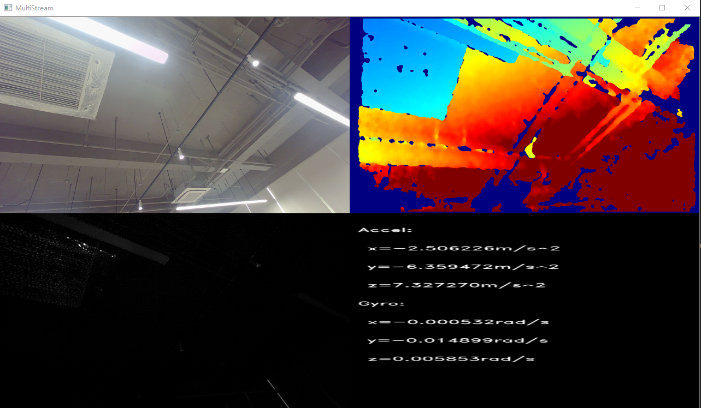

# Orbbec SDK

 

> [!IMPORTANT]
>
> Welcome to the Orbbec SDK. Before you begin using this version of Orbbec SDK, it's crucial to check the following device support list to verify the compatibility.
>

This main branch is based on Orbbec SDK v1 and it is compatible with Orbbec's original OpenNI protocol devices through built-in code, enabling developers to migrate to Orbbec SDK to support both new and old products with one set of code.

With the major update in 2024 October, Orbbec SDK becomes open-source with enhanced flexibility and scalability. This update ensures compatibility with all new Orbbec USB products that adhere to the UVC standard. However, [Orbbec SDK v2](https://github.com/orbbec/OrbbecSDK_v2) no longer supports Orbbec's legacy OpenNI protocol devices, which will continue to receive bug fixes support in the Orbbec SDK v1 branch. We encourage you to check out whether your devices is supported by Orbbec SDK v2 and use the new release if it is supported there.

If you are a user in China, it is recommended to use Gitee([gitee Repo](https://gitee.com/orbbecdeveloper/OrbbecSDK)).

Here is the device support list of main branch (v1.x) and Orbbec SDK v2 (v2.x):

<table border="1" style="border-collapse: collapse; text-align: left; width: 100%;">
  <thead>
    <tr style="background-color: #1f4e78; color: white; text-align: center;">
      <th>Product Series</th>
      <th>Product</th>
      <th><a href="https://github.com/orbbec/OrbbecSDK/tree/main" style="color: black; text-decoration: none;">Orbbec SDK V1</a></th>
      <th><a href="https://github.com/orbbec/OrbbecSDK_v2" style="color: black; text-decoration: none;">Orbbec SDK v2</a></th>
    </tr>
  </thead>
  <tbody>
    <tr>
      <td style="text-align: center; font-weight: bold;">Gemini 435Le</td>
      <td>Gemini 435Le</td>
      <td>not supported</td>
      <td>recommended for new designs</td>
    </tr>
    <tr>
      <td rowspan="8" style="text-align: center; font-weight: bold;">Gemini 330</td>
      <td>Gemini 335Le</td>
      <td>not supported</td>
      <td>recommended for new designs</td>
    </tr>
    <tr>
      <td>Gemini 335</td>
      <td>full maintenance</td>
      <td>recommended for new designs</td>
    </tr>
    <tr>
      <td>Gemini 336</td>
      <td>full maintenance</td>
      <td>recommended for new designs</td>
    </tr>
    <tr>
      <td>Gemini 330</td>
      <td>full maintenance</td>
      <td>recommended for new designs</td>
    </tr>
    <tr>
      <td>Gemini 335L</td>
      <td>full maintenance</td>
      <td>recommended for new designs</td>
    </tr>
    <tr>
      <td>Gemini 336L</td>
      <td>full maintenance</td>
      <td>recommended for new designs</td>
    </tr>
    <tr>
      <td>Gemini 330L</td>
      <td>full maintenance</td>
      <td>recommended for new designs</td>
    </tr>
    <tr>
      <td>Gemini 335Lg</td>
      <td>not supported</td>
      <td>recommended for new designs</td>
    </tr>
    <tr>
      <td rowspan="5" style="text-align: center; font-weight: bold;">Gemini 2</td>
      <td>Gemini 2</td>
      <td>full maintenance</td>
      <td>recommended for new designs</td>
    </tr>
    <tr>
      <td>Gemini 2 L</td>
      <td>full maintenance</td>
      <td>recommended for new designs</td>
    </tr>
    <tr>
      <td>Gemini 2 XL</td>
      <td>recommended for new designs</td>
      <td>to be supported</td>
    </tr>
    <tr>
      <td>Gemini 215</td>
      <td>not supported</td>
      <td>recommended for new designs</td>
    </tr>
    <tr>
      <td>Gemini 210</td>
      <td>not supported</td>
      <td>recommended for new designs</td>
    </tr>
    <tr>
      <td rowspan="3" style="text-align: center; font-weight: bold;">Femto</td>
      <td>Femto Bolt</td>
      <td>full maintenance</td>
      <td>recommended for new designs</td>
    </tr>
    <tr>
      <td>Femto Mega</td>
      <td>full maintenance</td>
      <td>recommended for new designs</td>
    </tr>
    <tr>
      <td>Femto Mega I</td>
      <td>full maintenance</td>
      <td>recommended for new designs</td>
    </tr>
    <tr>
      <td rowspan="3" style="text-align: center; font-weight: bold;">Astra</td>
      <td>Astra 2</td>
      <td>full maintenance</td>
      <td>recommended for new designs</td>
    </tr>
    <tr>
      <td>Astra+</td>
      <td>limited maintenance</td>
      <td>not supported</td>
    </tr>
    <tr>
      <td>Astra Pro Plus</td>
      <td>limited maintenance</td>
      <td>not supported</td>
    </tr>
    <tr>
      <td style="text-align: center; font-weight: bold;">Astra Mini</td>
      <td>Astra Mini Pro</td>
      <td>full maintenance</td>
      <td>not supported</td>
    </tr>
  </tbody>
</table>

**Note**: If you do not find your device, please contact our FAE or sales representative for help.

**Definition**:

1. recommended for new designs: we will provide full supports with new features,  bug fix and performance optimization;
2. full maintenance: we will provide bug fix support;
3. limited maintenance: we will provide critical bug fix support;
4. not supported: we will not support specific device in this version;
5. to be supported: we will add support in the near future.

## Product support

| **Products List** | **Minimal Firmware Version**        |
|-------------------|-----------------------------|
| Gemini 330        | 1.2.20                   |
| Gemini 330L        | 1.2.20                    |
| Gemini 335        | 1.2.20                   |
| Gemini 335L        | 1.2.20                    |
| Gemini 336        | 1.2.20                      |
| Gemini 336L        | 1.2.20                    |
| Femto Bolt        | 1.0.6                |
| Femto Mega        | 1.1.7                 |
| Femto Mega I      | 2.0.2                       |
| Gemini 2 XL       | Obox: V1.2.5  VL:1.4.54     |
| Astra 2           | 2.8.20                      |
| Gemini 2 L        | 1.4.32                      |
| Gemini 2          | 1.4.60               |
| Astra+            | 1.0.19 |
| Femto             | 1.6.7                       |
| Femto W           | 1.1.8                       |
| DaBai             | 2436                        |
| DaBai DCW         | 2460                        |
| DaBai DW          | 2606                        |
| Astra Mini Pro    | 1007                        |
| Gemini E          | 3460                        |
| Gemini E Lite     | 3606                        |
| Gemini            | 3018                      |
| Astra Mini S Pro  | 1005                      |

## What is included in the repository

* **library** : Orbbec SDK core library files and C/C++ header files.
* **examples** : C/C++ samples project source code.
* **doc** : API reference documentation and sample documentation.
* **driver** : Windows device driver for OpenNI protocol devices (Dabai, Dabai DCW, Dabai DW, Astra mini Pro, Astra Pro Plus, A1 Pro, Gemini E, Gemini E Lite, Gemini). While modules that use the standard UVC protocol do not need to install drivers.
* **scripts** : Linux udev rules for resolving permission issues and Windows timestamp registration scripts for resolving timestamp and metadata issues.

## license structure

The current software license structure is as follows


More information about the license of each module can be found in the [license file](LICENSE.txt).

## Platform support

| Operating system | Requirement                                                                                  | Description                                                                                                                             |
|------------------|----------------------------------------------------------------------------------------------|-----------------------------------------------------------------------------------------------------------------------------------------|
| Windows          | - Windows 10 April 2018 (version 1803, operating system build 17134) release (x64) or higher ,windows 11 | The generation of the VS project depends on the installation of the VS version and the cmake version, and supports VS2015/vs2017/vs2019 |
| Linux            | - Linux Ubuntu 16.04/18.04/20.04/22.04 (x64)                                                       | Support GCC 7.5                                                                                                                         |
| Arm32            | - Linux Ubuntu 16.04/18.04/20.04                                                             | Support GCC 7.5                                                                                                                         |
| Arm64            | - Linux Ubuntu 18.04/20.04/22.04                                                                   | Support GCC 7.5                                                                                                                         |
| MacOS            | - M series chip, 11.0 and above; Intel x86 chip, 10.15 and above.                            | supported hardware products: Gemini 2, Gemini 2 L, Astra 2, Gemini 2 XL, Femto Mega, Gemini 330 series                                                   |

* Note: supported Arm platforms: NVIDIA Jetson AGX Orin (arm64), NVIDIA Jetson Orin NX (arm64), NVIDIA Jetson Orin Nano (arm64), NVIDIA Jetson AGX Xavier (arm64), NVIDIA Jetson Xavier NX (arm64), NVIDIA Jetson Nano (arm64), A311D (arm64), Raspberry Pi 4 (arm64), Raspberry Pi 3 (arm32), RK3399 (arm64), other Arm platforms, may need to Cross-compile.


## OrbbecViewer

OrbbecViewer is a useful tool based on Orbbec SDK, that can be used to view the data stream from the Orbbec camera and control the camera.


**Supported platforms**: Windows x64, Linux x64 & ARM64, MacOS M series chip & Intel x86 chip

**Download link**: [Releases](https://github.com/orbbec/OrbbecSDK/releases)

**OrbbecViewer User Manual**: [OrbbecViewer User Manual](doc/OrbbecViewer/English/OrbbecViewer.md)

## Getting started

### Get source code

```bash
git clone https://github.com/orbbec/OrbbecSDK.git
```
Alternatively, you can install via binary packages, please refer to [installation guidance](doc/tutorial/English/Installation_guidance.md) for more information.

### Environment setup

* Linux:

 If you installed via a debian package, you can skip the installation of the udev rules file. If not, please install it using the following commands:

  ```bash
  cd OrbbecSDK/misc/scripts
  sudo chmod +x ./install_udev_rules.sh
  sudo ./install_udev_rules.sh
  sudo udevadm control --reload && sudo udevadm trigger
  ```
* Windows:

  Timestamp registration: [follow this: obsensor_metadata_win10](misc/scripts/obsensor_metadata_win10.md)
* *For more information, please refer to：[Environment Configuration](doc/tutorial/English/Environment_Configuration.md)*

## Examples

The sample code is located in the `./examples` directory and can be built using CMake.

### Build

```bash
cd OrbbecSDK && mkdir build && cd build && cmake .. && cmake --build . --config Release
```

### Run example

To connect your Orbbec camera to your PC, run the following steps:

```bash
cd OrbbecSDK/build/bin # build output dir
./OBMultiStream  # OBMultiStream.exe on Windows
```

Notes: On MacOS, sudo privileges are required.

```bash
# MacOS
cd OrbbecSDK/build/bin # build output dir
cp ../../lib/macOS/* . # copy lib to output dir
sudo ./OBMultiStream
```

The following image is the result of running MultiStream on the Gemini2 device. Other Devices run result maybe different.



Notes:
On the Linux/Arm platform ,this sample requires users to compile with Opencv4.2 or above,otherwise, it cannot be rendered.

### Use Orbbec SDK in your CMake project

Find and link Orbbec SDK in your CMakeLists.txt file like this:

```cmake
cmake_minimum_required(VERSION 3.1.15)
project(OrbbecSDKTest)

add_executable(${PROJECT_NAME} main.cpp)

# find Orbbec SDK
set(OrbbecSDK_DIR "/your/path/to/OrbbecSDK")
find_package(OrbbecSDK REQUIRED)

# link Orbbec SDK
target_link_libraries(${PROJECT_NAME} OrbbecSDK::OrbbecSDK)
```

## Documents

### Overview
* Github Pages：[https://orbbec.github.io/OrbbecSDK/](https://orbbec.github.io/OrbbecSDK/)
* Overview Document：[doc/tutorial/English/OverviewDocument.md](doc/tutorial/English/OverviewDocument.md)

### Tutorials
* Quick Start：[doc/tutorial/English/Environment_Configuration.md](doc/tutorial/English/Environment_Configuration.md)
* Examples: [examples/README.md](examples/README.md)

### API Reference
* API Reference: [doc/api/English/index.html](https://orbbec.github.io/OrbbecSDK/doc/api/English/index.html)
* OrbbecSDK C++ API user guide：[doc/tutorial/English/OrbbecSDK_C++_API_user_guide-v1.0.pdf](https://orbbec.github.io/OrbbecSDK/doc/tutorial/English/OrbbecSDK_C++_API_user_guide-v1.0.pdf)

### Multi Camera Sync
* Multi Camera Sync Document: [Multi Camera Sync](https://www.orbbec.com/docs/set-up-cameras-for-external-synchronization_v1-2/)

## Frequently Asked Questions

### No Data Stream from Multiple Cameras

**Insufficient Power Supply**:
  - Ensure that all cameras are not connected to the same hub.
  - Use a powered hub to provide sufficient power to each camera.

**High Resolution**:
  - Try lowering the resolution to resolve data stream issues.

**Increase usbfs_memory_mb Value**:
  - Increase the `usbfs_memory_mb` value to 128MB by running the following command:
    ```bash
    echo 128 | sudo tee /sys/module/usbcore/parameters/usbfs_memory_mb
    ```
  - For making this change permanent, check [this link](https://github.com/OpenKinect/libfreenect2/issues/807).

## Related links

* [Orbbec SDK Repo](https://github.com/orbbec/OrbbecSDK)
* [Orbbec Main Page](https://www.orbbec.com/)
* [Orbbec 3D Club](https://3dclub.orbbec3d.com)
