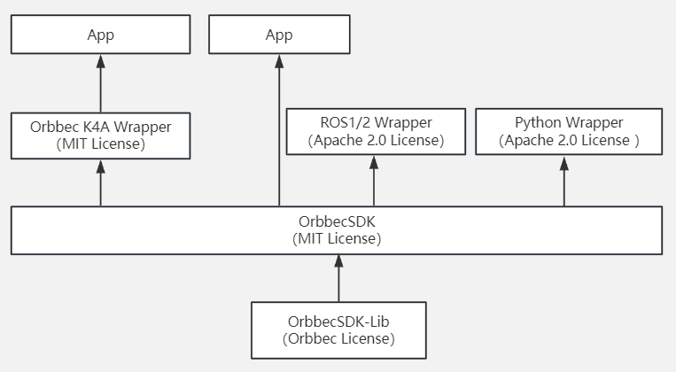

# OrbbecSDK

 

Orbbec 3D 相机产品软件开发套件，全面支持 UVC，实现免驱动即插即用，提供低层和高层简单易用的 API，帮助开发者在不同场景下灵活使用。

这个主分支是基于 Orbbec SDK v1 构建的，它通过内置代码与 Orbbec 原始的 OpenNI 协议设备兼容，使开发者能够迁移到 Orbbec SDK，用一套代码支持新旧产品。

随着2024年10月新分支2.x-main的重大更新，Orbbec SDK 变得开源，增强了灵活性和可扩展性。这次2.x-main 的更新确保了与所有遵循 UVC 标准的新 Orbbec USB 产品的兼容性。然而，[Orbbec SDK v2](https://github.com/orbbec/OrbbecSDK_v2) 不再支持 Orbbec 的旧版 OpenNI 协议设备，这些设备将继续在 Orbbec SDK v1 分支中获得错误修复支持。我们鼓励你检查你的设备是否支持 Orbbec SDK v2，并在支持的情况下使用新版本。

如果你是中国的用户，建议使用 Gitee([gitee Repo](https://gitee.com/orbbecdeveloper/OrbbecSDK))。

## 本仓库包含内容

* **library** : OrbbecSDK 核心库文件和 C/C++ 头文件。
* **examples** : C/C++ 示例工程源码
* **doc** : API 参考文档和示例文档。
* **driver** :  Windows 设备驱动，用于 OpenNI 协议设备（Dabai、Dabai DCW、Dabai DW、Astra mini Pro、Astra Pro Plus、A1 Pro、Gemini E、Gemini E Lite、Gemini），使用标准 UVC 协议的模块则无需安装驱动。
* **scripts** : Linux udev 规则，用于解决权限问题；Windows 时间戳注册脚本，用于解决时间戳和元数据问题。

## 软件license结构说明

当前遵循软件license结构如下




## 支持平台

| Operating system | Requirement                                                                                  | Description                                                                                                                             |
|------------------|----------------------------------------------------------------------------------------------|-----------------------------------------------------------------------------------------------------------------------------------------|
| Windows          | - Windows 10 April 2018 (version 1803, operating system build 17134) release (x64) or higher,windows 11 | The generation of the VS project depends on the installation of the VS version and the cmake version, and supports VS2015/vs2017/vs2019 |
| Linux            | - Linux Ubuntu 16.04/18.04/20.04/22.04 (x64)                                                       | Support GCC 7.5                                                                                                                         |
| Arm32            | - Linux Ubuntu 16.04/18.04/20.04                                                             | Support GCC 7.5                                                                                                                         |
| Arm64            | - Linux Ubuntu 18.04/20.04/22.04                                                                   | Support GCC 7.5                                                                                                                         |
| MacOS            | - M series chip, 11.0 and above、intel x86 chip, 10.15 and above.                             | supported hardware products: Gemini 2, Gemini 2 L, Astra 2,Gemini 2 XL, Femto Mega, Gemini 330系列                                                      |

* 注: 当前版本支持的Arm平台：NVIDIA Jetson AGX Orin (arm64), NVIDIA Jetson Orin NX (arm64), NVIDIA Jetson Orin Nano (arm64), NVIDIA Jetson AGX Xavier (arm64), NVIDIA Jetson Xavier NX (arm64), NVIDIA Jetson Nano (arm64), A311D (arm64), Raspberry Pi 4 (arm64), Raspberry Pi 3 (arm32), RK3399 (arm64), 其它Arm系统，可能需要重新交叉编译。


## 支持产品

| **产品列表**     | **固件版本**                |
|------------------|-----------------------------|
| Gemini 335        | 	1.2.20                    |
| Gemini 335L        | 	1.2.20                   |
| Gemini 336        | 	1.2.20                    |
| Gemini 336L        | 	1.2.20                    |
| Femto Bolt        | 1.0.6/1.0.9/1.1.2                 |
| Femto Mega        | 1.1.7/1.2.7/1.2.9                 |
| Femto Mega I      | 2.0.2                       |
| Gemini 2 XL       | Obox: V1.2.5  VL:1.4.54     |
| Astra 2           | 2.8.20                      |
| Gemini 2 L        | 1.4.32                      |
| Gemini 2          | 1.4.60 /1.4.76              |
| Astra+            | 1.0.22/1.0.21/1.0.20/1.0.19 |
| Femto             | 1.6.7                       |
| Femto W           | 1.1.8                       |
| DaBai             | 2436                        |
| DaBai DCW         | 2460                        |
| DaBai DW          | 2606                        |
| Astra Mini Pro    | 1007                        |
| Gemini E          | 3460                        |
| Gemini E Lite     | 3606                        |
| Gemini            | 3.0.18                      |
| Astra Mini S Pro  | 1.0.05                      |
| Gemini 215        | 1.0.9                       |

## OrbbecViewer

OrbbecViewer是一个基于Orbbec SDK的实用工具，用于查看来自Orbbec相机的数据流并控制相机.


**支持平台**: Windows x64, Linux x64&ARM64, MacOS M seires chip and Intel x86 chip

**下载链接**: [Releases](https://github.com/orbbec/OrbbecSDK/releases)

**OrbbecViewer使用说明**: [OrbbecViewer User Manual](doc/OrbbecViewer/Chinese/OrbbecViewer.md)

## 快速开始

### 获取源码

```bash     
git clone https://github.com/Orbbec/OrbbecSDK.git     
```

您也可以通过二进制包进行安装，请参考[安装指南](doc/tutorial/Chinese/Installation_guidance.md)获取更多信息。

### 环境配置

* Linux：

如果您通过 Debian 包进行安装，则可以跳过 udev 规则文件的安装。如果没有，请使用以下命令进行安装：

  ```bash
  cd OrbbecSDK/misc/scripts
  sudo chmod +x ./install_udev_rules.sh
  sudo ./install_udev_rules.sh
  sudo udevadm control --reload && sudo udevadm trigger
  ```
* Windows：
  metadat时间戳注册: [obsensor_metadata_win10](misc\scripts\obsensor_metadata_win10.md)
* 有关环境配置的更多信息请参考：[Environment Configuration](doc/tutorial/Chinese/Environment_Configuration.md)

## 示例

示例代码位于./examples目录中，可以使用CMake进行编译

### 编译

    ``bash     cd OrbbecSDK && mkdir build && cd build && cmake .. && cmake --build . --config Release     ``

### 运行示例

    首先连接Orbbec相机，然后运行如下脚本：``bash     cd OrbbecSDK/build/bin # build output dir     ./OBMultiStream  # OBMultiStream.exe on Windows     ``

下图是Gemini2 设备，运行MultiStream的结果图，其它设备运行的结果可能不一样.


注意事项:
在Linux或Arm平台,需要安装Opencv 4.2或以上版本，否则不能渲染.

### CMake项目中使用Orbbec SDK

在CMakeLists.txt文件中查找并链接Orbbec SDK：

```cmake
cmake_minimum_required(VERSION 3.1.15)
project(OrbbecSDKTest)

add_executable(${PROJECT_NAME} main.cpp)

# find Orbbec SDK
set(OrbbecSDK_DIR "/your/path/to/OrbbecSDK")
find_package(OrbbecSDK REQUIRED)

# link Orbbec SDK
target_link_libraries(${PROJECT_NAME} OrbbecSDK::OrbbecSDK)
```

## 文档

* Github：[https://orbbec.github.io/OrbbecSDK/](https://orbbec.github.io/OrbbecSDK/README_CN)
* 概述文档：[doc/tutorial/Chinese/OverviewDocument.md](doc/tutorial/Chinese/OverviewDocument.md)
* API 参考: [doc/api/English/index.html](https://orbbec.github.io/OrbbecSDK/doc/api/English/index.html)
* 多机同步文档: [Multi Camera Sync](https://www.orbbec.com/docs/set-up-cameras-for-external-synchronization_v1-2/)
* OrbbecSDK C++ API user guide：[doc/tutorial/Chinese/OrbbecSDK_C++_API_user_guide-v1.0.pdf](https://orbbec.github.io/OrbbecSDK/doc/tutorial/Chinese/OrbbecSDK_C++_API_user_guide-v1.0.pdf)
* Environment Configuration：[doc/tutorial/Chinese/Environment_Configuration.md](doc/tutorial/Chinese/Environment_Configuration.md)
* 示例说明: [examples/README.md](examples/README_CN.md)


## 相关链接

* [奥比中光主页](https://www.orbbec.com.cn/)
* [3D 视觉开发者社区](https://developer.orbbec.com.cn/)
