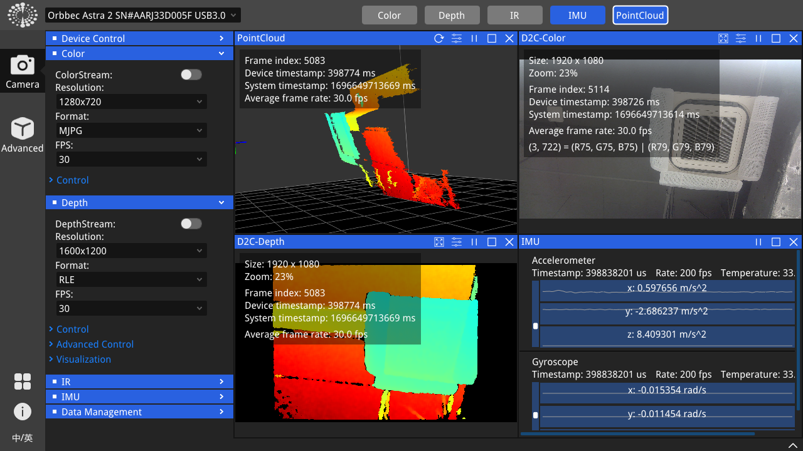

# OrbbecSDK

 

Orbbec 3D 相机产品软件开发套件，全面支持 UVC，实现免驱动即插即用，提供低层和高层简单易用的 API，帮助开发者在不同场景下灵活使用。

此外，该 SDK 通过内置代码兼容 Orbbec 原有的 OpenNI 协议设备，开发者可以完全迁移到 OrbbecSDK，一套代码即可支持 Orbbec 的新一代产品和老产品。

## 本仓库包含内容

* **library** : OrbbecSDK 核心库文件和 C/C++ 头文件。
* **examples** : C/C++ 示例工程源码
* **doc** : API 参考文档和示例文档。
* **driver** :  Windows 设备驱动，用于 OpenNI 协议设备（Dabai、Dabai DCW、Dabai DW、Astra mini Pro、Astra Pro Plus、A1 Pro、Gemini E、Gemini E Lite、Gemini），使用标准 UVC 协议的模块则无需安装驱动。
* **scripts** : Linux udev 规则，用于解决权限问题；Windows 时间戳注册脚本，用于解决时间戳和元数据问题。

## 支持平台

| Operating system | Requirement                                                  | Description |
| --- | --- | --- |
| Windows | - Windows 10 April 2018 (version 1803, operating system build 17134) release (x64) or higher<br /> | The generation of the VS project depends on the installation of the VS version and the cmake version, and supports VS2015/vs2017/vs2019 |
| Linux | - Linux Ubuntu 16.04/18.04/20.04 (x64)<br />|Support GCC 7.5|
| Arm32|- Linux Ubuntu 16.04/18.04/20.04<br /> |  Support GCC 7.5 |
| Arm64 |- Linux Ubuntu 18.04/20.04<br /> |  Support GCC 7.5 |
| MacOS |- M series chip, 11.0 and above、intel x86 chip, 10.15 and above. <br /> |  supported hardware products: Gemini 2, Gemini 2 L, Astra 2,Gemini 2 XL, Femto Mega |

* 注: 当前版本支持的Arm平台：jestson nano(arm64)、AGX Orin(arm64)、Orin NX (arm64)、Orin Nano(arm64)、A311D(arm64)、树莓派4(arm64)、树莓派3（arm32)、rk3399(arm64), 其它Arm系统，可能需要重新交叉编译。

* Windows 11, Ubuntu 22.04 和其他一些 Linux 平台理论上也支持，但是未经过完整测试”

## 支持产品

| **产品列表** | **固件版本** |
| --- | --- |
| Femto Bolt       | 1.0.6/1.0.9   |
| Femto Mega       | 1.1.7/1.2.7   |
| Gemini 2 XL      | Obox: V1.2.5  VL:1.4.54    |
| Astra 2          | 2.8.20                     |
| Gemini 2 L       | 1.4.32                     |
| Gemini 2         | 1.4.60 /1.4.76             |
| Astra+           | 1.0.22/1.0.21/1.0.20/1.0.19 |
| Femto            | 1.6.7                       |
| Femto W          | 1.1.8                       |
| DaBai            | 2436                        |
| DaBai DCW        | 2460                        |
| DaBai DW         | 2606                        |
| Astra Mini Pro   | 1007                        |
| Gemini E         | 3460                        |
| Gemini E Lite    | 3606                        |
| Gemini           | 3.0.18                      |
| Astra Mini S Pro | 1.0.05                      |


## OrbbecViewer
OrbbecViewer是一个基于Orbbec SDK的实用工具，用于查看来自Orbbec相机的数据流并控制相机.



**支持平台**: Windows x64, Linux x64&ARM64

**下载链接**: [Releases](https://github.com/orbbec/OrbbecSDK/releases)

**OrbbecViewer使用说明**: [OrbbecViewer User Manual](doc/OrbbecViewer/Chinese/OrbbecViewer.md)


## 快速开始

### 获取源码

    ```bash
    git clone https://github.com/Orbbec/OrbbecSDK.git
    ```

### 环境配置
* Linux：

    安装 udev rules 文件

    ``` bash
    cd OrbbecSDK/misc/scripts
    sudo chmod +x ./install_udev_rules.sh
    sudo ./install_udev_rules.sh
    sudo udevadm control --reload && sudo udevadm trigger
    ```

* Windows：
    metadat时间戳注册: [obsensor_metadata_win10](misc\scripts\obsensor_metadata_win10.md)

* 有关环境配置的更多信息请参考：[Environment Configuration](doc/tutorial/Chinese/Environment_Configuration.md)


## 示例
示例代码位于./examples目录中，可以使用CMake进行编译

### 编译

    ```bash
    cd OrbbecSDK && mkdir build && cd build && cmake .. && cmake --build . --config Release
    ```

### 运行示例
    首先连接Orbbec相机，然后运行如下脚本：
    ```bash
    cd OrbbecSDK/build/bin # build output dir
    ./OBMultiStream  # OBMultiStream.exe on Windows
    ```

下图是Gemini2 设备，运行MultiStream的结果图，其它设备运行的结果可能不一样.


注意事项:
在Linux或Arm平台,需要安装Opencv 4.2或以上版本，否则不能渲染.

### CMake项目中使用Orbbec SDK

在CMakeLists.txt文件中查找并链接Orbbec SDK：

```cmake
cmake_minimum_required(VERSION 3.1.15)
project(OrbbecSDKTest)

add_executable(${PROJECT_NAME} main.cpp)

# find Orbbec SDK
set(OrbbecSDK_DIR "/your/path/to/OrbbecSDK")
find_package(OrbbecSDK REQUIRED)

# link Orbbec SDK
target_link_libraries(${PROJECT_NAME} OrbbecSDK::OrbbecSDK)
```


## 文档

* Github：[https://orbbec.github.io/OrbbecSDK/](https://orbbec.github.io/OrbbecSDK/README_CN)
* API 参考: [doc/api/Chinese/index.html](https://orbbec.github.io/OrbbecSDK/doc/api/Chinese/index.html)
* OrbbecSDK C++ API user guide：[doc/tutorial/Chinese/OrbbecSDK_C++_API_user_guide-v1.0.pdf](https://orbbec.github.io/OrbbecSDK/doc/tutorial/Chinese/OrbbecSDK_C++_API_user_guide-v1.0.pdf)
* Environment Configuration：[doc/tutorial/Chinese/Environment_Configuration.md](doc/tutorial/Chinese/Environment_Configuration.md)
* 示例说明: [examples/README.md](examples/README_CN.md)
* 示例描述: [doc/tutorial/Chinese/Code_Sample_Description/Sample_Description(C_C++).md](doc/tutorial/Chinese/Code_Sample_Description/Sample_Description(C_C++).md)


## 相关链接

* [奥比中光主页](https://www.orbbec.com.cn/)
* [3D 视觉开发者社区](https://developer.orbbec.com.cn/)
