# 介绍
OrbbecViewer是基于Orbbec SDK开发的示例工具，帮助开发者快速使用Orbbec的3D传感器产品。实现了 Orbbec 3D传感器产品的特性功能，包括读取序列号、获取设备类型、相机参数、控制等功能。

本文档对这些功能进行了描述并演示了基本使用的过程。
# OrbbecViewer工具概述
## 目标用户
OrbbecViewer工具专为最终用户/开发人员设计，用于使用Orbbec SDK 3D相机。

## 支持的平台

| **操作系统** | **要求** | **描述** |
| --- | --- | --- |
| Windows |  - Windows 10 的 2018 年 4 月（版本 1803，操作系统内部版本 17134）发行版 (x64) 或更高版本 - 4 GB 内存 - USB2.0 及以上端口  | vs的工程的生成依赖安装vs版本和cmake版本，支持vs2015/vs2017/vs2019 |
| Linux |  - Linux Ubuntu 16.04/18.04/20.04/22.04 (x64) - 4 GB 内存 - USB2.0 及以上端口  | 支持GCC 7.5 |
| Arm64 |  - Linux Ubuntu 18.04/20.04/22.04 - 4 GB RAM - USB2.0 and above ports  |  Support GCC 7.5 |

# OrbbecViewer工具的使用
## 3.1 软件主界面
如图所示，主界面用红框分隔标注了3个区域，作用分别是：

| **区域** | **名称** | **功能** |
| --- | --- | --- |
| 区域一 | 设备管理区 | 传感器列表、点云 |
| 区域二 | 控制面板区 | 数据流开关及参数配置、图像采集功能控制、D2C功能控制、点云控制 |
| 区域三 | 图像预览区 | 传感器图像预览，帧率、时间戳等|

其中，控制面板区左侧有六个按钮，最下方按钮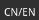用于切换中英文；用于打开软件详情页面。
用于查看设备信息和固件升级；剩下两个按钮用于切换不同功能的控制面板TAB页，从上往下一次为“相机控制”、“高级模式”。

## 3.2 数据流
OrbbecViewer 允许用户选择和配置深度、红外和彩色数据流。本节概述了用户可在工具中自定义的参数。用户完成配置后，单击顶部按钮开始数据流传输。

OrbbecViewer工具允许用户选择深度、红外和彩色数据流组合。

 

### 分辨率与帧率
摄像机为用户提供了多种分辨率可供选择，以满足他们的解决方案需求。各路数据流都提供了多种可选的帧格式，以供用户自由选择合适的图像尺寸、图像格式和帧率组合。

例如，深度流可以支持320x240、640x480、640x400、1280x800、320x288、640x576、1024x1024、512x512等分辨率，FPS帧率的区间范围为5到30，不同的设备支持的分辨率、图像格式、帧率有差异，请参考产品手册。

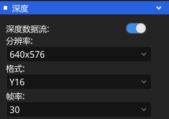

彩色流可以支持640x480~3840x2160多种分辨率，FPS帧率的区间范围5到30不等，支持MJPG、RGB、I420、H265。

 对于彩色流的预览，MJPG、H264、H265是编码格式，需要先进行解码，解码通常耗时会比较大，会导致掉帧或渲染出“花屏”画面。在某些型号PC上，可通过硬件加速解码。
 
 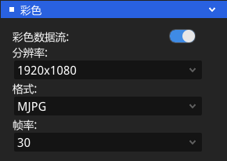

 红外流可以支持320x240、640x480、640x400、1280x800、640x576、512x512、1024x1024 等分辨率，FPS帧率5到30不等。 不同的设备支持的分辨率、图像格式、帧率有差异，请参考产品手册。
 
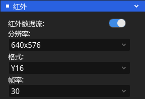

用户可根据实际情况选择最适合使用的分辨率。请注意，分辨率越高，精确度越高，但会增加计算强度。

## 3.3 设备信息
点击按钮“”查看设备信息

OrbbecViewer工具包含简单的设备信息，如固件版本、产品识别码、相机参数、温度等。 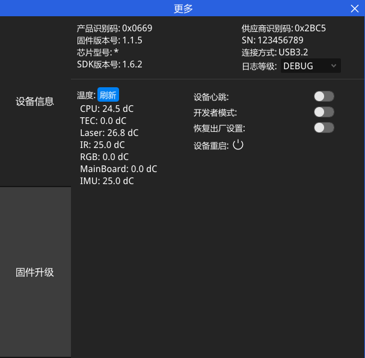

## 3.4 图像预览区
开流会默认显示平均帧率、时间戳、图像帧号等信息。
* 点击右上角来切换信息显示\关闭。
* 点击可以关闭流，但不从预览区中移除。
* 点击可以重新打开已经暂停且未从预览区移除的流。
* 数据流关闭后，图像预览窗并不会随之关闭，需要用户点击图像预览窗右上角。

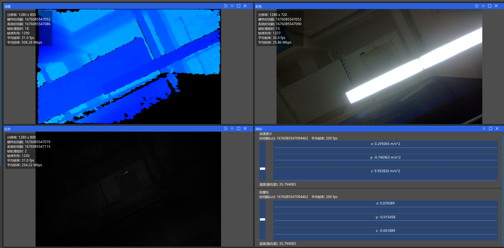

## 3.5 控制面板区
### 传感器和数据流
#### 获取相机名称、序列号及USB协议
设备上电并将USB与PC主机连接后，打开OrbbecViewer工具软件，软件会自动连接设备。某些设备可能初始化较长时间，请耐心等待设备连接成功。连接成功后，控制面板区自动显示设备具体信息。

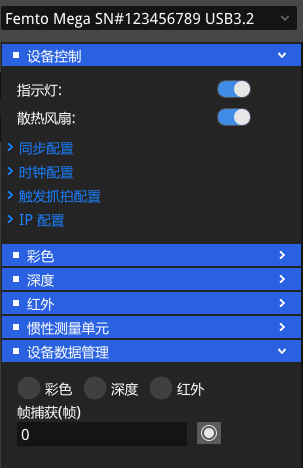
#### 深度流模块
包括：镜像、软件滤波、旋转、曝光等功能（不同型号设备功能支持情况会不一致）。

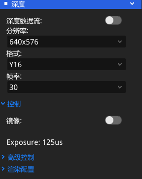

#### 彩色流模块
包括：镜像、翻转、对齐、曝光、白平衡、增益、亮度、锐度、饱和度、对比度、色调等功能（不同型号设备功能支持情况会不一致）。

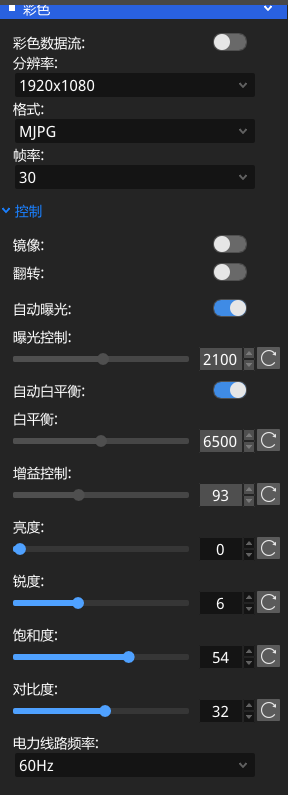

#### 红外流板块
包括镜像、曝光、旋转等功能（不同型号设备功能支持情况会不一致）。

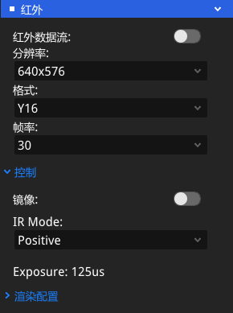

#### 惯性测量单元
包括Imu频率和量程设置：

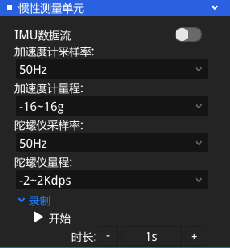

#### 设备数据管理
用户可选择对应图像和捕获帧来进行录制，采集的帧默认保存在“OrbbecViewer/output”目录中。

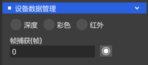

## 3.6 D2C、点云功能（支持硬件D2C和软件D2C）
在高级模式下，同时支持D2C和点云。
* 控制深度和彩色图像的对齐功能,对齐模式支持硬件D2C和软件D2C。
* 帧同步： 开启帧同步，SDK内部会将同一时刻的Depth和Color组合成一个FrameSet，对外输出，需要支持帧同步的硬件模组才能支持，如： Gemini2、Gemini2 L、Astra2、Femto、Femto W、Femto Mega等。
* 获取参数： 当前相机分辨率的内外参。
* 2D 控制： 显示和保存2D 图像。
* 3D 控制： 显示和保存3D点云数据。
* D2C的有效区域：D2C后深度相对RGB的有效范围。
* 录制和回放功能：录制后文件保存在"./output/RecordFile"文件夹内，录制后的文件可以导入回放。

## 3.7 固件更新
在设备已连接状态，点击可进入固件更新页面。

* 选择好固件类型后，在“固件”输入框输入现有更新的固件镜像文件，点击“升级”按钮开始更新。

* 设备固件更新如意外失败，不会影响原固件运行，重新连接设备进行更新即可。设备更新时间比较长，且设备会自动重启一次，请留意提示信息并耐心等待。

* Astra+等模组(
Astra+、gemini2、Gemini2 L、Astra2、Dabai、Dabai DCW、Dabai DW、Astra Mini Pro、Astra Pro Plus、Gemini、GeminiE、GeminiE Lite) 的升级界面如下:

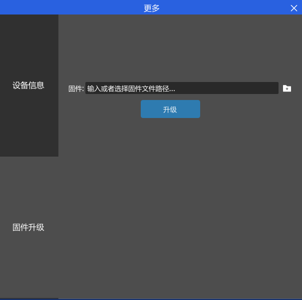

* Femto、Femto W 的固件升级界面如下：

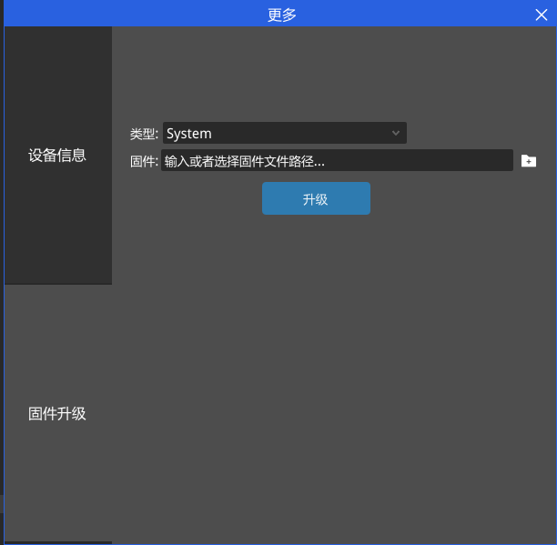
* Femto Mega 的固件升级暂不支持windows升级，需要在linux下 使用管理员权限 调用OrbbecViewer
升级。

## 3.8 日志信息
默认情况下，日志信息区是折叠单条显示状态，可通过点击最右边按钮

展开查看完整log信息。展开后可通过点击按钮清空log，通过点击按钮恢复折叠单条显示状态。 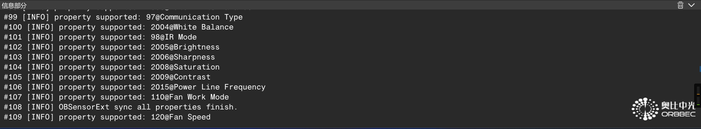

