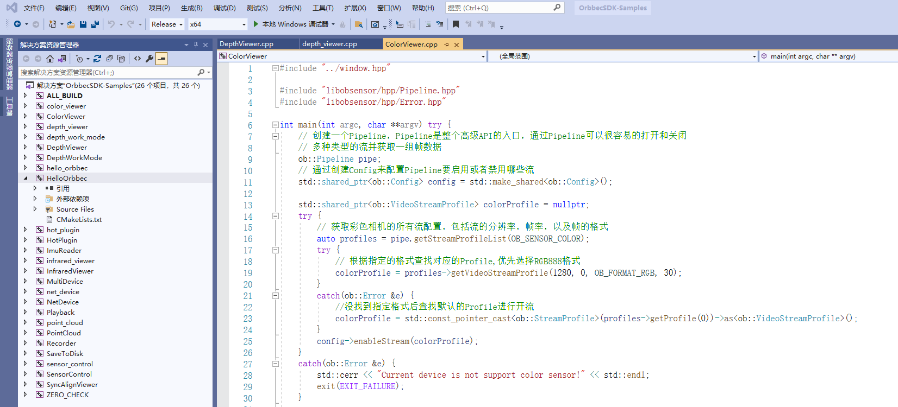

<!-- 本文档面向开发者 -->
# 简介
本文档主要介绍 OrbbecSDK 依赖的安装及 OrbbecSDK的编译说明。

# 安装说明
Orbbec SDK 兼容标准UVC协议，支持的硬件设备符合标准UVC规格，Gemini2、Femto 、Femto W、Femto Mega、Astra+ 这些模组使用的标准的UVC协议，因此不需要安装额外的驱动程序。
## 1. 安装私有驱动
openni私有驱动的目录如下：双击以下.exe 图片目录，安装驱动程序。Dabai、Dabai DCW、Dabai DW、Astra mini Pro、Astra Pro Plus、A1 Pro、Gemini E、Gemini E Lite、Gemini 这些是使用的openni 的私有协议，需要安装私有的驱动。

## 2. 配置OpenCV（Examples依赖）
数据渲染依赖第三方库OpenCV，这里以OpenCV 4.3.0为例演示安装配置 1）执行OpenCV安装文件，选择opencv要安装的目录，点击extract执行安装；  2）在系统的环境变量中添加OpenCV的路径，变量名输入OpenCV_DIR,注意字母的大小写，变量值为OpenCV安装目录的build文件夹路径；  

# windows 编译说明
软件依赖：VisualStudio2019、cmake 3.10及以上版本 1）下载/获取我们的SDK软件包，存放位置假设为D盘根目录：“D:/V1.5.7”，目录结构如下所示： 

2）打开Cmake，将“Examples”文件夹设置为代码路径，“Examples”下的“build”文件夹设置为生成二进制文件的路径，如下图所示。如Examples下无build，需要新建该文件夹。 

3）点击“Configure”并选择对应的Visual Studio版本和平台版本后，点击“Finish”，如下所示： 

4）点击“Generate”，如下所示：  5）可以通过以下两种方式打开Sample工程 方法一：通过cmake，点击“Open Project”按钮，打开Visual Studio工程  方法二：通过文件夹，Examples/build中的Visual Studio工程直接启动，如下图所示。  6）打开Examples工程界面如下所示：  7)选择你想要运行的工程，右键点击并将其“设置为启动项目”,在运行选项处选择release和64位版本；  

8）将设备连接到主机 9）将bin目录下的dll文件拷贝至执行文件处，运行工程，结果如下所示，至此第一个Eaxmple就运行成功了。  

# linux 编译说明
     首先下载Linux 或 ARM的 OrbbecSDK，然后按照以下步骤进行编译。
## 1、系统环境配置
1)安装libudev库：sudo apt install libudev-dev 
2)安装libusb库：sudo apt install libusb-dev 

## 2、USB访问权限配置
Linux系统默认对USB设备的直接访问需要root权限，可以通过rules配置文件解决。在OrbbecSDK发布的文件解压后，在根目录下会有一个“99-obsensor-libusb.rules”配置文件和“install.sh”安装脚本，通过sudo命令执行“install.sh”脚本，即可完成rules配置文件的安装。另外，如果“install.sh”安装脚本并没有执行权限，可通过改命令解决：“sudo chmod +x ./install.sh”。 成功执行安装脚本后，再接入设备时生效（已接入的设备需要重新拔插）。 
## 3、验证设备状态
1）环境准备：ubuntu18.04 x64 desktop 2）以Astra+为例，使用USB 3.0 Type-C数据线，用于与PC机连接。 3）使用lsusb命令，查看是否PC系统有正确识别到相机  4）通过PID&VID来判断相机是否正常被识别 VID：2bc5	PID：0532(彩色相机) VID：2bc5	PID：0636(深度相机) 

## 4、Linux Sample编译
在Examples 目录下新建一个build目录，如下：
 
cd build  
cmake ..  
make  

# 常见FAQ

[常见问题FAQ](https://developer.orbbec.com.cn/technical_library.html?id=59)  

