# 简介

本文档主要介绍 OrbbecSDK 依赖的安装及 OrbbecSDK 的编译说明。

# 安装说明

Orbbec SDK 兼容标准 UVC 协议，支持的硬件设备符合标准 UVC 规格，Gemini2、Femto 、Femto W、Femto Mega、Astra+、Astra2、Gemini2 L 、Gemini 330系列 这些模组使用的标准的 UVC 协议，因此不需要安装额外的驱动程序。

# windows 环境配置

## 1. 安装私有驱动

openni 私有驱动的目录如下：双击以下. exe 图片目录，安装驱动程序。Dabai、Dabai DCW、Dabai DW、Astra mini Pro、Astra Pro Plus、A1 Pro、Gemini E、Gemini E Lite、Gemini 这些是使用的 openni 的私有协议，需要安装私有的驱动。
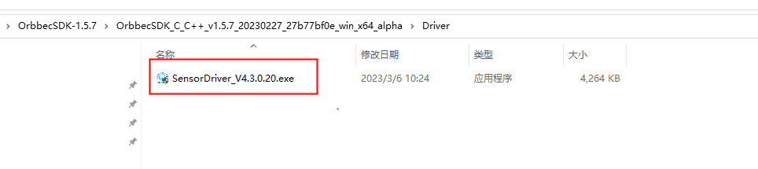

## 2. 配置 OpenCV（Examples 依赖）

数据渲染依赖第三方库 OpenCV，这里以 OpenCV 4.3.0 为例演示安装配置。

* 执行 OpenCV 安装文件，选择 opencv 要安装的目录，点击 extract 执行安装。

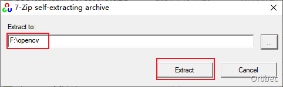

* 在系统的环境变量中添加 OpenCV 的路径，变量名输入 OpenCV_DIR, 注意字母的大小写，变量值为 OpenCV 安装目录的 build 文件夹路径。

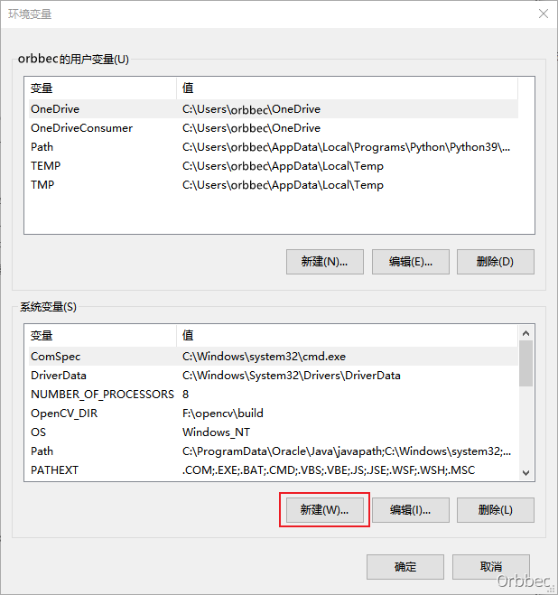


## 3. metadata 时间戳注册

现在因为Windows 系统机制，对于 UVC 协议设备，如果需要拿到时间戳等 metadata 信息，需要先往注册表完成注册。可依据 obsensor_metadata_win10.md 文档指引执行 obsensor_metadata_win10.ps1 脚本自动完成。
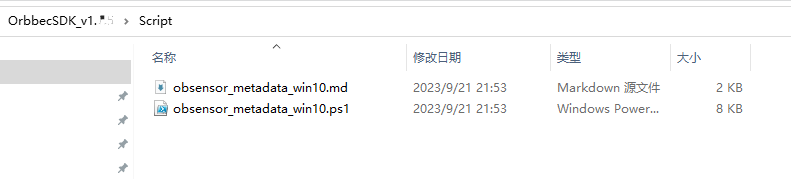

## 4. windows 编译说明

软件依赖：VisualStudio2019、cmake 3.10 及以上版本

* 下载 / 获取我们的 SDK 软件包，以 1.5.7 版本为例介绍 windows 如何编译。
* 打开 Cmake，将 “Examples” 文件夹设置为代码路径，“Examples”下的 “build” 文件夹设置为生成二进制文件的路径，如下图所示。如 Examples 下无 build，需要新建该文件夹。

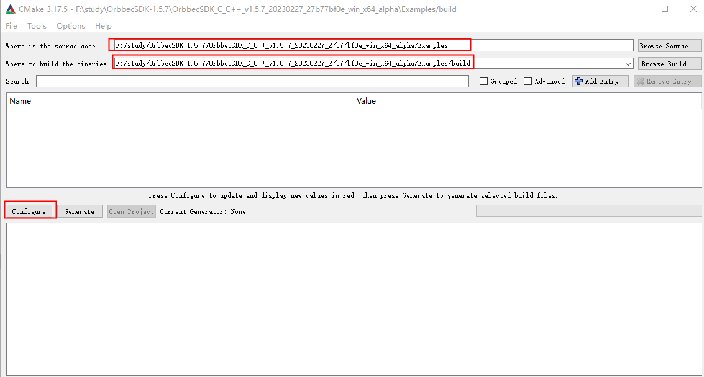

* 点击 “Configure” 并选择对应的 Visual Studio 版本和平台版本后，点击“Finish”，如下所示：

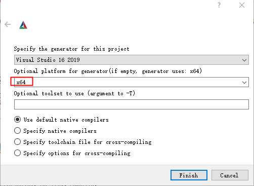

* 点击“Generate”，如下所示：

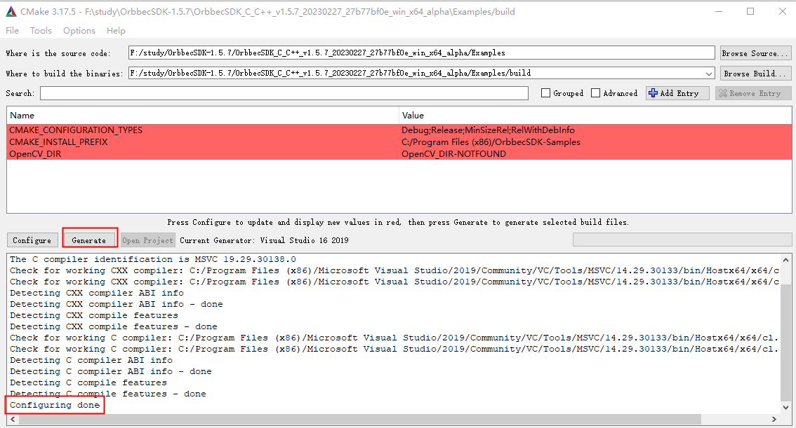

* 可以通过以下两种方式打开 Sample 工程
  方法一：通过 cmake，点击 “Open Project” 按钮，打开 Visual Studio 工程

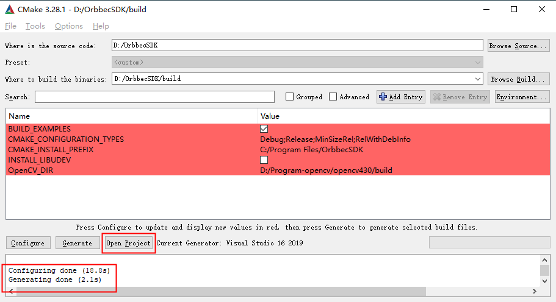

方法二：通过文件夹，Examples/build 中的 Visual Studio 工程直接启动，如下图所示：

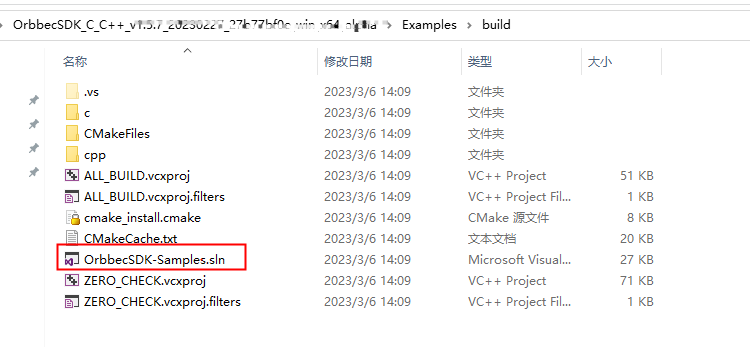

* 打开 Examples 工程界面如下所示：
  
* 选择你想要运行的工程，右键点击并将其“设置为启动项目”, 在运行选项处选择 release 和 64 位版本。
* 将设备连接到主机。
* 将 bin 目录下的 dll 文件和配置文件拷贝到编译生成的 bin 路径下
  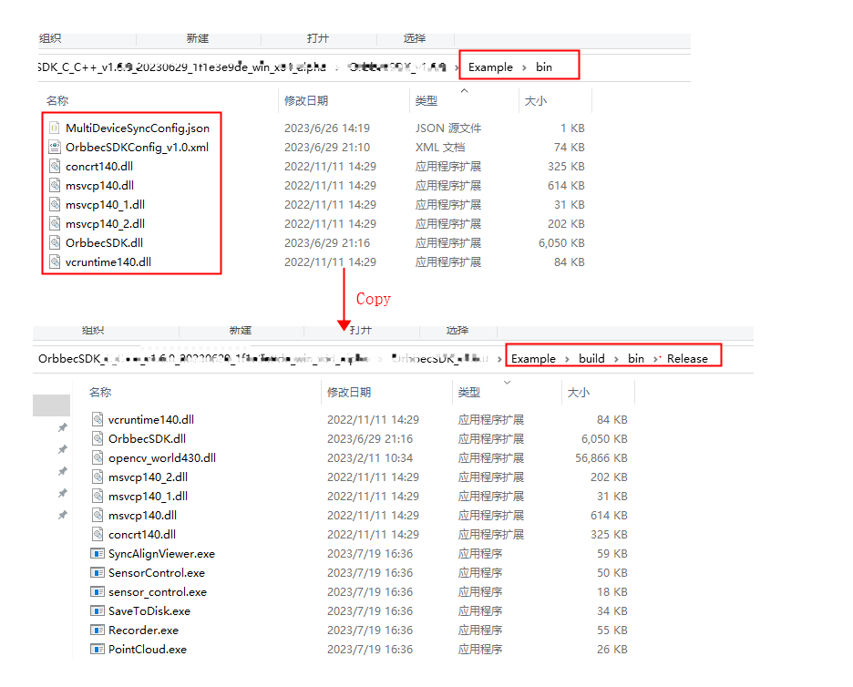
* 运行 OBHelloOrbbec 工程，结果如下所示，至此第一个 Example 就运行成功了。

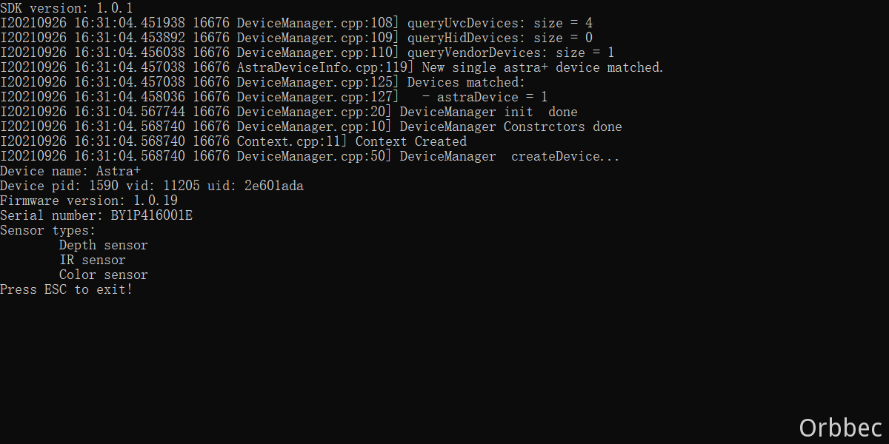

# linux 环境配置

首先下载 Linux 或 ARM 的 OrbbecSDK，然后按照以下步骤进行编译。

## 1、系统环境配置

* 安装 libudev 库：

```bash
sudo apt install libudev-dev
```

* 安装 libusb 库：

```bash
sudo apt install libusb-dev
```

## 2、USB 访问权限配置

Linux 系统默认对 USB 设备的直接访问需要 root 权限，可以通过 rules 配置文件解决。在 OrbbecSDK 发布的文件解压后，在 Script 目录下会有一个 “99-obsensor-libusb.rules” 配置文件和 “install_udev_rules.sh” 安装脚本，通过 sudo 命令执行 “install_udev_rules.sh” 脚本，即可完成 rules 配置文件的安装。

方法如下： 首先修改 “install_udev_rules.sh” 安装脚本的执行权限。

```bash
sudo chmod +x ./install_udev_rules.sh
sudo ./install_udev_rules.sh
```

成功执行安装脚本后，再接入设备时生效（已接入的设备需要重新拔插）。

## 3. USBFS 缓存大小配置（可选）

默认情况下，USBFS 缓存大小为 16 MB。此值不足以用于高分辨率图像或多个流和多个设备使用。用户可以将缓存大小增加到 128 MB。

### 检查 USBFS 缓存大小

```bash
cat /sys/module/usbcore/parameters/usbfs_memory_mb
```

### 临时增加 USBFS 缓存大小

```bash
sudo sh -c 'echo 128> /sys/module/usbcore/parameters/usbfs_memory_mb'
```

### 永久增加 USBFS 缓存大小

要永久增加缓存大小，请将内核参数 usbcore.usbfs_memory_mb=128 添加到引导加载程序配置中。如何做到这一点取决于系统上的引导加载程序。

对于 GRUB2（最常见）：

1. 打开 `/etc/default/grub`， 将：`GRUB_CMDLINE_LINUX_DEFAULT="quiet splash"`（或引号内的其他内容，取决于您的系统）替换为：`GRUB_CMDLINE_LINUX_DEFAULT="quiet splash usbcore.usbfs_memory_mb=128"`
2. 更新 grub

   ```bash
    sudo update-grub
   ```
3. 重启你的系统

其他引导加载程序：配置其他引导加载程序的附加内核参数，请参阅您的引导加载程序手册。

## 4. 验证设备状态

* 环境准备：ubuntu18.04 x64 desktop
* 以 Astra + 为例，使用 USB 3.0 Type-C 数据线，用于与 PC 机连接。
* 使用 lsusb 命令，查看是否 PC 系统有正确识别到相机。

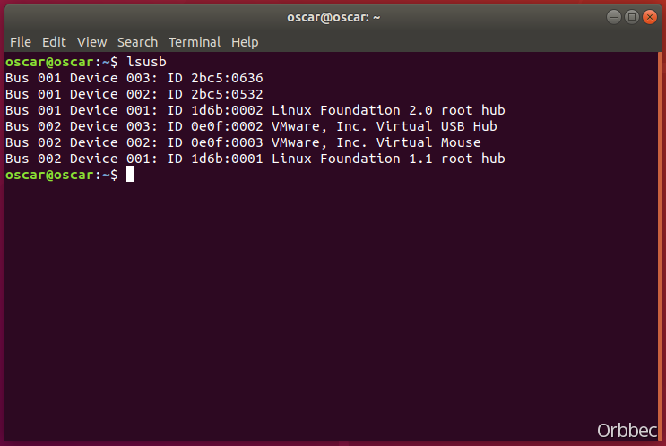

* 通过 PID&VID 来判断相机是否正常被识别
  VID：2bc5 PID：0536(彩色相机)
  VID：2bc5 PID：0636(深度相机)

## 5. Linux Sample 编译

在 OrbbecSDK 目录下新建一个 build 目录，如下：


```bash
cd OrbbecSDK
mkdir build
cd build
cmake ..
make
```

# Mac 环境配置

### 安装 Xcode 和 Homebrew

1. **安装 Xcode**:

   - Xcode 是Apple提供的官方开发工具，其中包含C++编译器.
   - 您可以从 Mac App Store 免费下载.
   - 安装Xcode还将安装命令行工具，其中包括GCC编译器和其他开发工具.
2. **安装 Homebrew**:

   - Homebrew 是 macOS 的包管理器，可用于安装各种开发工具和库.
   - 安装 Homebrew，请在终端中执行以下命令:
     ```bash
     /bin/bash -c "$(curl -fsSL https://raw.githubusercontent.com/Homebrew/install/HEAD/install.sh)"
     ```
   - 使用 Homebrew，您可以轻松安装其他开发工具，例如 Git.

这些步骤将设置在 macOS 上进行 C++ 开发所需的基本工具.

### 安装依赖项

```bash
brew install cmake opencv
```

### 编译并运行示例

```bash
cd OrbbecSDK
mkdir build
cd build
cmake .. && make -j8
make install
cd install/bin
sudo ./OBHelloOrbbec
```

# 常见 FAQ

[常见问题 FAQ](https://developer.orbbec.com.cn/technical_library.html?id=59)
