# 安装指南
本文档描述如何在Windows和Linux操作系统上通过安装包安装Orbbec SDK。

## Windows 安装指南

从 [https://github.com/orbbec/OrbbecSDK/releases](https://github.com/orbbec/OrbbecSDK/releases) 下载安装程序 `OrbbecSDK_v1.x.x_win64.exe`。

安装过程如下：

1. 双击.exe文件，弹出以下对话框：

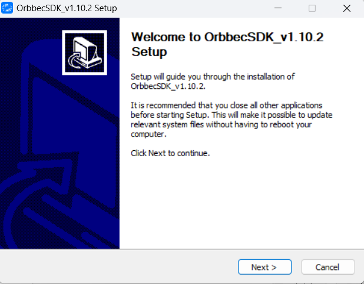

2. 点击“下一步”，弹出以下对话框：

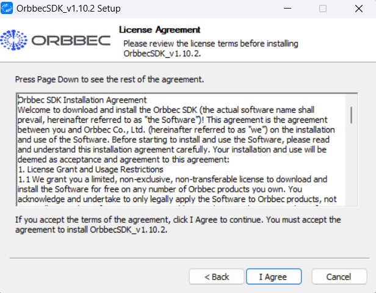

3. 点击“我同意”，弹出以下对话框：

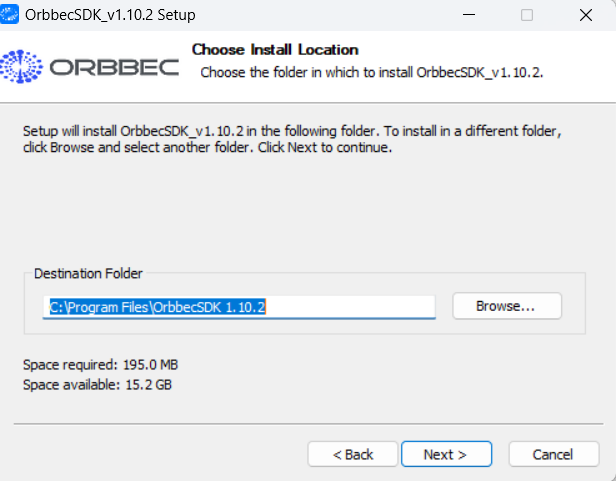

4. 再次点击“下一步”：

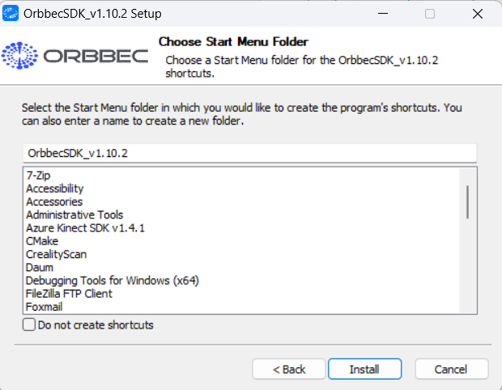

5. 点击“安装”并等待安装完成。

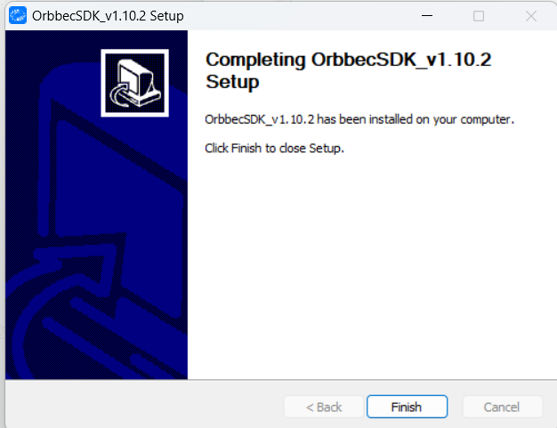

6. 安装完成后，Orbbec SDK安装目录中的文件如下：

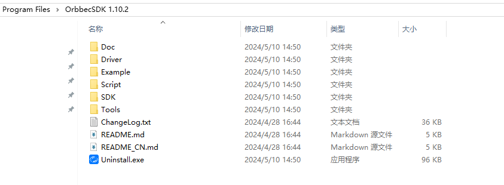

可以通过桌面快捷方式访问Orbbec Viewer。


## Linux /Arm64 安装指南

### 通过.deb包安装

.deb包下载链接：[https://github.com/orbbec/OrbbecSDK/releases](https://github.com/orbbec/OrbbecSDK/releases)

`OrbbecSDK_v1.x.x_amd64.deb`是Linux x64的安装包。

`OrbbecSDK_v1.x.x_arm64.deb`是ARM 64的安装包。

1. 在Linux x64 (ubuntu)平台上，使用以下命令安装：

```bash
sudo dpkg -i OrbbecSDK_v1.x.x_amd64.deb
```

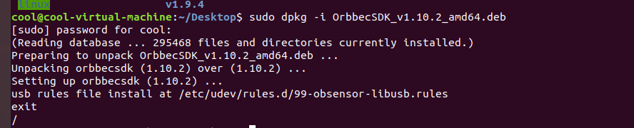

2) 使用`dpkg -L orbbecsdk`检查Orbbec SDK的整个包路径，而Orbbec SDK的头文件和库文件将被安装在`/usr/local`路径中。

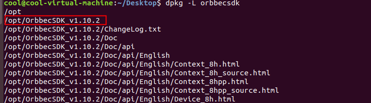

3) 输入`OrbbecViewer`来运行Orbbec Viewer。

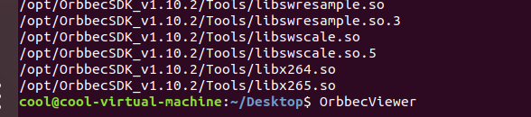

### 通过Debian Apt仓库安装

1) 在终端中，输入以下命令以获取并添加用于验证的公钥：

```bash
wget -O - http://s3.amazonaws.com/orbbec-debian-repos-aws/repos/orbbec_sdk/pub_key.pub | sudo apt-key add -
```

* 通过输入以下命令检查公钥是否成功添加：

```bash
apt-key list
```

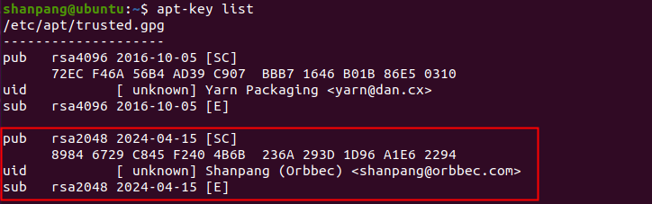

如果出现域名无法解析的问题，尝试以下命令重启系统DNS解析服务并重试第一个命令：

```bash
sudo systemctl restart systemd-resolved
```

2) 在终端中，输入以下命令添加apt源更新地址：

```bash
echo "deb http://s3.amazonaws.com/orbbec-debian-repos-aws/repos/orbbec_sdk stable main" | sudo tee /etc/apt/sources.list.d/orbbec-orbbecsdk.list
```

3) 通过以下命令可以查询orbbecsdk：

```bash
sudo apt update
sudo apt search orbbecsdk
```

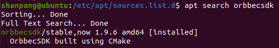

4) 通过`dpkg -L orbbecsdk`检查Orbbec SDK的安装目录，通过输入`OrbbecViewer`命令，您可以运行Orbbec Viewer。