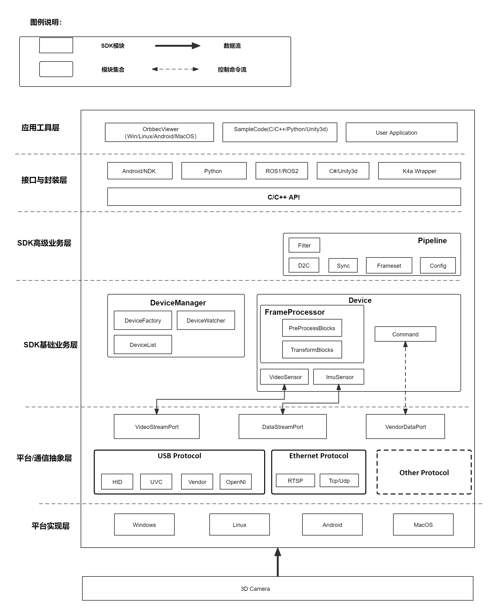
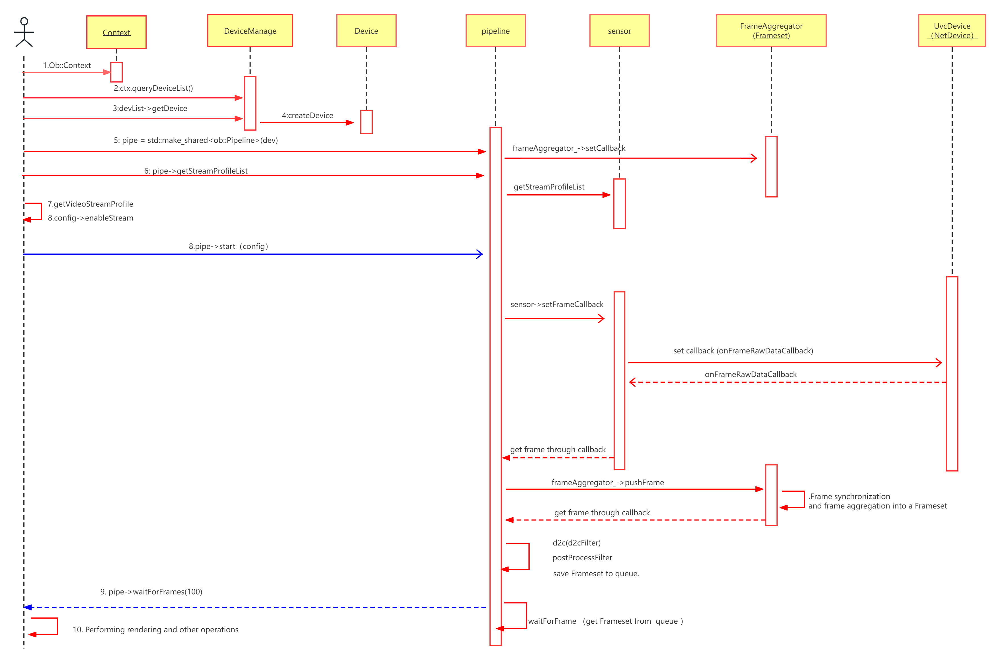

# 概述
欢迎阅读Orbbec SDK（以下简称“SDK”）的使用教程！SDK 不仅提供了简洁的高阶API，又提供全面、灵活的低阶API，能够让您更快速的了解和使用奥比中光3D传感摄像头。
# 功能介绍
Orbbec SDK是针对奥比中光结构光、双目、iToF等3D传感摄像头，提供设备参数配置、数据流读取和流处理的，跨平台（Windows、Android、Linux）的软件开发包。

**核心功能：**

- 深度相机的访问及相关参数设置
- RGB相机的访问及相关参数设置（例如：曝光和白平衡）
- 传感器的访问及相关参数设置（例如：陀螺仪和加速度计）
- 帧同步及对齐的控制
- 点云数据
- 滤波等算法能力
- 多操作系统及Wrapper的支持。

**亮点：**

- “薄”：提供最少层级、高性能获取设备数据的能力
- “灵活”：模块化传感器功能，灵活组合不同设备
- “高可扩展”：支持日益多样化形态的设备及系统，以及插件化算法适用于不同场景

SDK 中包含的内容：

| **内容** | **描述** |
| --- | --- |
|  代码示例 | 这些简单的示例演示了如何轻松使用 SDK 将访问相机的代码片段包含到您的应用程序中。包括彩色流、深度流、点云、对齐、录制等。 |
|  工具 | OrbbecViewer：演示使用SDK控制3D传感摄像头的主要基础功能和参数配置的工具，旨在帮助开发者快速了解、验证SDK和3D传感摄像头的能力。借助此应用程序，您可以快速访问您的深度摄像头，以查看深度流、可视化点云、录制和回放数据流、配置您的摄像头设置。 |

# SDK 架构

**应用工具层**

OrbbecViewer，Sample 及用户应用实现。

**接口封装层**

OrbbecSDK 接口封装及 wrapper的封装。

**高级业务层**

HighLevel 对核心业务组件进行封装，使用pipeline 对外提供接口。

**基础业务层**

核心业务逻辑框架实现。

**平台/通信抽象层**

跨平台组件屏蔽各个操作系统差异实现，提供统一访问方式。

**平台实现层**

各个平台的的驱动实现。

# SDK 视频流获取时序图 

注：其中标了序号的是对外的接口，没有标明序号的是内部接口。

# SDK 常用概念 

**Context** 

环境上下文，初始化时最先创建的对象，可进行一些设置，包括但不限于设备状态改变回调、日志等级等等的设置。Context可以访问多个Device。

**Device** 

一台实际硬件设备对应一个Device对象。用来获取设备相关信息和控制设备的属性。

**Sensor** 

Sensor 可以理解为实际设备的子设备，比如对应Color Sensor、IR Sensor、Depth Sensor、IMU Sensor等等。一个Device可以包含多个Sensor。

**Stream** 

Stream 代表数据流，一般一个Sensor会输出一种或者多种数据流，数据流由一系列的时间序列帧。Frame组成。针对Stream, 用StreamProfile来描述单独流配置。

**Frame** 

代表Stream中的一帧数据，也包含了该帧数据的相关信息，如时间戳、类型等。
**FrameSet** 

代表同一时间戳下面的不同类型Frame的组合，比如Color Frame、Depth Frame的组合。

**Pipeline** 

HighLevel对应的对象，封装了快速访问SDK的接口，功能简单，可以让用户快速地上手和使用SDK。

**Filter** 

主要是针对复合流FrameSet的一些算法处理模块，例如：点云的算法处理。

