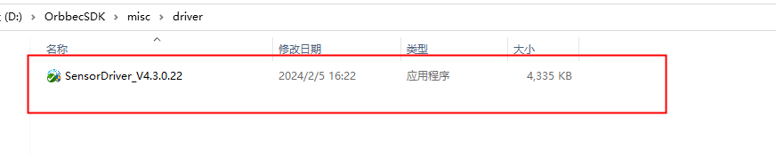
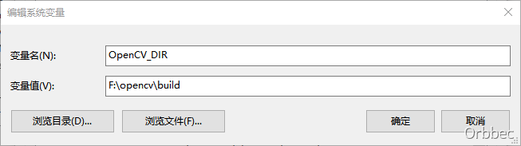
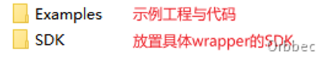
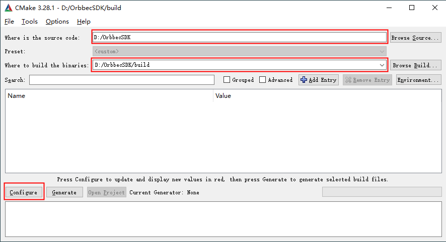
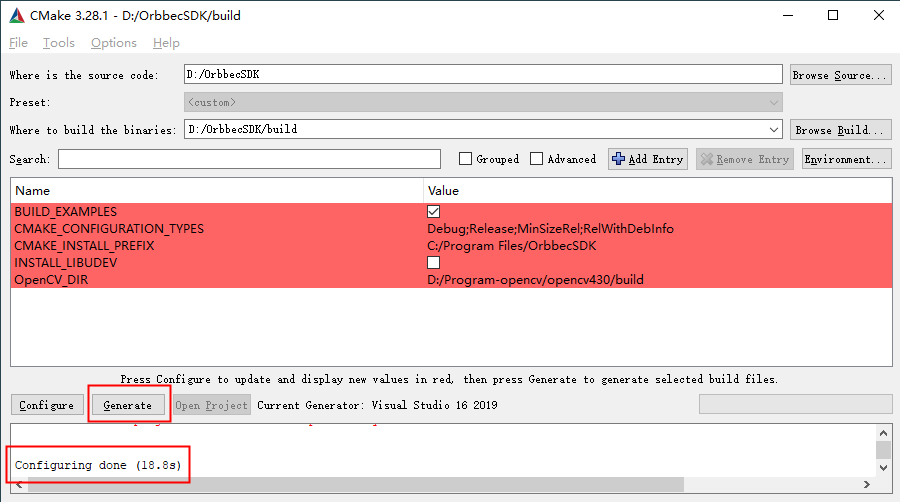
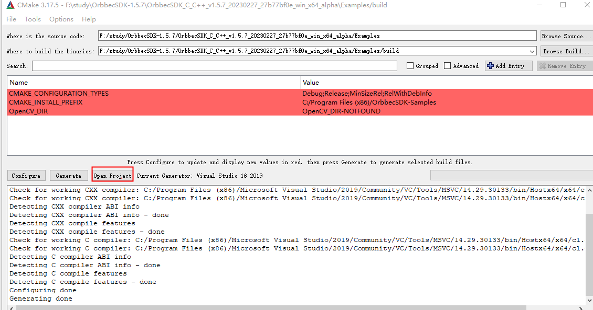
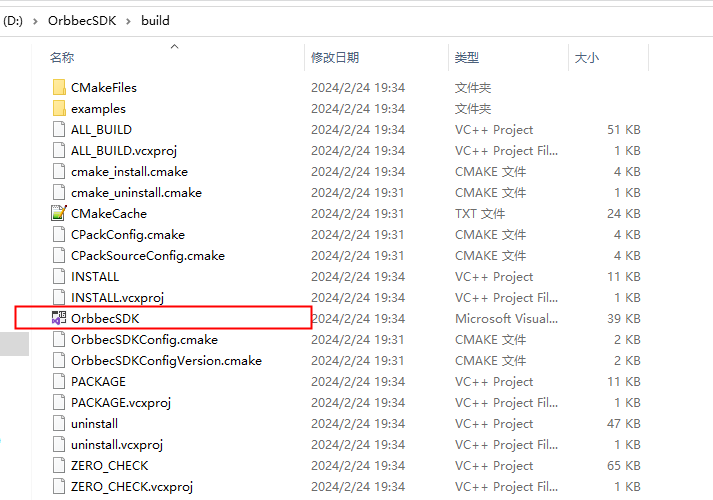
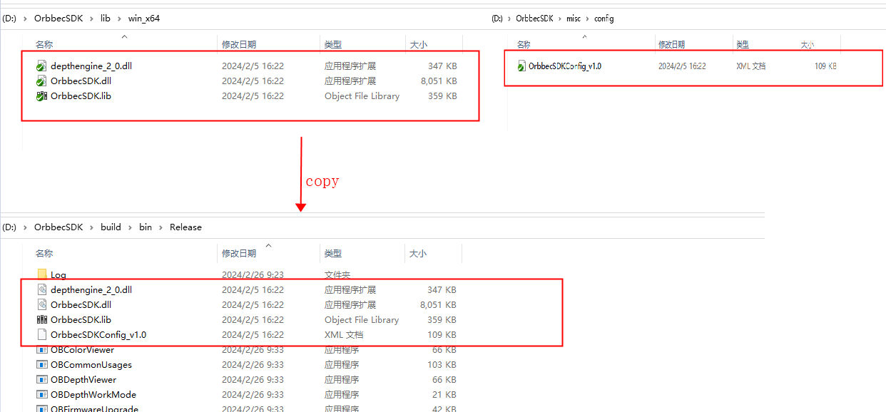
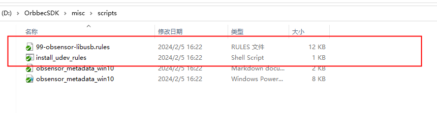
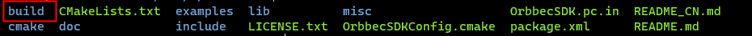

<!-- 本文档面向开发者 -->
# introduction
This document introduces the installation of OrbbecSDK dependencies and the compilation instructions of OrbbecSDK Sample.

# install dependency
The Orbbec SDK is compatible with the standard UVC protocol, and the standard UVC used by Gemini2、Femto 、Femto W、Femto Mega、Astra+ device, so no additional drivers are required.

## 1. install driver

Dabai, Dabai DCW, Dabai DW, Astra mini Pro, Astra Pro Plus, A1 Pro, Gemini E, Gemini E Lite, Gemini These use the private protocol of openni and need to install private drivers.
The directory of the openni driver is as follows: double-click the following .exe image directory to install the driver. 

## 2. Configure OpenCV (Examples dependency)

Data rendering relies on the third-party library OpenCV. Here we take OpenCV 4.3.0 as an example to demonstrate the installation configuration 
Execute the OpenCV installation file, select the directory where opencv is to be installed, and click extract to execute the installation. 

2)Add the path of OpenCV in the environment variables of the system, enter OpenCV_DIR for the variable name, pay attention to the capitalization of the letters, and the variable value is the path to the build folder of the OpenCV installation directory； 

## 3. Generate your first application
Software dependency: VisualStudio2019, cmake 3.10 and above 1) Download/obtain our SDK software package. The storage location is assumed to be the root directory of Disk D: "D:/V1.5.7". The directory structure is as follows: 

)

2)Open Cmake and set the "Examples" folder as the code path, and the "build" folder under "Examples" as the path to generate the binary file, as shown in the figure below. If there is no build under Examples, you need to create a new folder. 

3)Click "Configure" and select the corresponding Visual Studio version and platform version, then click "Finish", as shown below: 

4)Click "Generate", as shown below: 

5)The Sample project can be opened in the following two ways Method 1: With cmake, click the "Open Project" button to open the Visual Studio project 

Method 2: In the folder, directly start the Visual Studio project in Examples/build, as shown in the figure below.

6)Open the Examples project interface as shown below: 

(7) Select the project you want to run, right click and "set as startup project", select release and 64-bit version at the run option；  

 8) Connect the device to the host 
9) Copy the dll files from the bin directory of the Examples folder to the build folder where the generated executables located at , and then run the project.

# Linux
## 1. System environment configuration
1)Install libudev library: sudo apt install libudev-dev 2) Install libusb library: sudo apt install libusb-dev

## 2. USB access rights configuration
By default, direct access to USB devices in Linux systems requires root privileges, which can be resolved through the rules configuration file. After the files released by OrbbecSDK are decompressed, there will be a "99-obsensor-libusb.rules" configuration file and "install.sh" installation script in the root directory. Run the "install.sh" script through the sudo command to complete the rules Installation of configuration files. In addition, if the "install.sh" installation script does not have execution permission, it can be solved by changing the command: "sudo chmod +x ./install.sh". After the installation script is successfully executed, it will take effect when the device is connected again (the connected device needs to be re-plugged). 

## 3. Verify device status
1)Environment preparation: ubuntu18.04 x64 desktop 2) Take Astra+ as an example, use USB 3.0 Type-C data cable to connect with PC. 3) Use the lsusb command to check if the PC system correctly recognizes the camera 

 4) Judge whether the camera is recognized normally by PID&VID VID: 2bc5 PID: 0532 (color camera) VID: 2bc5 PID: 0636 (depth camera)

## 4、Linux Sample compile
Create a build directory in the Examples directory, as follows:
 
cd build  
cmake ..  
make  

# Frequently Asked Question

[FAQ](https://developer.orbbec.com.cn/technical_library.html?id=59)  

