# Installation guidance
This document describes how to install the Orbbec SDK via installation packages on both Windows and Linux.

## Windows Installation guidance

Download the installer "OrbbecSDK_v1.x.x_win64.exe" from [https://github.com/orbbec/OrbbecSDK/releases](https://github.com/orbbec/OrbbecSDK/releases).

The installation process is as follows:

1. Double-click the .exe file, and the following dialog box will pop up:

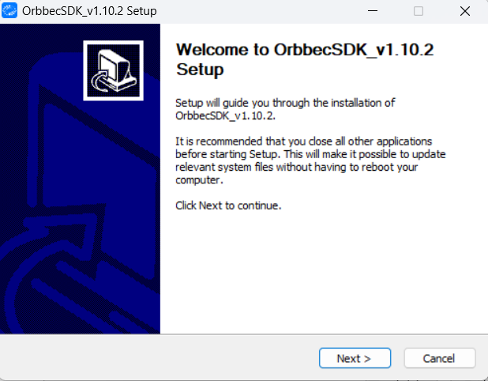

2. Click "Next", and the following dialog box will pop up:

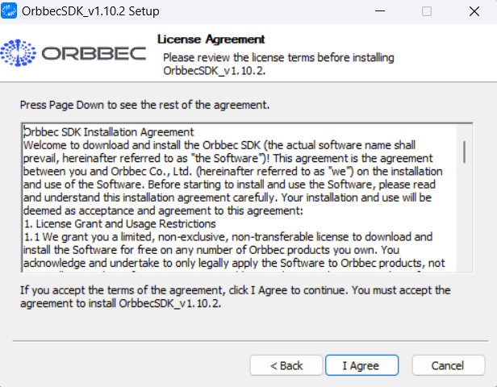

3. Click "I Agree", and the following dialog box will pop up:

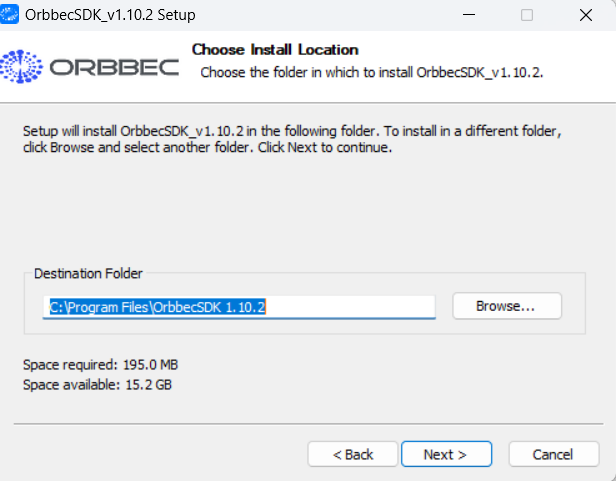

4. Click "Next" again:

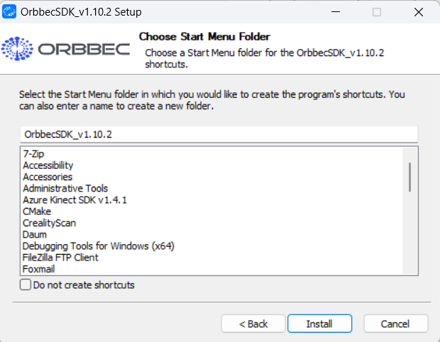

5. Click "Install" and wait for the installation to complete.

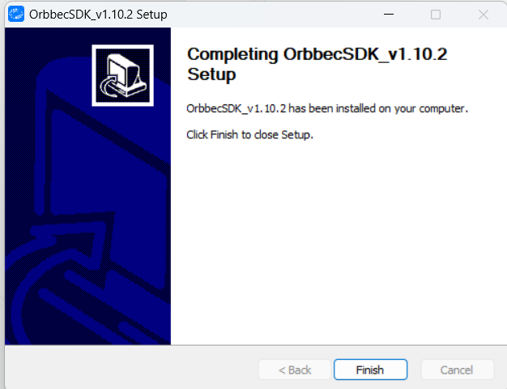

6. After the installation, the files in the Orbbec SDK installation directory are as follows:

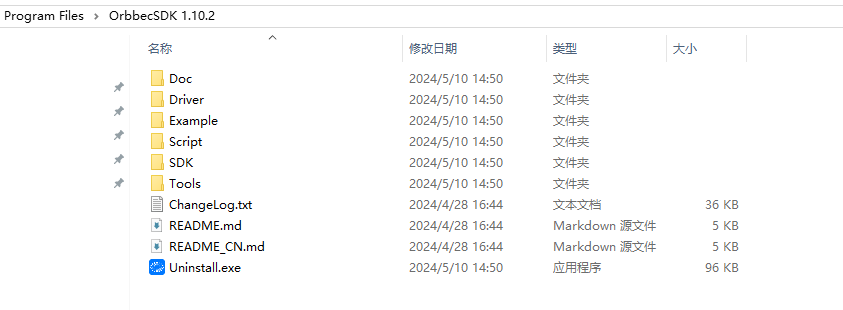

The Orbbec Viewer  can be accessed via the desktop shortcut.


## Linux /Arm64 Installation guidance

### Install via .deb Package

.deb package download link: [https://github.com/orbbec/OrbbecSDK/releases](https://github.com/orbbec/OrbbecSDK/releases)

OrbbecSDK_v1.x.x_amd64.deb is the installation package for Linux x64, and OrbbecSDK_v1.x.x_arm64.deb is the installation package for Arm64.

1. On the Linux x64 (ubuntu) platform, install using the following command:

```bash
sudo dpkg -i OrbbecSDK_v1.x.x_amd64.deb
```

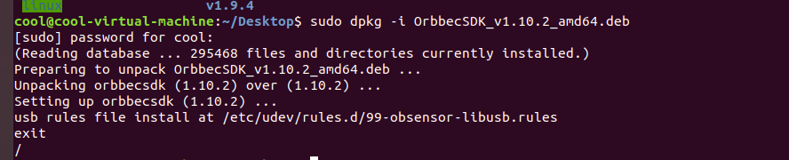

2) Check the entire package path of the Orbbec SDK using `dpkg -L orbbecsdk`, while the header files and library files of the Orbbec SDK will be installed in the `/usr/local` path.

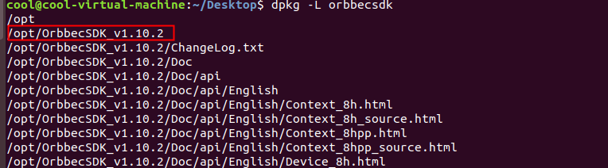

3) Enter `OrbbecViewer` to run the Orbbec Viewer.

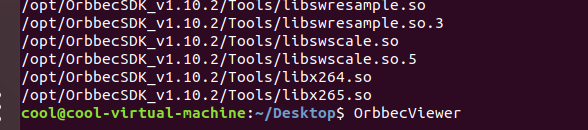

### Install via Debian Apt Repository

1) In the terminal, enter the following command to obtain and add the public key used for verification:

```bash
wget -O - http://s3.amazonaws.com/orbbec-debian-repos-aws/repos/orbbec_sdk/pub_key.pub | sudo apt-key add -
```

* Check if the public key was added successfully by entering:

```bash
apt-key list
```

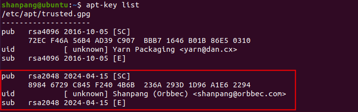

If there is a problem with the host not resolving, try the following command to restart the system DNS resolution service and retry the first command:

```bash
sudo systemctl restart systemd-resolved
```

2) In the terminal, enter the following command to add the apt source update address:

```bash
echo "deb http://s3.amazonaws.com/orbbec-debian-repos-aws/repos/orbbec_sdk stable main" | sudo tee /etc/apt/sources.list.d/orbbec-orbbecsdk.list
```

3) The following command can be used to query Orbbec SDK:

```bash
sudo apt update
sudo apt search orbbecsdk
```

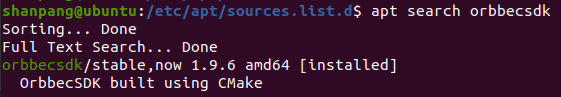

4) Check the installation directory of the Orbbec SDK through `dpkg -L orbbecsdk`, and by entering the `OrbbecViewer` command, you can run the Orbbec Viewer .
