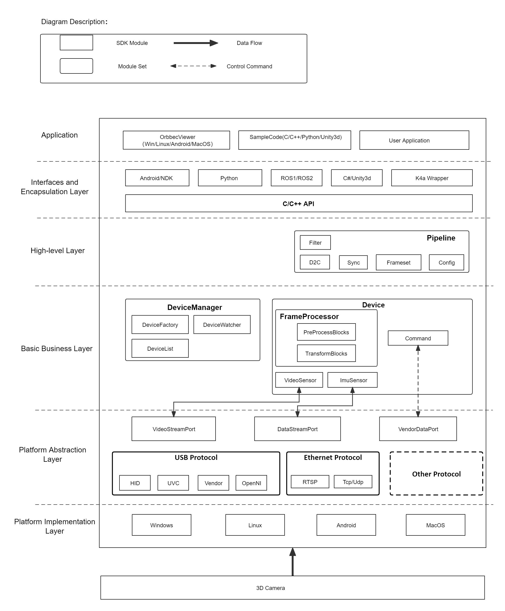
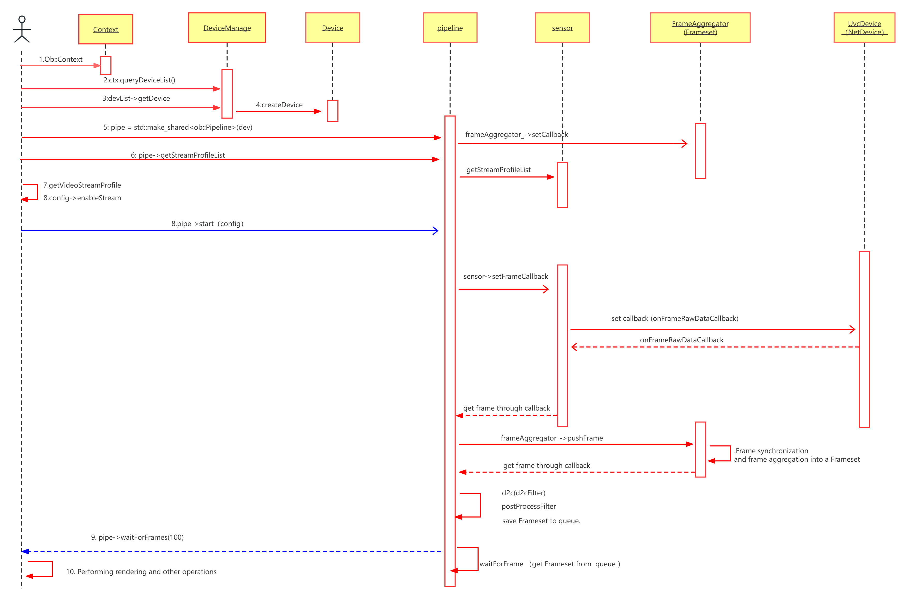

# Overview
Welcome to the Orbbec SDK (hereinafter referred to as "SDK") tutorial! The SDK not only provides a concise high-level API, but also a flexible and comprehensive low-level API to help you use and quickly understand Orbbec 3D cameras in detail. 

# Features
Orbbec SDK is a cross-platform (Windows, Android, Linux) software development kit that provides device parameter configuration, data stream reading and stream processing for 3D sensing cameras such as Orbbec structured light, binocular, and iToF.

**Core functions: **

- Depth camera access and related parameter settings 
- RGB camera access and related parameter settings (eg exposure and white balance) 
- Sensor access and related parameter settings (eg gyroscope and accelerometer) 
- Frame synchronization and alignment control 
- Point cloud data 
- Algorithmic capabilities such as filtering 
- Multi-OS and Wrapper support. 

**Highlights:**

SDK design goals: thin + flexible + high scalability. 

- "Thin": Provides the ability to obtain device data at the minimum level and high performance 
- "Flexible": Modular sensor function, flexible combination of different devices 
- "Highly Scalable": Supports increasingly diversified devices and systems, and plug-in algorithms for different scenarios 

What's included in the SDK:

| Content | Description                                                  |
| --- | --- |
| Code example | These simple examples demonstrate how to easily use the SDK to include code snippets that access the camera into your application. Includes color flow, depth flow, point cloud, alignment, recording, and more.  |
| tool | OrbbecViewer: A tool that demonstrates the main basic functions and parameter configuration of the 3D sensing camera using the SDK to help developers quickly understand and verify the capabilities of the SDK and the 3D sensing camera. With this application, you can quickly access your depth camera to view the depth stream, visualize point clouds, record and playback data streams, configure your camera settings.  |

# SDK Architecture

**Application**

OrbbecViewer, Sample, and User Application Implementation.

**Interfaces and Encapsulation Layer**

OrbbecSDK Interface Encapsulation and Wrapper Encapsulation.

**High-level Layer**

HighLevel encapsulates the core business components and provides interfaces to the outside using a pipeline.

**Basic business layer**

The realization of the core business logic framework.

**Platform abstraction layer**

Cross-platform components shield the implementation of different operating systems and provide a unified access method. 

**Platform implementation layer**

The driver implementation of each platform.

# SDK Frame Acquisition Sequence Diagram 

Note: The interfaces labeled with numbers are external interfaces, while the ones without numbers are internal interfaces.

# SDK Concepts 

**Context** 

Context which provides a set of settings includes settings such as device state change callbacks, log levels, and more. The Context can access multiple devices.

**Device** 

One actual hardware device corresponds to one Device object, which is used to obtain relevant information of the device and control its attributes.

**Sensor** 

A Sensor can be understood as a sub-device of the actual device, corresponding to Color Sensor, IR Sensor, Depth Sensor, IMU Sensor, etc. One Device can contain multiple Sensors.

**Stream** 

Stream represents a data flow. Generally, a Sensor can output one or more types of data flows, which are composed of a series of time-sequenced Frames. For Stream, StreamProfile is used to describe the configuration of an individual stream.

**Frame** 

Represents a frame of data in the Stream, and also contains relevant information about that frame of data, such as timestamp, type, etc.

**FrameSet** 

Represents a combination of different types of Frames with the same timestamp, such as a combination of Color Frame and Depth Frame.

**Pipeline** 

The HighLevel corresponding object encapsulates the interface for quick access to the SDK. It has simple functions that allow users to quickly get started and use the SDK.

**Filter** 

It mainly refers to some algorithmic processing modules for the composite stream FrameSet, such as point cloud algorithm processing.
