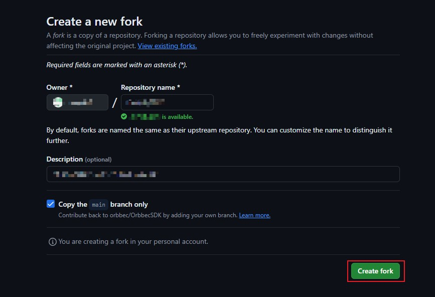
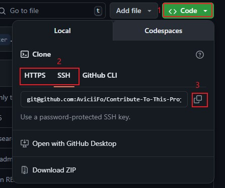
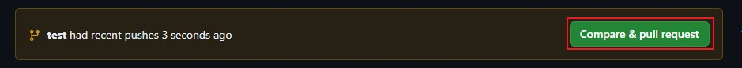
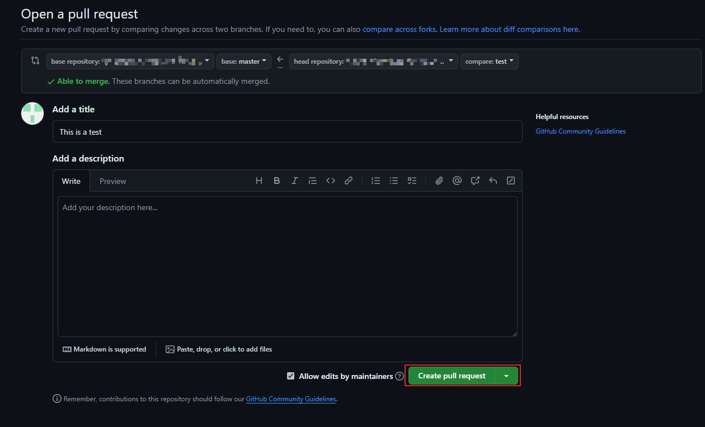

# Contributing to Orbbec SDK

If you would like to contribute to this source project, please follow these steps:

**Step1:Fork the repository**

- This step is to ensure that make a copy of this project and place it in your own GitHub account.
- Repository is Github's way of raising usage items, and fork is its copy
- Make sure you are on the Orbbec SDK repository's [main page](https://github.com/orbbec/OrbbecSDK-dev).



- Now, you have a copy of the repository in your own GitHub account.
Please switch to the fork in your own account.


**Step2:Clone the repository**
- You can use HTTPS or SSH to clone the repository.Copy the URL of the repository you want to clone.


- Go back to your local folder and open git bash.

```bash
git clone https://github.com/orbbec/OrbbecSDK-dev.git
```

**Step3:Create a new branch**

- After clone the repository, switch to the repository folder.

```bash
cd OrbbecSDK-dev
```

- Create a new branch to work on. `your_branch_name` is a custom name

```bash
git checkout -b your_branch_name
```

**Step4:Commit your changes**

- If you have changed something, you can use `git status` to check the status of your repository.
- Your changes to the file need to be uploaded to the branch `your_branch_name` , use `git add <filename>` or `git add .` to add all the changes to the branch.
-Then use `git commit -m "your commit message"` to commit your changes.

**Step5:Push your changes to GitHub**

- Now you can use `git push origin your_branch_name` to push your changes to GitHub.

**Step6:Submit a PR(Pull Request)**

- After successfully pushing the change file into your fork repository, back to you fork in Github, then you can submit the PR to the main repository.


- After filling in the title and description, you can click `Create pull request`


- Finally, you've done all the steps, and we will approve your PR after the reviewers have checked it.

## **Thank you for your contributions！**
