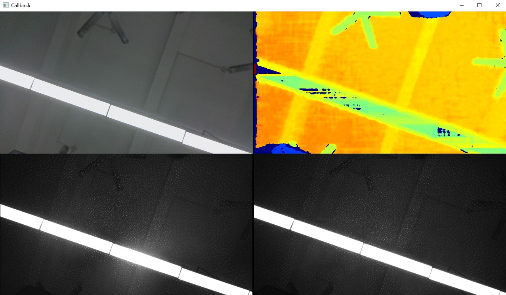

# C++ Sample: 1.stream.callback

## Overview

In this sample,user can get the depth、RGB、IR image.This sample also support users can perform user-defined operations such as data acquisition, data processing, and data modification within the callback function.

### Knowledge

Pipeline is a pipeline for processing data streams, providing multi-channel stream configuration, switching, frame aggregation, and frame synchronization functions.

Device is a class that can be used to get device information, parameters, and a list of contained sensors.

Sensor can be used to obtain different components of the camera and the stream of the component, for example, RGB, IR, Depth stream can be obtained through the RGB, IR, Depth sensor.

## code overview

1. Create the pipeline instance using the default configuration and create a config instance to enable or disable the streams.Get the device instance from pipeline,and then get the sensor instance from device.

    ```c++
        // Create a pipeline.
        ob::Pipeline pipe;

        // Configure which streams to enable or disable for the Pipeline by creating a Config.
        std::shared_ptr<ob::Config> config = std::make_shared<ob::Config>();

        // Get device from pipeline.
        auto device = pipe.getDevice();

        // Get sensorList from device.
        auto sensorList = device->getSensorList();
    ```

2. Get only the sensor for the VideoStream,enable the stream from these sensor.

    ```c++
        for(uint32_t index = 0; index < sensorList->getCount(); index++) {
                // Query all supported infrared sensor type and enable the infrared stream.
                // For dual infrared device, enable the left and right infrared streams.
                // For single infrared device, enable the infrared stream.
                OBSensorType sensorType = sensorList->getSensorType(index);

                // exclude non-video sensor type
                if(!ob::TypeHelper::isVideoSensorType(sensorType)) {
                    continue;
                }

                // Enable the stream for the sensor type.
                config->enableStream(sensorType);
            }
    ```

3. In this callback function, you can add what you want to do with the data.Avoid performing complex computational operations within callback functions; prolonged operations can lead to data frame drops. It is recommended to use a queue for processing.

    ```c++
        // Start the pipeline with callback.
        pipe.start(config, [&](std::shared_ptr<ob::FrameSet> output) {
            std::lock_guard<std::mutex> lock(framesetMutex);
            frameset = output;
        });
    ```

4. Render window

    ```c++
        while(win.run()) {
            std::lock_guard<std::mutex> lock(framesetMutex);

            if(frameset == nullptr) {
                continue;
            }

            // Rendering display
            win.pushFramesToView(frameset);
        }
    ```

5. stop pipeline

    ```c++
        // Stop the Pipeline, no frame data will be generated
        pipe.stop();
    ```

## Run Sample

If you are on Windows, you can switch to the directory `OrbbecSDK-dev/build/win_XX/bin` to find the `ob_callback.exe`.

If you are on linux, you can switch to the directory `OrbbecSDK-dev/build/linux_XX/bin` to find the `ob_callback`.

### Key introduction

Press the Esc key in the window to exit the program.

### Result


