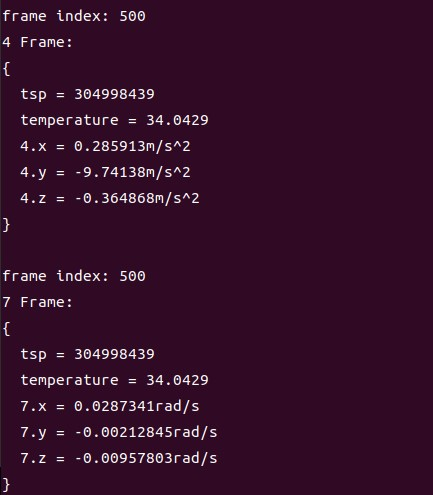

# C++ Sample: 1.stream.imu

## Overview

Use the SDK interface to obtain the camera's internal imu data and output it

### Knowledge

AccelFrame measures the acceleration of x, y, and z in m/s^2
GyroFrame measures the angular velocity of x, y, and z in rad/s

Frameset is a combination of different types of Frames.imu data stream can be obtained through frameset

## code overview

1. Configure output imu related information and open stream.You must configure this before calling pipe.start().

    ```cpp

        // Configure which streams to enable or disable for the Pipeline by creating a Config.
        std::shared_ptr<ob::Config> config = std::make_shared<ob::Config>();

        // Enable Accel stream.
        config->enableAccelStream();

        // Enable Gyro stream.
        config->enableGyroStream();

        // Only FrameSet that contains all types of data frames will be output.
        config->setFrameAggregateOutputMode(OB_FRAME_AGGREGATE_OUTPUT_ALL_TYPE_FRAME_REQUIRE);

    ```

2. Instantiate pipeline, configure output imu related information and open stream

    ```cpp
        auto accelFrameRaw    = frameSet->getFrame(OB_FRAME_ACCEL);
        auto accelFrame       = accelFrameRaw->as<ob::AccelFrame>();
        auto accelIndex       = accelFrame->getIndex();
        auto accelTimeStampUs = accelFrame->getTimeStampUs();
        auto accelTemperature = accelFrame->getTemperature();
        auto accelType        = accelFrame->getType();
        if(accelIndex % 50 == 0) {  // print information every 50 frames.
            auto accelValue = accelFrame->getValue();
            printImuValue(accelValue, accelIndex, accelTimeStampUs, accelTemperature, accelType, "m/s^2");
        }

        auto gyroFrameRaw    = frameSet->getFrame(OB_FRAME_GYRO);
        auto gyroFrame       = gyroFrameRaw->as<ob::GyroFrame>();
        auto gyroIndex       = gyroFrame->getIndex();
        auto gyroTimeStampUs = gyroFrame->getTimeStampUs();
        auto gyroTemperature = gyroFrame->getTemperature();
        auto gyroType        = gyroFrame->getType();
        if(gyroIndex % 50 == 0) {  // print information every 50 frames.
            auto gyroValue = gyroFrame->getValue();
            printImuValue(gyroValue, gyroIndex, gyroTimeStampUs, gyroTemperature, gyroType, "rad/s");
        }
    ```

## Run Sample

Press the Esc key in the window to exit the program.

### Result


