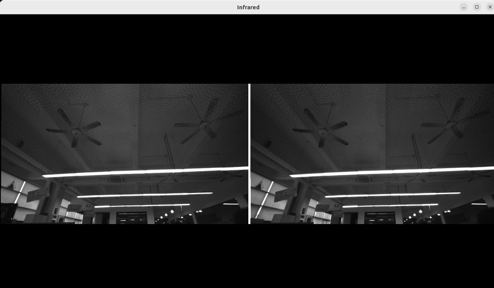

# C++ Sample: 1.stream.infrared

## Overview

Use the SDK interface to obtain the camera IR stream and display it in the window

### Knowledge

Pipeline is a pipeline for processing data streams, providing multi-channel stream configuration, switching, frame aggregation, and frame synchronization functions.

## code overview

1. Configure IR sensor related information and enable the IR stream.You must configure this before calling pipe.start().

    ```cpp
        // Get the device from pipeline.
        std::shared_ptr<ob::Device> device = pipe.getDevice();

        // Get the sensor list from device.
        std::shared_ptr<ob::SensorList> sensorList = device->getSensorList();

        // Create a config for pipeline.
        std::shared_ptr<ob::Config> config = std::make_shared<ob::Config>();

        for(uint32_t index = 0; index < sensorList->getCount(); index++) {
            // Query all supported infrared sensor type and enable the infrared stream.
            // For dual infrared device, enable the left and right infrared streams.
            // For single infrared device, enable the infrared stream.
            OBSensorType sensorType = sensorList->getSensorType(index);
            if(sensorType == OB_SENSOR_IR || sensorType == OB_SENSOR_IR_LEFT || sensorType == OB_SENSOR_IR_RIGHT) {
                // Enable the stream with specified profile;
                config->enableVideoStream(sensorType, OB_WIDTH_ANY, OB_HEIGHT_ANY, 30, OB_FORMAT_ANY);
            }
        }
    ```

2. Open the window and output the IR stream

    ```cpp
        ob_smpl::CVWindow win("Infrared", 1280, 720, ob_smpl::ARRANGE_ONE_ROW);
        while(win.run()) {
        // Wait for up to 100ms for a frameset in blocking mode.
            auto frameSet = pipe.waitForFrameset(100);
            if(frameSet == nullptr) {
                continue;
        }

        // Render a set of frame in the window.
        win.pushFramesToView(frameSet);
        }
    ```

## Run Sample

Press the Esc key in the window to exit the program.

### Result


