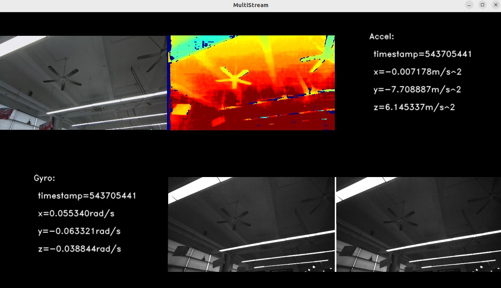

# C++ Sample: 1.stream.multi_streams

## Overview

Use SDK to obtain multiple camera data streams and output them

### Knowledge

Pipeline is a pipeline for processing data streams, providing multi-channel stream configuration, switching, frame aggregation, and frame synchronization functions.

Device is a class that can be used to get device information, parameters, and a list of contained sensors.

Sensor can be used to obtain different components of the camera and the stream of the component, for example, RGB, IR, Depth stream can be obtained through the RGB, IR, Depth sensor.

Frameset is a combination of different types of Frames.

## code overview

1. Configure the output video stream in addition to imu data, such as depth, color, etc.

    ```cpp
        // Get sensor list from device.
        auto sensorList = device->getSensorList();

        for(uint32_t i = 0; i < sensorList->getCount(); i++) {
            // Get sensor type.
            auto sensorType = sensorList->getSensorType(i);

            // exclude gyro and accel sensors.
            if(sensorType == OB_SENSOR_GYRO || sensorType == OB_SENSOR_ACCEL) {
                continue;
            }

            // enable the stream.
            config->enableStream(sensorType);
        }

        // Start the pipeline with config
        std::mutex                          frameMutex;
        std::shared_ptr<const ob::FrameSet> renderFrameSet;
        pipe.start(config, [&](std::shared_ptr<ob::FrameSet> frameSet) {
            std::lock_guard<std::mutex> lock(frameMutex);
            renderFrameSet = frameSet;
        });
    ```

2. Instantiate the pipeline, configure IMU related information and start streaming

    ```cpp
        // The IMU frame rate is much faster than the video, so it is advisable to use a separate pipeline to obtain IMU data.
        auto                                dev         = pipe.getDevice();
        auto                                imuPipeline = std::make_shared<ob::Pipeline>(dev);
        std::mutex                          imuFrameMutex;
        std::shared_ptr<const ob::FrameSet> renderImuFrameSet;

        std::shared_ptr<ob::Config> imuConfig = std::make_shared<ob::Config>();
        // enable gyro stream.
        imuConfig->enableGyroStream();
        // enable accel stream.
        imuConfig->enableAccelStream();
        // start the imu pipeline.
        imuPipeline->start(imuConfig, [&](std::shared_ptr<ob::FrameSet> frameSet) {
            std::lock_guard<std::mutex> lockImu(imuFrameMutex);
            renderImuFrameSet = frameSet;
        });
    ```

## Run Sample

Press the Esc key in the window to exit the program.

### Result


