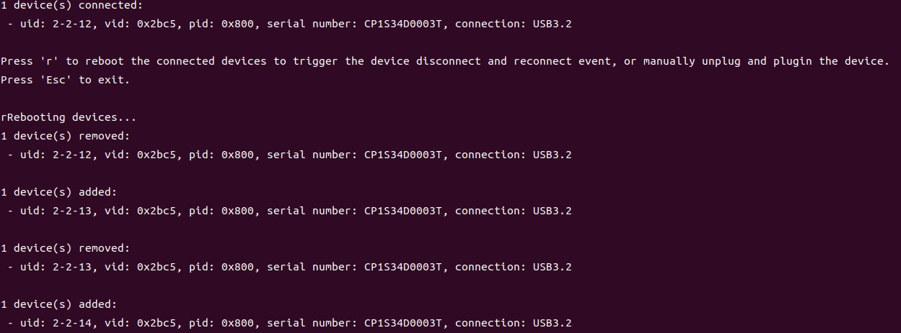

# C++ Sample：2.device.hot_plugin

## Overview

Use SDK to handle the settings of device unplug callback and process the acquired code stream after unplugging

### Knowledge

Pipeline is a pipeline for processing data streams, providing multi-channel stream configuration, switching, frame aggregation, and frame synchronization functions.

Device is a class that can be used to get device information, parameters, and a list of contained sensors.

Sensor can be used to obtain different components of the camera and the stream of the component, for example, RGB, IR, Depth stream can be obtained through the RGB, IR, Depth sensor.

### Attention

*The GMSL devices (such as Gemini335Lg) do not support hot plugging.*

## code overview

1. Register device callback and execute relevant functions during device unplugging and unplugging

    ```cpp
        ctx.setDeviceChangedCallback( []( std::shared_ptr< ob::DeviceList > removedList, std::shared_ptr< ob::DeviceList > addedList ) {
                DeviceDisconnectCallback( removedList );
                DeviceConnectCallback( addedList );
            } );
    ```

2. Trigger the callback function to print relevant information

    ```cpp
        void printDeviceList(const std::string &prompt, std::shared_ptr<ob::DeviceList> deviceList) {
            auto count = deviceList->getCount();
            if(count == 0) {
                return;
            }
            std::cout << count << " device(s) " << prompt << ": " << std::endl;
            for(uint32_t i = 0; i < count; i++) {
                auto uid          = deviceList->getUid(i);
                auto vid          = deviceList->getVid(i);
                auto pid          = deviceList->getPid(i);
                auto serialNumber = deviceList->getSerialNumber(i);
                auto connection   = deviceList->getConnectionType(i);
                std::cout << " - uid: " << uid << ", vid: 0x" << std::hex << std::setfill('0') << std::setw(4) << vid << ", pid: 0x" << pid
                            << ", serial number: " << serialNumber << ", connection: " << connection << std::endl;
            }
            std::cout << std::endl;
        }
    ```

3. Restart your device

```cpp
    void rebootDevices(std::shared_ptr<ob::DeviceList> deviceList) {
        for(uint32_t i = 0; i < deviceList->getCount(); i++) {
            // get device from device list
            auto device = deviceList->getDevice(i);

            // reboot device
            device->reboot();
        }
    }
```

## Run Sample

Press R to reboot the device
You can try to manually unplug and plug the device
Press the Esc key in the window to exit the program

### Result


