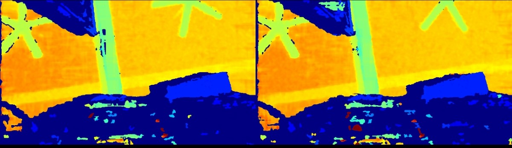

# C++ Sample: 3.advanced.hdr

## Overview

In this sample, user can get the HDR merge image. Also Allows the user to control the on-off of the HDR synthesis and whether the original image is displayed through the keyboard.

### Knowledge

Pipeline is a pipeline for processing data streams, providing multi-channel stream configuration, switching, frame aggregation, and frame synchronization functions

Frameset is a combination of different types of Frames

### Attentions

> This Sample only supports Gemini330 series devices.

## Code overview

### 1. Check if the device supports HDR merge

```c++
if(!device->isPropertySupported(OB_STRUCT_DEPTH_HDR_CONFIG, OB_PERMISSION_READ_WRITE)) {
    std::cerr << "Current default device does not support HDR merge" << std::endl;
    std::cout << "Press any key to exit...";
    ob_smpl::waitForKeyPressed();
    return -1;
}
```

### 2. Get depth stream profile

Get all stream profiles of the depth camera, including stream resolution, frame rate, and frame format

```c++
auto depthProfiles = pipe.getStreamProfileList(OB_SENSOR_DEPTH);
auto depthProfile  = depthProfiles->getProfile(OB_PROFILE_DEFAULT);
config->enableStream(depthProfile);
```

### 3. Create HDRMerge

Create HDRMerge post processor to merge depth frames betweens different hdr sequence ids.
The HDRMerge also supports processing of infrared frames.

```c++
auto hdrMerge = ob::FilterFactory::createFilter("HDRMerge");
```

### 5. Configure and enable Hdr stream

```c++
    OBHdrConfig obHdrConfig;
    obHdrConfig.enable     = true;  // enable HDR merge
    obHdrConfig.exposure_1 = 7500;
    obHdrConfig.gain_1     = 24;
    obHdrConfig.exposure_2 = 100;
    obHdrConfig.gain_2     = 16;
    device->setStructuredData(OB_STRUCT_DEPTH_HDR_CONFIG, reinterpret_cast<uint8_t *>(&obHdrConfig), sizeof(OBHdrConfig));
```

### 7. Stop the pipeline and close hdr merge

```c++
// Stop the Pipeline, no frame data will be generated
pipe.stop();

// close hdr merge
obHdrConfig.enable = false;
device->setStructuredData(OB_STRUCT_DEPTH_HDR_CONFIG, reinterpret_cast<uint8_t *>(&obHdrConfig), sizeof(OBHdrConfig));
```

## Run Sample

### Key introduction

Press the 'Esc' key in the window to exit the program.
Press the '?' key in the window to show key map.
Press the 'M' key in the window to Toggle HDR merge.
Press the 'N' key in the window to Toggle alternate show origin frame.

### Result


