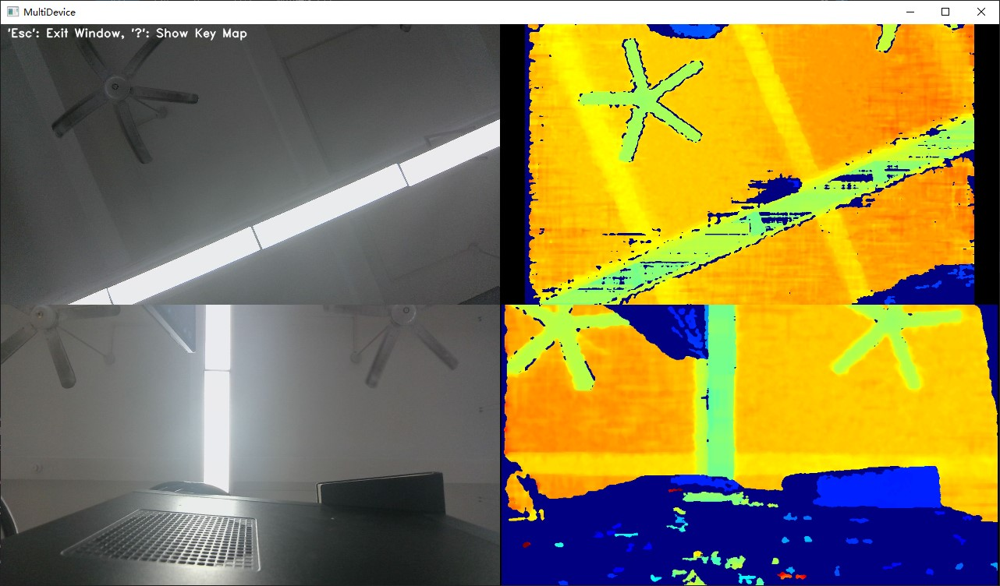

# C++ Sample：3.advanced.multi_devices

## Overview

In this sample, users can connect multiple camera devices and get color and depth images of different cameras.

### Knowledge

Context is the environment context, the first object created during initialization, which can be used to perform some settings, including but not limited to device status change callbacks, log level settings, etc. Context can access multiple Devices.

FrameSet is a combination of different types of Frames.

## code overview

1. StartStream DeviceIndex is used to identify different devices, and map is used to store the color and depth stream of different devices.

    ```cpp
    void StartStream(std::map<int, std::shared_ptr<ob::Pipeline>> &pipes) {

    for(auto &item: pipes) {
        int   deviceIndex = item.first;
        auto &pipe        = item.second;

        // config to enable depth and color streams
        std::shared_ptr<ob::Config> config = std::make_shared<ob::Config>();
        config->enableVideoStream(OB_STREAM_COLOR);
        config->enableVideoStream(OB_STREAM_DEPTH);

        // start pipeline and pass the callback function to receive the frames
        pipe->start(config, [deviceIndex](std::shared_ptr<ob::FrameSet> frameSet) {
            std::lock_guard<std::mutex> lock(framesetMutex);
            framesets[deviceIndex] = frameSet;
        });
    }
    }
    ```

2. StopStream Obtain pipelines corresponding to different devices and stop the pipelines.

    ```cpp
    void StopStream(std::map<int, std::shared_ptr<ob::Pipeline>> &pipes) {
        for(auto &item: pipes) {
            auto &pipe = item.second;
            // stop the pipeline
            pipe->stop();
        }

        std::lock_guard<std::mutex> lock(framesetMutex);
        framesets.clear();
    }
    ```

3. Obtain the currently connected devices through context, and obtain the list and number of devices.

    ```cpp
    // Create a Context
    ob::Context ctx;

    // Query the list of connected devices
    auto devList = ctx.queryDeviceList();

    // Get the number of connected devices
    int devCount = devList->getCount();
    ```

4. Use map to bind deviceIndex to the device's pipeline to distinguish video streams obtained by different devices.

    ```cpp
    // Create a pipeline for each device
    std::map<int, std::shared_ptr<ob::Pipeline>> pipes;
    for(int i = 0; i < devCount; i++) {
        // Get the device from device list
        auto dev  = devList->getDevice(i);

        // Create a pipeline for the device
        auto pipe = std::make_shared<ob::Pipeline>(dev);

        // Add the pipeline to the map of pipelines
        pipes.insert({ i, pipe });
    }
    ```

## Run Sample

### Key introduction

Press the 'Esc' key in the window to exit the program.
Press the '?' key in the window to show key map.

### Result


