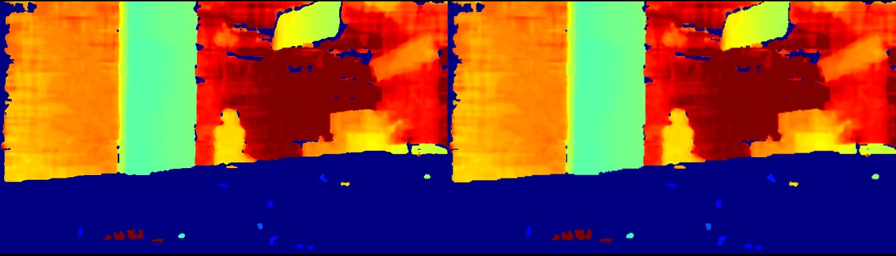

# C++ Sample: 3.advanced.post_processing

## Overview

Use the SDK interface to  demonstrate post-processing operations, display post-processed images, and exit the program using the ESC_KEY key

### Knowledge

Pipeline is a pipeline for processing data streams, providing multi-channel stream configuration, switching, frame aggregation, and frame synchronization functions

Frameset is a combination of different types of Frames

win is used to display the frame data.

## Code overview

1. Get the device and sensor, and create the list of recommended filters for the sensor

    ```cpp
        auto device     = pipe.getDevice();
        auto sensor     = device->getSensor(OB_SENSOR_DEPTH);
        auto filterList = sensor->createRecommendedFilters();
    ```

2. The filter operation.

    - Get the type of filter

    ```cpp
    filter->getName()
    ```

    - Get the Config Schema Vec object

    ```cpp
    filter->getConfigSchemaVec()
    ```

    - Enable the filter

    ```cpp
    filter->enable(tokens[1] == "on");
    ```

    - Get the Config Value object by name.

    ```cpp
    filter->getConfigValue(configSchema.name)
    ```

    - Get the Enable State of the filter.

    ```cpp
    filter->isEnabled()
    ```

    - Set the filter config value by name.

    ```cpp
    filter->setConfigValue(tokens[1], value);
    ```

3. Apply the recommended filters to the depth frame

    ```cpp
        auto processedFrame = depthFrame;
        // Apply the recommended filters to the depth frame
        for(auto &filter: filterList) {
            if(filter->isEnabled()) {  // Only apply enabled filters
                processedFrame = filter->process(processedFrame);
            }
        }
    ````

## Run Sample

Press the button according to the interface prompts

### Result


