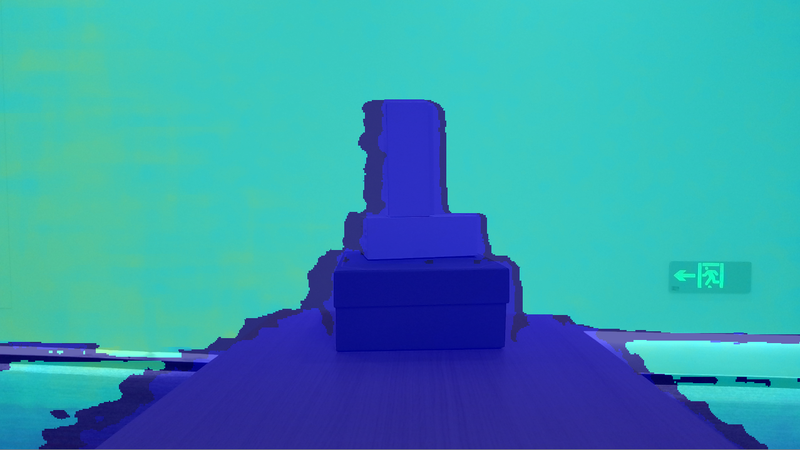

# Align Filter Viewer

Supported devices: Gemini 330 series cameras, such as Gemini G335
Function description: Demonstrate using SDK for stream alignment demonstration, display aligned images, and exit the program with ESC_KEY key
This example is based on the C High Level API for demonstration

## 1.Create Pipeline and stream Configuration
```c

// Create a pipeline to open the depth stream after connecting the device
pipeline = ob_create_pipeline(&error);
check_error(error);

// Create config to configure the resolution, frame rate, and format of the depth stream
ob_config *config = ob_create_config(&error);
check_error(error);

// Configure the depth stream
ob_stream_profile      *depth_profile = NULL;
ob_stream_profile_list *profiles      = ob_pipeline_get_stream_profile_list(pipeline, OB_SENSOR_DEPTH, &error);
check_error(error);

// Find the corresponding profile according to the specified format, first look for the y16 format
depth_profile = ob_stream_profile_list_get_video_stream_profile(profiles, 640, OB_HEIGHT_ANY, OB_FORMAT_Y16, 30, &error);
// If the specified format is not found, search for the default profile to open the stream
if(error) {
    depth_profile = ob_stream_profile_list_get_profile(profiles, OB_PROFILE_DEFAULT, &error);
    ob_delete_error(error);
    error = nullptr;
}

// enable stream
ob_config_enable_stream(config, depth_profile, &error);
check_error(error);

// Configure the color stream
ob_stream_profile *     color_profile = nullptr;
ob_stream_profile_list *color_rofiles = ob_pipeline_get_stream_profile_list(pipeline, OB_SENSOR_COLOR, &error);
if(error) {
    printf("Current device is not support color sensor!\n");
    exit(EXIT_FAILURE);
}

// Find the corresponding Profile according to the specified format, and choose the RGB888 format first
color_profile = ob_stream_profile_list_get_video_stream_profile(color_rofiles, 1280, OB_HEIGHT_ANY, OB_FORMAT_RGB, 30, &error);
// If the specified format is not found, search for the default Profile to open the stream
if(error) {
    color_profile = ob_stream_profile_list_get_profile(color_rofiles, OB_PROFILE_DEFAULT, &error);
    ob_delete_error(error);
    error = nullptr;
}

// enable stream
ob_config_enable_stream(config, color_profile, &error);
check_error(error);
```

## 2.Configure stream alignment
```c
/* Config depth align to color or color align to depth.
ob_stream_type align_to_stream = OB_STREAM_DEPTH; */
ob_stream_type align_to_stream = OB_STREAM_COLOR;
ob_filter *    align_filter    = ob_create_align(&error, align_to_stream);
```

## 3.Start Pipeline through Configuration
```c
// Start the pipeline with config
ob_pipeline_start_with_config(pipeline, config, &error);
check_error(error);
```
## 4.Get aligned data
```c++
ob_frame *new_frame_set = ob_filter_process(align_filter, frameset, &error);
check_error(error);

new_depth_frame = ob_frameset_depth_frame(new_frame_set, &error);
check_error(error);

new_color_frame = ob_frameset_color_frame(new_frame_set, &error);
check_error(error);
```
## 5.Release resources and exit the program.
```c
ob_delete_filter(align_filter, &error);
check_error(error);

// stop the pipeline
ob_pipeline_stop(pipeline, &error);
check_error(error);

// destroy the window
delete win;

// destroy profile
ob_delete_stream_profile(depth_profile, &error);
check_error(error);

// destroy profile list
ob_delete_stream_profile_list(profiles, &error);
check_error(error);

// destroy profile
ob_delete_stream_profile(color_profile, &error);
check_error(error);

// destroy profile list
ob_delete_stream_profile_list(color_rofiles, &error);
check_error(error);

// destroy the pipeline
ob_delete_pipeline(pipeline, &error);
check_error(error);
```
## 6.Expected Output

