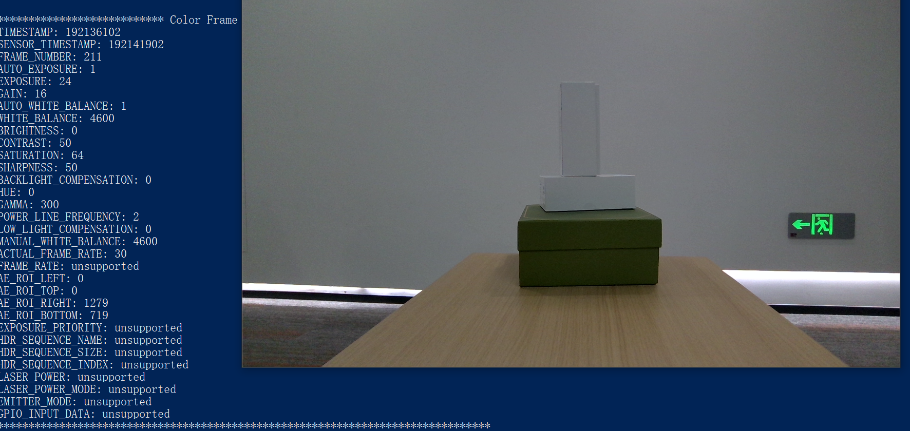

# C Sample Color Stream Viewer

Function description: Demonstrate using SDK to get color data and draw display, get resolution and set it, display color images, and exit the program through ESC_KEY key

This example is based on the C High Level API for demonstration

## 1. create a Pipeline to connect the device and open color streams
```c
    pipe = ob_create_pipeline( &error );
```

## 2. Create a Configuration to configure the resolution, frame rate, and format of color and depth streams
```c
    ob_config* config = ob_create_config( &error );

    //Configure Color streaming
    ob_stream_profile *     color_profile = NULL;
    ob_stream_profile_list *profiles      = ob_pipeline_get_stream_profile_list(pipe, OB_SENSOR_Color, &error);
    //Search for the corresponding Profile according to the specified format, and prioritize the RGB888 format
    color_profile = ob_stream_profile_list_get_video_stream_profile(profiles, 640, OB_HEIGHT_ANY, OB_FORMAT_RGB, 30, &error);
    //If the RGB888 format is not found and does not match the format, search for the corresponding profile to open the stream
    if(error){
    	color_profile = ob_stream_profile_list_get_video_stream_profile(profiles, 640, OB_HEIGHT_ANY, OB_FORMAT_ANY, 30, &error);
    	error = nullptr;
    }
    ob_config_enable_stream(config, depth_profile, &error);  // Enable configuration
```

## 3. Start Pipeline through Configuration
```c
    ob_pipeline_start_with_config(pipe, config, &error);
```


## 4. Release resources and exit the program.
```c
    //Release frameSet
    ob_delete_frame(frameset, &error);
    
    //Release profile
    ob_delete_stream_profile(color_profile, &error);
    
    //Release profile list
    ob_delete_stream_profile_list(profiles, &error);
    
    //Release device
    ob_delete_device(device, &error);
    
    //Release pipeline
    ob_delete_pipeline(pipe, &error);
```

## 5. Expected Output 
