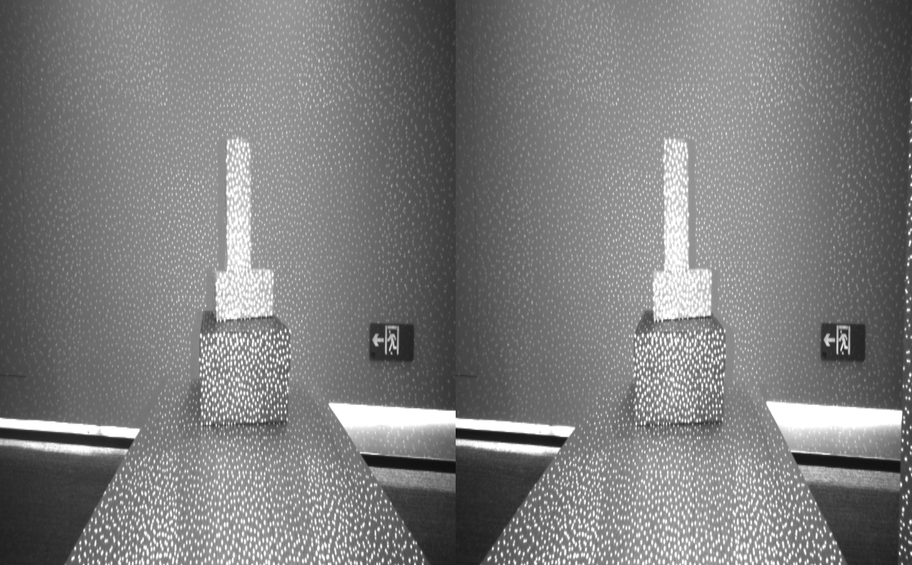

# C Sample Double Infrared Viewer

Supported devices: Only supports Gemini 330 series, Gemini 2 XL, Gemini 2 VL

Function description: Demonstrate obtaining dual infrared camera images, displaying left and right infrared images, and exiting the program with the ESC_KEY key

This example is based on the C High Level API for demonstration

## 1. Create pipeline and config
```c
    // Create a pipeline to open the Infrared stream after connecting the device
    pipeline = ob_create_pipeline(&error);
    check_error(error);
    
    // Create config to configure the resolution, frame rate, and format of the Infrared stream
    ob_config *config = ob_create_config(&error);
    check_error(error);
```

## 2. Get Left IR Stream Configuration
```c
    // Configure the infrared stream(IR_LEFT)
    ob_stream_profile      *ir_left_profile  = NULL;
    ob_stream_profile_list *ir_left_profiles = ob_pipeline_get_stream_profile_list(pipeline, OB_SENSOR_IR_LEFT, &error);
    check_error(error);
    
    if(ir_left_profiles == nullptr) {
        printf("The obtained IR(Left) resolution list is NULL. For monocular structured light devices, try opening the IR data stream using the IR example. ");
        return 0;
    }
    
    // Find the corresponding profile according to the specified format, first look for the y16 format
    ir_left_profile = ob_stream_profile_list_get_profile(ir_left_profiles, OB_PROFILE_DEFAULT, &error);
    check_error(error);
    
    // enable stream
    ob_config_enable_stream(config, ir_left_profile, &error);
    check_error(error);
```

## 3. Get Right IR Stream Configuration
```c
    // Configure the infrared stream(IR_RIGHT)
    ob_stream_profile      *ir_right_profile  = NULL;
    ob_stream_profile_list *ir_right_profiles = ob_pipeline_get_stream_profile_list(pipeline, OB_SENSOR_IR_RIGHT, &error);
    check_error(error);
    
    // Find the corresponding profile according to the specified format, first look for the y16 format
    ir_right_profile = ob_stream_profile_list_get_profile(ir_right_profiles, OB_PROFILE_DEFAULT, &error);
    check_error(error);
    
    // enable stream
    ob_config_enable_stream(config, ir_right_profile, &error);
    check_error(error);
```

## 4. Start pipeline through config
```c
    ob_pipeline_start_with_config(pipeline, config, &error);
    check_error(error);
```

## 5. Get left and right IR frame data
```c
    ob_frame *ir_left_frame = ob_frameset_get_frame(frameset, OB_FRAME_IR_LEFT, &error);
    check_error(error);
    
    ob_frame *ir_right_frame = ob_frameset_get_frame(frameset, OB_FRAME_IR_RIGHT, &error);
    check_error(error);
```

## 6. stop pipeline
```c
    ob_pipeline_stop(pipeline, &error);
    check_error(error);
```

## 7. Release relevant resources
```c
    // destroy the window
    delete win;
    
    // destroy profile
    ob_delete_stream_profile(ir_left_profile, &error);
    check_error(error);
    
    // destroy profile list
    ob_delete_stream_profile_list(ir_left_profiles, &error);
    check_error(error);
    
    // destroy profile
    ob_delete_stream_profile(ir_right_profile, &error);
    check_error(error);
    
    // destroy profile list
    ob_delete_stream_profile_list(ir_right_profiles, &error);
    check_error(error);
    
    // destroy the pipeline
    ob_delete_pipeline(pipeline, &error);
    check_error(error);
```

## 8. Expected Output 

