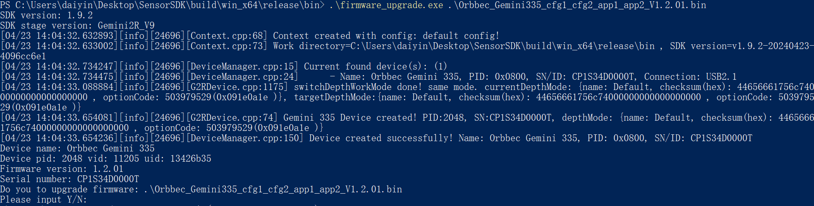

# C Sample Firmware Update

Function Description: This example demonstrates how to upgrade a device using firmware files

This example is based on the C Low Level API for demonstration. The example is compiled in C++ and the OrbbecSDK uses the C language API

## 1. Get firmware files through command parameters in the main function interface
```c
    // The check_firmware_file_path() function is used to check if a file exists. In actual code, it is best to check if the suffix is bin or img, and if the firmware file matches the target device
    const char *check_firmware_file_path(int argc, char **argv) {
        if(argc < 2) {
            printf("Please input firmware path.\n");
            return "";
        }
    
        const char *filePath = *(argv + 1);
        FILE       *file     = fopen(filePath, "r");
        if(!file) {
            printf("Open Firmware file failed. filePath: %s\n", filePath);
            return "";
        }
    
        fclose(file);
    
        return filePath;
    }
    
    int main(int argc, char **argv) {
        const char *firmware_file_path = check_firmware_file_path(argc, argv);
        if(!firmware_file_path || 0 == strlen(firmware_file_path)) {
            printf("command: \n$ ./frameware_upgrade[.exe] firmwareFile.bin\n");
            return 0;
        }
    
        // The following business code
    
        return 0;
    }
```

## 2. Create an ob_context and get the device through it
 This example assumes that the upper computer (Windows, Ubuntu, Arm platforms) has already inserted the device before running firmware_upgrade[.exe]. Device_changed_callback is used to listen for business processing of the upgraded device after firmware upgrade and device restart
```c
    // Building an ob_context object
    ob_error   *error = NULL;
    ob_context *ctx   = ob_create_context(&error);
    check_error(error);
    
    // Set up a device change listener, device_changed_callback is a key function for managing device declaration cycles, and developers must pay attention to this callback
    ob_set_device_changed_callback(ctx, device_changed_callback, &callback_user_data_, &error);
    check_error(error);
    
    // Query the currently connected devices
    ob_device_list *dev_list = ob_query_device_list(ctx, &error);
    check_error(error);
    
    // Retrieve the current number of connected devices from ob_device_list
    int dev_count = ob_device_list_device_count(dev_list, &error);
    check_error(error);
    if(dev_count == 0) {
        // Firmware upgrade example assumes that the device has been connected to the upper computer (Windows, Ubuntu, Android platforms)
        printf("Device not found!\n");
        return -1;
    }
    
    // Get the first device, index=0
    ob_device *dev = ob_device_list_get_device(dev_list, 0, &error);
    check_error(error);
    
    // Print device information
    dump_device_info(dev);
```
## 3. Get the current firmware version information of the device
```c
    // Print device name, SN, VID, PID, and firmware version
    void dump_device_info(ob_device *device) {
        ob_error *error = NULL;
    
        // Get the ob_device_info object, through which the basic information of the target device can be obtained
        ob_device_info *dev_info = ob_device_get_device_info(device, &error);
        check_error(error);
    
        // Device Name
        const char *name = ob_device_info_name(dev_info, &error);
        check_error(error);
        printf("Device name: %s\n", name);
    
        // VID，PID，UID of the device
        int pid = ob_device_info_pid(dev_info, &error);
        check_error(error);
        int vid = ob_device_info_vid(dev_info, &error);
        check_error(error);
        const char *uid = ob_device_info_uid(dev_info, &error);
        check_error(error);
        printf("Device pid: %d vid: %d uid: %s\n", pid, vid, uid);
    
        // The current firmware version number of the device
        const char *fw_ver = ob_device_info_firmware_version(dev_info, &error);
        check_error(error);
        printf("Firmware version: %s\n", fw_ver);
    
        // SN of the device
        const char *sn = ob_device_info_serial_number(dev_info, &error);
        check_error(error);
        printf("Serial number: %s\n", sn);
    
        // Release resources, otherwise it will cause memory leakage
        ob_delete_device_info(dev_info, &error);
        check_error(error);
    }
```

## 4. Upgrade firmware for the target device 
a. Implement firmware upgrade callback interface for C API; 
b. Call the firmware upgrade interface for upgrading;
```c
    // Implement firmware upgrade callback interface for C API;
    void device_upgrade_callback(ob_upgrade_state state, const char *message, uint8_t percent, void *user_data) {
        if(state == STAT_START) {
            printf("Upgrade Firmware start\n");
        }
        else if(state == STAT_FILE_TRANSFER) {
            printf("Upgrade Firmware file transfer, percent: %u\n", (uint32_t)percent);
        }
        else if(state == STAT_IN_PROGRESS) {
            printf("Upgrade Firmware in progress, percent: %u\n", (uint32_t)percent);
        }
        else if(state == STAT_DONE) {
            // Firmware upgrade successful
            printf("Upgrade Firmware done, percent: %u\n", (uint32_t)percent);
            is_upgrade_success_ = true;
        }
        else if(state == STAT_VERIFY_IMAGE) {
            printf("Upgrade Firmware verify image\n");
        }
        else {
            // Firmware upgrade failed
            printf("Upgrade Firmware failed. state: %d, errMsg: %s, percent: %u \n", (int)state, message ? message : "", (uint32_t)percent);
        }
    }
    
    // Perform firmware upgrades on the target device
    bool upgrade_firmware(ob_device *device, const char *firmwarePath) {
        const char *index     = strstr(firmwarePath, ".img");
        bool        isImgFile = (bool)index;
        index                 = strstr(firmwarePath, ".bin");
        bool isBinFile        = (bool)index;
        if(!(isImgFile || isBinFile)) {
            // Firmware upgrade files are usually bin or img. In actual business, it is best to use information such as file name and file MD5 to prevent errors
            printf("Upgrade Fimware failed. invalid firmware file: %s\n", firmwarePath);
            return false;
        }
    
        // Call the firmware upgrade interface for upgrading;
        is_upgrade_success_ = false;
        ob_error *error     = NULL;
        ob_device_upgrade(device, firmwarePath, device_upgrade_callback, false, &callback_user_data_, &error);
        check_error(error);
        return is_upgrade_success_;
    }
```
After a successful firmware upgrade, the device needs to be restarted. There are two ways to restart a device: one is to unplug and unplug the device (or restart the operating system), and the other is to call the reboot interface of the OrbbecSDK. After the device goes online, the dump_device_info() function in this example can be used to query the current firmware version information of the device

## 4. The following example demonstrates restarting a device through the firmware reboot interface
```c
    // reboot device
    printf("Reboot device\n");
    is_device_removed_       = false;
    is_wait_reboot_complete_ = true;
    ob_device_reboot(dev, &error);
    check_error(error);
    
    // Release resources to prevent memory leaks
    ob_delete_device(dev, &error);
    check_error(error);
```
On ob_device_changed_callback, you can listen for events related to device rebooting and going offline or online. For more details, please refer to the example of Hot Plugin
```c
    // Monitoring device changes
    void device_changed_callback(ob_device_list *removed, ob_device_list *added, void *user_data) {
        ob_error *error = NULL;
    
        // Processing online devices through added
    
        // Processing offline devices through removal
    
        // Release resources to avoid memory leaks
        ob_delete_device_list(removed, &error);
        check_error(error);
    
        // elease resources to avoid memory leaks
        ob_delete_device_list(added, &error);
        check_error(error);
    }
```

## 5. Expected Output

