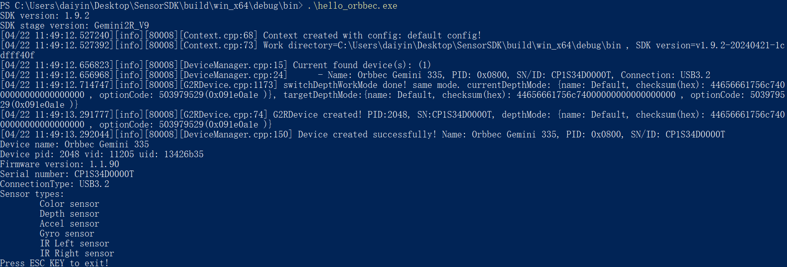

# C Sample Hello Orbbec

Function Description: Used to demonstrate SDK initialization, get SDK version, get device model, get device serial number, get firmware version number, SDK resource release, and exit the program through the ESC_KEY key

This example is based on the C Low Level API for demonstration

## 1. Firstly, get and print the current SDK version
```c
    printf("SDK version: %d.%d.%d\n", ob_get_major_version(), ob_get_minor_version(), ob_get_patch_version());
```

## 2. Create a Context for obtaining a list of device information and creating devices
```c
    ob_error*   error = NULL;
    ob_context* ctx   = ob_create_context( &error );
```

Query the list of connected devices to get the number of devices in the list, and use index number 0 to create the first device in the list
```c
    ob_device_list* dev_list = ob_query_device_list( ctx, &error );
    int dev_count = ob_device_list_device_count(dev_list, &error);
    if(dev_count == 0) {
    	printf("Device not found!\n");
    	return -1;
    }
    ob_device* dev = ob_device_list_get_device(dev_list, 0, &error);
```
## 3. Next, you can get information related to this device
```c
    //Get device information
    ob_device_info* dev_info = ob_device_get_device_info(dev, &error);
    
    //Get device name
    const char* name = ob_device_info_name(dev_info, &error);
    
    //Get pid, vid, uid of the device
    int pid = ob_device_info_pid(dev_info, &error);
    int vid = ob_device_info_vid(dev_info, &error);
    int uid = ob_device_info_uid(dev_info, &error);
    
    //By get the firmware version number of the device
    const char* fw_ver = ob_device_info_firmware_version(dev_info, &error);
    
    //By get the serial number of the device
    const char* sn = ob_device_info_serial_number(dev_info, &error);
    
    //Get a list of supported sensors
    ob_sensor_list* sensor_list = ob_device_get_sensor_list(dev, &error);
    
    //Get the number of sensors
    int count = ob_sensor_list_get_sensor_count(sensor_list, &error);
    for(int i = 0; i < count; i++)
    {
        ob_sensor_type sensor_type = ob_sensor_list_get_sensor_type(sensor_list， i, &error);
        switch (sensor_type)
        {
          case OB_SENSOR_COLOR:
          		break;
        	case OB_SENSOR_DEPTH:
          		break;
        	case OB_SENSOR_IR:
          		break;
        }
    }
```

## 4. Release resources and exit the program.
```c
    //Release sensor list
    ob_delete_sensor_list(sensor_list, &error);
    //Release device info
    ob_delete_device_info(dev_info, &error);
    //Release device
    ob_delete_device(dev, &error);
    //Release device list
    ob_delete_device_list(dev_list, &error);
    //Release context
    ob_delete_context(ctx, &error);
```
## 5. Expected Output 
