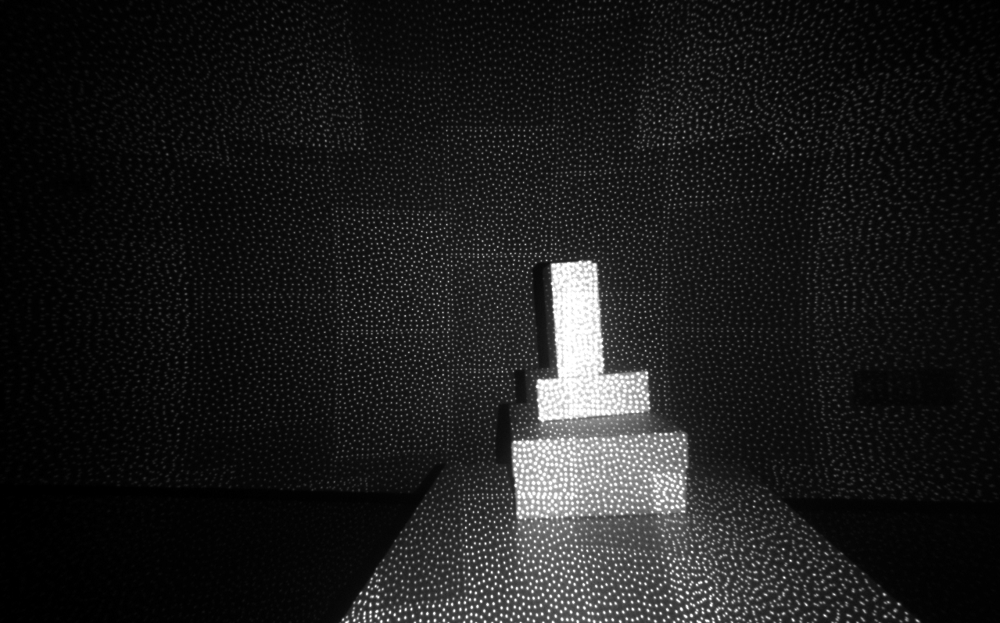

# C Sample Infrared Stream Viewer

Function description: Demonstrate obtaining infrared camera images, displaying infrared images, and exiting the program with the ESC_KEY key

This example is based on the C High Level API for demonstration

## 1. Create a pipeline for stream configuration
```c
    // Create a pipeline to open the Infrared stream after connecting the device
    pipeline = ob_create_pipeline(&error);
    check_error(error);
    
    // Create config to configure the resolution, frame rate, and format of the Infrared stream
    ob_config *config = ob_create_config(&error);
    check_error(error);
    
    // Configure the infrared stream
    // Please adjust the sensor according to the actual product, some device types only have OB_SENSOR_IR_LEFT and OB_SENSOR_IR_RIGHT.
    ob_stream_profile      *ir_profile = NULL;
    ob_stream_profile_list *profiles   = ob_pipeline_get_stream_profile_list(pipeline, OB_SENSOR_IR, &error);
    check_error(error);
    
    if(profiles == nullptr) {
        printf(
            "The obtained IR resolution list is NULL. For binocular structured light devices, try using the doubleIr example to turn on the ir data stream. ");
        return 0;
    }
    
    // Find the corresponding profile according to the specified format, first look for the y16 format
    ir_profile = ob_stream_profile_list_get_video_stream_profile(profiles, 640, OB_HEIGHT_ANY, OB_FORMAT_Y16, 30, &error);
    // If the specified format is not found, search for the default profile to open the stream
    if(error) {
        ir_profile = ob_stream_profile_list_get_profile(profiles, OB_PROFILE_DEFAULT, &error);
        ob_delete_error(error);
        error = nullptr;
    }
    
    // enable stream
    ob_config_enable_stream(config, ir_profile, &error);
    check_error(error);
```

## 2. Start pipeline through config
```c
    // Start the pipeline with config
    ob_pipeline_start_with_config(pipeline, config, &error);
    check_error(error);
```

## 3. Release relevant resources
```c
    // stop the pipeline
    ob_pipeline_stop(pipeline, &error);
    check_error(error);
    
    // destroy the window
    delete win;
    
    // destroy profile
    ob_delete_stream_profile(ir_profile, &error);
    check_error(error);
    
    // destroy profile list
    ob_delete_stream_profile_list(profiles, &error);
    check_error(error);
    
    // destroy the pipeline
    ob_delete_pipeline(pipeline, &error);
    check_error(error);
```

## 4. expected Output 

