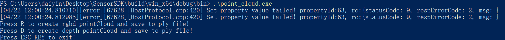

# 点云示例

功能描述：连接设备开流，生成深度点云或RGBD点云并保存成ply格式文件，并通过ESC_KEY键退出程序

本示例基于C++ High Level API进行演示

## 1. 创建点云保存成ply格式文件函数，ply文件格式详细描述可在网络上查看
```c
    //保存点云数据到ply
    void save_points_to_ply( ob_frame* frame, const char* fileName ) {
        int pointsSize = ob_frame_data_size( frame, &error ) / sizeof( ob_point );
        check_error( error );
    
        FILE* fp = fopen( fileName, "wb+" );
        fprintf( fp, "ply\n" );
        fprintf( fp, "format ascii 1.0\n" );
        fprintf( fp, "element vertex %d\n", pointsSize );
        fprintf( fp, "property float x\n" );
        fprintf( fp, "property float y\n" );
        fprintf( fp, "property float z\n" );
        fprintf( fp, "end_header\n" );
    
        ob_point* point = ( ob_point* )ob_frame_data( frame, &error );
        check_error( error );
        for ( int i = 0; i < pointsSize; i++ ) {
            fprintf( fp, "%.3f %.3f %.3f\n", point->x, point->y, point->z );
            point++;
        }
    
        fflush( fp );
        fclose( fp );
    }
    
    //保存彩色点云数据到ply
    void save_rgb_points_to_ply( ob_frame* frame, const char* fileName ) {
        int pointsSize = ob_frame_data_size( frame, &error ) / sizeof( ob_color_point );
        check_error( error );
    
        FILE* fp = fopen( fileName, "wb+" );
        fprintf( fp, "ply\n" );
        fprintf( fp, "format ascii 1.0\n" );
        fprintf( fp, "element vertex %d\n", pointsSize );
        fprintf( fp, "property float x\n" );
        fprintf( fp, "property float y\n" );
        fprintf( fp, "property float z\n" );
        fprintf( fp, "property uchar red\n" );
        fprintf( fp, "property uchar green\n" );
        fprintf( fp, "property uchar blue\n" );
        fprintf( fp, "end_header\n" );
    
        ob_color_point* point = ( ob_color_point* )ob_frame_data( frame, &error );
        check_error( error );
    
        for ( int i = 0; i < pointsSize; i++ ) {
            fprintf( fp, "%.3f %.3f %.3f %d %d %d\n", point->x, point->y, point->z, ( int )point->r, ( int )point->g, ( int )point->b );
            point++;
        }
    
        fflush( fp );
        fclose( fp );
    }
```

## 2. 创建Pipeline及流配置
```c
    //创建pipeline 用于连接设备后打开Color和Depth流
    pipeline = ob_create_pipeline( &error );
    //创建config，用于配置 Color 和 Depth 流的 分辨率、帧率、格式
    ob_config* config = ob_create_config( &error );
    
    
    //配置Color流
    ob_stream_profile_list *colorProfiles = ob_pipeline_get_stream_profile_list(pipeline, OB_SENSOR_COLOR, &error);
    if(error) {
        printf("Current device is not support color sensor!\n");
        ob_delete_error(error);
        error = NULL;
        // Turn on D2C alignment, which needs to be turned on when generating RGBD point clouds
        ob_config_set_align_mode(config, ALIGN_DISABLE, &error);
        check_error(error);
    }
    // Open the default profile of Color Sensor, which can be configured through the configuration file
    if(colorProfiles) {
        color_profile = ob_stream_profile_list_get_profile(colorProfiles, OB_PROFILE_DEFAULT, &error);
    }
    
        //配置Depth流
    if(color_profile) {
        // Try find supported depth to color align hardware mode profile
        depthProfiles = ob_get_d2c_depth_profile_list(pipeline, color_profile, ALIGN_D2C_HW_MODE, &error);
        check_error(error);
        int d2cCount = ob_stream_profile_list_count(depthProfiles, &error);
        check_error(error);
        if(d2cCount > 0) {
            align_mode = ALIGN_D2C_HW_MODE;
        }
        else {
            // Try find supported depth to color align software mode profile
            depthProfiles = ob_get_d2c_depth_profile_list(pipeline, color_profile, ALIGN_D2C_SW_MODE, &error);
            check_error(error);
            d2cCount = ob_stream_profile_list_count(depthProfiles, &error);
            check_error(error);
            if(d2cCount > 0) {
                align_mode = ALIGN_D2C_SW_MODE;
            }
        }
    }
    else {
        depthProfiles = ob_pipeline_get_stream_profile_list(pipeline, OB_SENSOR_DEPTH, &error);
        check_error(error);
```  

## 3. 打开设备D2C功能
```c
    // Turn on D2C alignment, which needs to be turned on when generating RGBD point clouds
    ob_config_set_align_mode(config, align_mode, &error)
```

## 4. 开启pipeline
```c
    ob_pipeline_start_with_config(pipeline, config, &error);
```
在开流后创建点云filter。点云filter用于将depth和color帧数据转换成点云数据。点云filter在开流后创建目的是让SDK内部自动根据当前开流配置设置好相机参数。当然也可以自行设置。
```cpp
    // Create a point cloud Filter object (device parameters will be obtained inside the Pipeline when the point cloud filter is created, so try to configure
    // the device before creating the filter)
    ob_filter *point_cloud = ob_create_pointcloud_filter(&error);
    check_error(error);
    
    // Obtain the current open-stream camera parameters from the pipeline and pass them to the point cloud filter
    ob_camera_param camera_param = ob_pipeline_get_camera_param(pipeline, &error);
    check_error(error);
    ob_pointcloud_filter_set_camera_param(point_cloud, camera_param, &error);
    check_error(error);
```

## 5. 启动主循环，循环内根据用户按键调用点云filter生成深度点云或RGBD点云数据，并保存成ply文件。
```c
    //等待一帧数据，超时时间为100ms
    ob_frame *frameset = ob_pipeline_wait_for_frameset(pipeline, 100, &error);
    check_error(error);
    if(frameset != NULL) {
        // get depth value scale
        ob_frame *depth_frame = ob_frameset_depth_frame(frameset, &error);
        check_error(error);
        if(depth_frame == NULL) {
            continue;
        }
    
        // get depth value scale
        float depth_value_scale = ob_depth_frame_get_value_scale(depth_frame, &error);
        check_error(error);
    
        // delete depth frame
        ob_delete_frame(depth_frame, &error);
        check_error(error);
    
        // point position value multiply depth value scale to convert uint to millimeter (for some devices, the default depth value uint is not
        // millimeter)
        ob_pointcloud_filter_set_position_data_scale(point_cloud, depth_value_scale, &error);
        check_error(error);
    
        ob_pointcloud_filter_set_point_format(point_cloud, OB_FORMAT_RGB_POINT, &error);
        check_error(error);
        ob_frame *pointsFrame = ob_filter_process(point_cloud, frameset, &error);
        check_error(error);
        if(pointsFrame != NULL) {
            save_rgb_points_to_ply(pointsFrame, "rgb_points.ply");
            printf("rgb_points.ply Saved\n");
            ob_delete_frame(pointsFrame, &error);
            check_error(error);
            points_created = true;
        }
        ob_delete_frame(frameset, &error);  // Destroy frameSet to reclaim memory
        check_error(error);
        if(points_created) {
            break;
        }
    }
```

## 6. 主循环退出后，停流并销毁回收资源
```c
    // stop pipeline
    ob_pipeline_stop(pipeline, &error);
    check_error(error);
    
    // destroy pipeline
    ob_delete_pipeline(pipeline, &error);
    check_error(error);
    
    // destroy config
    ob_delete_config(config, &error);
    check_error(error);
    
    // destroy profile
    ob_delete_stream_profile(depth_profile, &error);
    check_error(error);
    
    // destroy profile
    ob_delete_stream_profile(color_profile, &error);
    check_error(error);
    
    // destroy profile list
    ob_delete_stream_profile_list(colorProfiles, &error);
    check_error(error);
    
    ob_delete_stream_profile_list(depthProfiles, &error);
    check_error(error);
```

## 预期输出

