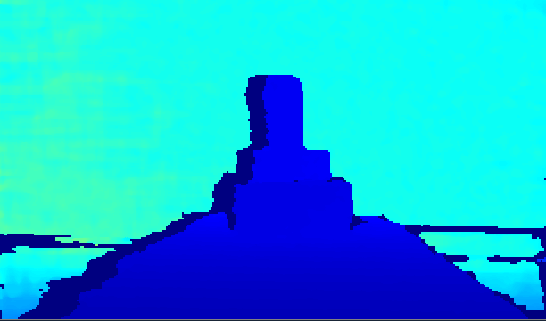

# 后处理示例

支持设备： Gemini 330系列相机，例如：Gemini G335

功能描述：演示使用后处理操作，显示后处理后的图像，并通过ESC_KEY键退出程序

本示例基于C High Level API进行演示

## 1. 创建pipeline，进行流配置
```c
    // Create a pipeline to open the depth stream after connecting the device
    pipeline = ob_create_pipeline(&error);
    check_error(error);
    
    // Create config to configure the resolution, frame rate, and format of the depth stream
    ob_config *config = ob_create_config(&error);
    check_error(error);
    
    // Configure the depth stream
    ob_stream_profile      *depth_profile = NULL;
    ob_stream_profile_list *profiles      = ob_pipeline_get_stream_profile_list(pipeline, OB_SENSOR_DEPTH, &error);
    check_error(error);
    
    // Find the corresponding profile according to the specified format, first look for the y16 format
    depth_profile = ob_stream_profile_list_get_video_stream_profile(profiles, 640, OB_HEIGHT_ANY, OB_FORMAT_Y16, 30, &error);
    // If the specified format is not found, search for the default profile to open the stream
    if(error) {
        depth_profile = ob_stream_profile_list_get_profile(profiles, OB_PROFILE_DEFAULT, &error);
        ob_delete_error(error);
        error = nullptr;
    }
    
    // enable stream
    ob_config_enable_stream(config, depth_profile, &error);
    check_error(error);
```

## 2. 获取传感器
```c
    // Get device
    ob_device *device = ob_pipeline_get_device(pipeline, &error);
    check_error(error);
    
    // Get depth sensor
    ob_sensor *depthSensor = ob_device_get_sensor(device, OB_SENSOR_DEPTH, &error);
    check_error(error)
```
## 3. 获取后处理列表
```c
    ob_filter_list *filterList = ob_sensor_get_recommended_filter_list(depthSensor, &error);
    check_error(error);
```
## 4. 后处理
```c
    ob_frame *depth_frame = ob_frameset_depth_frame(frameset, &error);
    check_error(error);
    
    if(depth_frame != nullptr) {
        for(uint32_t i = 0; i < count; i++) {
            ob_frame * new_depth_frame = nullptr;
            ob_filter *obFilter = filters[i];
            bool enable = ob_filter_is_enable(obFilter, &error);
            check_error(error);
            if(enable) {
                new_depth_frame = ob_filter_process(obFilter, depth_frame, &error);
                check_error(error);
    
                ob_delete_frame(depth_frame, &error);
                check_error(error);
    
                depth_frame = new_depth_frame;
            }
        }
    }
```

## 5. 释放相关资源
```c
    for(uint32_t i = 0; i < count; i++) {
        ob_filter *obFilter = filters[i];
        ob_delete_filter(obFilter, &error);
        check_error(error);
    }
    
    // destroy profile filterList
    ob_delete_filter_list(filterList, &error);
    check_error(error);
    
    // stop the pipeline
    ob_pipeline_stop(pipeline, &error);
    check_error(error);
    
    // destroy the window
    delete win;
    
    // destroy profile
    ob_delete_stream_profile(depth_profile, &error);
    check_error(error);
    
    // destroy profile list
    ob_delete_stream_profile_list(profiles, &error);
    check_error(error);
    
    // destroy the pipeline
    ob_delete_pipeline(pipeline, &error);
    check_error(error);
```

## 6. 预期输出

