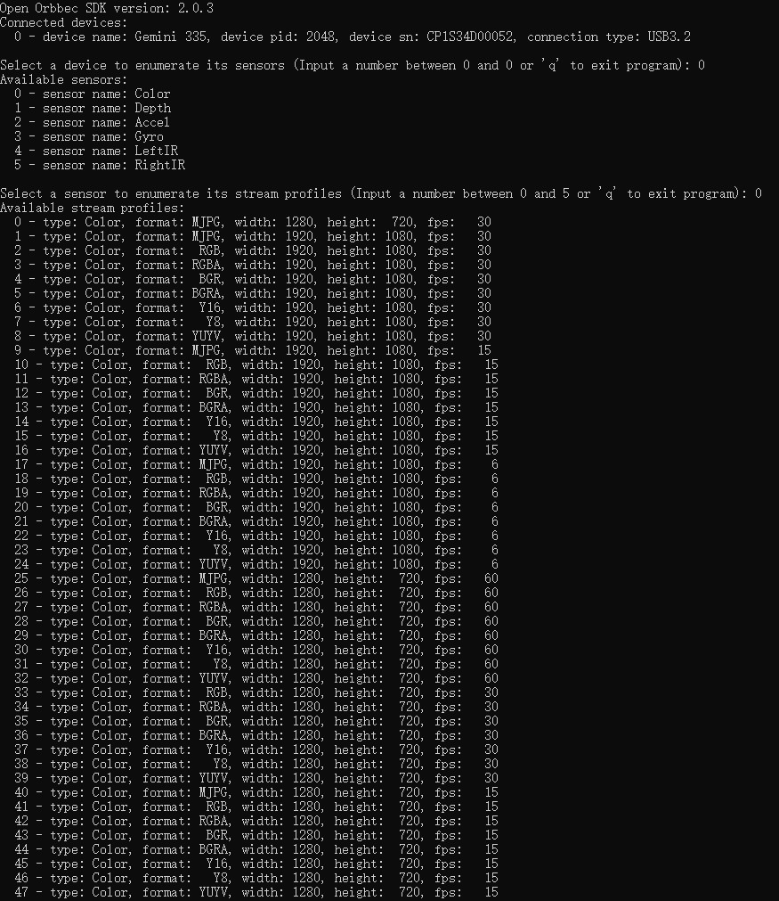

# Enumerate with C

This is a enumerate guide to get device streams profile information using the Orbbec SDK C API.

## Overview

### Knowledge

Context is the environment context, the first object created during initialization, which can be used to perform some settings, including but not limited to device status change callbacks, log level settings, etc. Context can access multiple Devices.

## Code Overview

### 1.Get inuput value

```c
if(input == 'q' || input == 'Q') {
    value = -1;
    break;
}
if(input >= '0' && input <= '9' && input - '0' >= min_value && input - '0' <= max_value) {
    value = input - '0';
    break;
}
printf("Invalid input, please input a number between %d and %d or \'q\' to exit program: ", min_value, max_value);
```

### 2.Enumerates stream information

Get stream profile list, then different output formats are formulated according to sensor type. For example, if sensor type = 'OB_SENSOR_COLOR', need to print stream type、stream format、stream resolution、stream fps、stream index.

```c
// Get sensor type.
ob_sensor_type sensor_type = ob_sensor_get_type(sensor, &error);
check_ob_error(&error);

// Get stream profile list.
ob_stream_profile_list *stream_profile_list = ob_sensor_get_stream_profile_list(sensor, &error);
check_ob_error(&error);

// Get stream profile count.
uint32_t stream_profile_count = ob_stream_profile_list_get_count(stream_profile_list, &error);
check_ob_error(&error);
```

### 3.Enumerate sensor list

Get sensor list, then print sensor type.

```c
// Get sensor list.
ob_sensor_list *sensor_list = ob_device_get_sensor_list(device, &error);
check_ob_error(&error);

// Get sensor count.
uint32_t sensor_count = ob_sensor_list_get_count(sensor_list, &error);
check_ob_error(&error);
```

### 4.Enumerates device information

Get device information. And then print device name、pid、SN、connect type.

```c
// Get device information.
ob_device_info *dev_inf = ob_device_get_device_info(device, &error);
check_ob_error(&error);
```

## Run Sample

If you are on Windows, you can switch to the directory `OrbbecSDK-dev/build/win_XX/bin` to find the `ob_enumerate_c.exe`.

If you are on linux, you can switch to the directory `OrbbecSDK-dev/build/linux_XX/bin` to find the `ob_enumerate_c`.

### Key introduction

 Input the devices index to get the sensor list.
 Input 'q' to exit the program.
 Input the sensor index to get the stream profile list.

### Result


