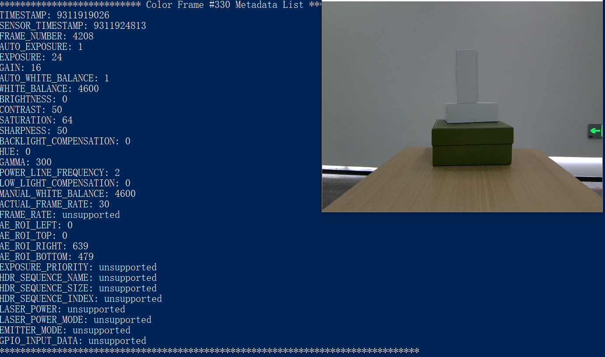

# C++ Sample Color Stream Viewer


Function description: This example mainly demonstrates the use of SDK to get color data and draw display,and exit the program through the ESC_KEY key

This example is based on the C++ High Level API for demonstration

## 1. Firstly, create a pipeline, through which multiple types of streams can be easily opened and closed, and a set of frame data can be obtained
```cpp
    ob::Pipeline pipe;
```

## 2. By creating config to configure which streams to enable 
```cpp
    // Configure which streams to enable or disable for the Pipeline by creating a Config
    std::shared_ptr<ob::Config> config = std::make_shared<ob::Config>();
    config->enableVideoStream(OB_STREAM_COLOR);
```

## 3. Start Pipeline
```cpp
    // Start the pipeline with config
    pipe.start(config);
```

## 4. Obtain color frame data

    Wait for a frame of data in a blocking manner, which is a composite frame containing frame data for all streams enabled in the configuration, and set the waiting timeout time for the frame
```cpp
    auto frameSet = pipe.waitForFrames(100); //Set the waiting time to 100ms
```

```cpp
// print metadata every 30 frames,Currently, only the Gemini 330 series supports metadata
auto index = colorFrame->index(); 
if(index % 30 == 0) {

    std::cout << "*************************** Color Frame #" << index << " Metadata List ********************************" << std::endl;
    for(int metaDataType = 0; metaDataType < OB_FRAME_METADATA_TYPE_COUNT; metaDataType++) {
        // Check if it is supported metaDataType for current frame
        if(colorFrame->hasMetadata((OBFrameMetadataType)metaDataType)) {
            // Get the value of the metadata
            std::cout << metaDataTypes[metaDataType] << ": " << colorFrame->getMetadataValue((OBFrameMetadataType)metaDataType) << std::endl;
        }
        else {
            std::cout << metaDataTypes[metaDataType] << ": " << "unsupported" << std::endl;
        }
    }
    std::cout << "********************************************************************************" << std::endl << std::endl;

}
```

## 5. Stop Pipeline, no more frame data will be generated
```cpp
    pipe.stop();
```

## 6.expected Output 

