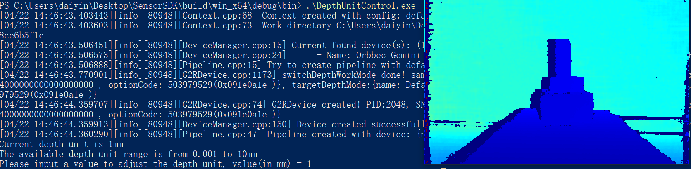

# 深度精度示例

功能描述：演示获取深度精度操作，显示深度图像，输出深度精度，并通过ESC_KEY键退出程序

本示例基于C++ High Level API进行演示

## 1. 创建Pipeline及流配置,并通过Pipeline获取设备
```cpp
    // Create a pipeline with default device
    ob::Pipeline pipe;
    
    // Get the device inside the pipeline
    auto device = pipe.getDevice()
```
## 2. 检查获取深度精度的方式
```cpp
    bool changeDepthUnitFlag = false;
    // check the way to adjust depth unit
    if(device->isPropertySupported(OB_PROP_DEPTH_PRECISION_LEVEL_INT, OB_PERMISSION_READ_WRITE)) {
        // change depth unit by adjust the depth precision level
        changeDepthUnitFlag = changeDepthUnit(device);
    }
    else if(device->isPropertySupported(OB_PROP_DEPTH_UNIT_FLEXIBLE_ADJUSTMENT_FLOAT, OB_PERMISSION_READ_WRITE)) {
        // for some models (Such as G330 series), user can adjust the depth unit by adjusting the depth unit flexible adjustment property
        changeDepthUnitFlag = changeDepthUnitFlexible(device);
    }
    else {
        std::cout << "Current device not support adjust depth unit, use the default depth unit 1mm" << std::endl;
        changeDepthUnitFlag = true;
    }
```
## 3. 计算深度值
```cpp
    // For Y16 format depth frame, print the distance of the center pixel every 30 frames
    if(depthFrame->index() % 30 == 0 && depthFrame->format() == OB_FORMAT_Y16) {
        // Convert depth values to 1mm precision
        auto rstImageData = convertDepthFrameUnitTo1mm(depthFrame);
    
        uint32_t  width          = depthFrame->width();
        uint32_t  height         = depthFrame->height();
        uint16_t  centerDistance = rstImageData.data()[width * height / 2 + width / 2];
    
        // Attention: if the distance is 0, it means that the depth camera cannot detect the object（may be out of detection range）
        std::cout << "The depth frame center value is " << centerDistance << " mm. " << std::endl;
```    

## 4.释放资源，退出程序
```cpp
    pipe.stop();
```

## 5. 预期输出


