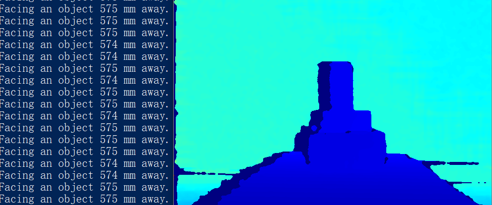

# DepthViewer 示例

功能描述：此示例主要演示使用SDK获取深度数据并进行绘制显示，并通过ESC_KEY键退出程序。

此示例基于C++高级API进行演示。

## 1. 创建一个Pipeline，通过Pipeline可以打开和关闭多种类型的数据流，并获取一组帧数据
```cpp
    ob::Pipeline pipe;
```

## 2. 通过创建配置来配置要启用哪些数据流
```cpp
    // By creating config to configure which streams to enable or disable for the pipeline, here the depth stream will be enabled
    std::shared_ptr<ob::Config> config = std::make_shared<ob::Config>();
    config->enableVideoStream(OB_STREAM_DEPTH);
```

## 3. 开启pipeline
```cpp
    pipe.start(config);
```

## 4. 获取Depth帧数据
以阻塞方式等待一帧数据，该帧数据是一个复合帧，包含了配置中启用的所有数据流的帧数据，并设置等待超时时间
```cpp
    auto frameSet = pipe.waitForFrames(100);	//Set the waiting time to 100ms
```

## 5. 停止Pipeline，不再生成帧数据
```cpp
    pipe.stop();
```
## 6. expected Output 

