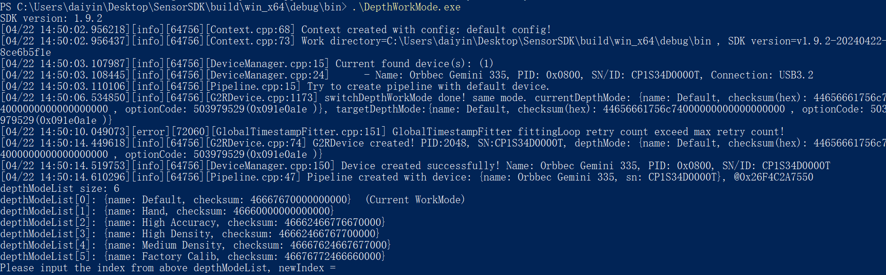

# C++ Sample Config Depth Work Mode


Supported devices: Gemini 2 series, Gemini 330 series cameras, Astra 2 cameras

Function description: Demonstrate the operation of converting depth working mode

> This example is based on the C++High Level API for demonstration

## 1. Create a pipeline to get device
```cpp
    // Create a pipeline with default device
    ob::Pipeline pipe;
    
    // Get the device inside the pipeline
    auto device = pipe.getDevice();
```
## 2. Check if work mode conversion is supported
```cpp
    // Check whether the camera depth working mode is supported, currently only the Gemini2 series binocular camera supports the depth working mode
    if(!device->isPropertySupported(OB_STRUCT_CURRENT_DEPTH_ALG_MODE, OB_PERMISSION_READ_WRITE)) {
        pressKeyExit("Current device not support depth work mode!");
        return -1;
    }
```
## 3. Get a list of depth work modes
```cpp
    // Query the current camera depth mode
    auto curDepthMode = device->getCurrentDepthWorkMode();
    // Get the list of camera depth modes
    auto depthModeList = device->getDepthWorkModeList();
    std::cout << "depthModeList size: " << depthModeList->count() << std::endl;
    for(uint32_t i = 0; i < depthModeList->count(); i++) {
        std::cout << "depthModeList[" << i << "]: " << (*depthModeList)[i];
        if(strcmp(curDepthMode.name, (*depthModeList)[i].name) == 0) {
            std::cout << "  (Current WorkMode)";
        }
    
        std::cout << std::endl;
    }
```
## 4. Set depth working mode
```cpp
    // Let the user choose a mode, then switch
    if(depthModeList->count() > 0) {
        uint32_t index = 0;
        std::cout << "Please input the index from above depthModeList, newIndex = ";
        std::cin >> index;
        if(index >= 0 && index < depthModeList->count()) {  // legitimacy check
            device->switchDepthWorkMode((*depthModeList)[index].name);
    
            // Check whether the mode changes after the display is switched
            curDepthMode = device->getCurrentDepthWorkMode();
            if(strcmp(curDepthMode.name, (*depthModeList)[index].name) == 0) {
                std::cout << "Switch depth work mode success! currentDepthMode: " << curDepthMode << std::endl;
            }
            else {
                std::cout << "Switch depth work mode failed!" << std::endl;
            }
        }
        else {
            std::cout << "switchDepthMode faild. invalid index: " << index << std::endl;
        }
    }
```
## 5. expected Output



