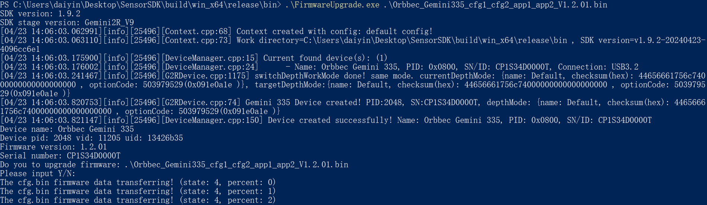

# C++ Sample Firmware Upgrade

Function Description: This example demonstrates how to upgrade a device using firmware

This example is based on the C++Low Level API for demonstration

## 1.Get firmware files through command parameters in the main function interface
```cpp
    // The checkFirmwareFilePath() function is used to check if a file exists. In actual code, it is best to check if the suffix is bin or img, and if the firmware file matches the target device
    std::string checkFirmwareFilePath(int argc, char **argv) {
        if(argc < 2) {
            std::cout << "Please input firmware path." << std::endl;
            return "";
        }
    
        std::string   filePath = std::string(*(argv + 1));
        std::ifstream fs(filePath);
        if(!fs.is_open()) {
            std::cout << "Open Firmware file failed. filePath: " << filePath << std::endl;
            return "";
        }
    
        fs.close();
        return filePath;
    }
    
    int main(int argc, char **argv) try {
        std::string firmwareFilePath = checkFirmwareFilePath(argc, argv);
        if(firmwareFilePath.empty()) {
            std::cout << "command: " << std::endl << "$ ./FirmwareUpgrade[.exe] firmwareFile.bin" << std::endl;
            return 0;
        }
    
        // The following business code
    
        return 0;
    }
    catch(ob::Error &e) {
        // Handling OrbbecSDK interface call exceptions. For example, in order to simplify the process of trying to catch multiple interfaces together, it is recommended to use a separate interface and try to catch each other in practical business scenarios
        std::cerr << "function:" << e.getName() << "\nargs:" << e.getArgs() << "\nmessage:" << e.getMessage() << "\ntype:" << e.getExceptionType() << std::endl;
        exit(EXIT_FAILURE);
    }
```
Create ob:: Context and get the device through ob:: Context. This example assumes that the upper computer (Windows, Ubuntu, Android platforms) has already inserted the device before running FirmwareUpgrade \[. exe\]. Ob:: DeviceChangedCallback is used to listen for business processing of the upgraded device after firmware upgrade and device restart
```cpp
    // Create ob:: Context object
    ob::Context ctx;
    // Set up a device change listener, device_changed_callback is a key function for managing device declaration cycles, and developers must pay attention to this callback
    ctx.setDeviceChangedCallback([](std::shared_ptr<ob::DeviceList> removedList, std::shared_ptr<ob::DeviceList> addedList) {
        if(isWaitRebootComplete_) {
            if(addedList && addedList->deviceCount() > 0) {
                auto device = addedList->getDevice(0);
                if(isDeviceRemoved_ && deviceSN_ == std::string(device->getDeviceInfo()->serialNumber())) {
                    rebootedDevice_       = device;
                    isWaitRebootComplete_ = false;
    
                    std::unique_lock<std::mutex> lk(waitRebootMutex_);
                    waitRebootCondition_.notify_all();
                }
            }
    
            if(removedList && removedList->deviceCount() > 0) {
                if(deviceUid_ == std::string(removedList->uid(0))) {
                    isDeviceRemoved_ = true;
                }
            }
        }  // if isWaitRebootComplete_
    });
    
    // Query the currently connected devices
    auto devList = ctx.queryDeviceList();
    
    // Retrieve the current number of connected devices from ob:: DeviceList
    if(devList->deviceCount() == 0) {
         // Firmware upgrade example: The default device has been connected to the upper computer (Windows, Ubuntu, Android platforms)
        std::cerr << "Device not found!" << std::endl;
        return -1;
    }
    
    // Get the first device, index=0
    auto dev = devList->getDevice(0);
    // Print device information
    dumpDeviceInfo(dev);
```

## 2. Get the current firmware version information of the device
```cpp
    // Print device name, SN, VID, PID, and firmware version
    void dumpDeviceInfo(std::shared_ptr<ob::Device> device) {
        // Get the ob:: DeviceInfo object, through which the basic information of the target device can be obtained
        auto devInfo = device->getDeviceInfo();
    
        // Device Name
        std::cout << "Device name: " << devInfo->name() << std::endl;
    
        // VID, PID, UID of the device
        std::cout << "Device pid: " << devInfo->pid() << " vid: " << devInfo->vid() << " uid: " << devInfo->uid() << std::endl;
    
        // The current firmware version number of the device
        auto fwVer = devInfo->firmwareVersion();
        std::cout << "Firmware version: " << fwVer << std::endl;
    
        // SN of the device
        auto sn = devInfo->serialNumber();
        std::cout << "Serial number: " << sn << std::endl;
    
        // The devInfo resource will be automatically released
    }
```
Upgrade firmware for the target device a. Implement firmware upgrade callback interface for C API; b. Call the firmware upgrade interface for upgrading;
```cpp
    // Perform firmware upgrades on the target device
    bool upgradeFirmware(std::shared_ptr<ob::Device> device, std::string firmwarePath) {
        auto index     = firmwarePath.find_last_of(".img");
        bool isImgFile = index != std::string::npos;
        index          = firmwarePath.find_last_of(".bin");
        bool isBinFile = index != std::string::npos;
        if(!(isImgFile || isBinFile)) {
            // Firmware upgrade files are usually bin or img. In actual business, it is best to use information such as file name and file MD5 to prevent errors
            std::cout << "Upgrade Fimware failed. invalid firmware file: " << firmwarePath << std::endl;
            return false;
        }
    
        bool isUpgradeSuccess = false;
        try {
            // Call the firmware upgrade interface for upgrading;
            device->deviceUpgrade(
                firmwarePath.c_str(),
                [=, &isUpgradeSuccess](OBUpgradeState state, const char *message, uint8_t percent) {
                    if(state == STAT_START) {
                        std::cout << "Upgrade Firmware start" << std::endl;
                    }
                    else if(state == STAT_FILE_TRANSFER) {
                        std::cout << "Upgrade Firmware file transfer, percent: " << (uint32_t)percent << std::endl;
                    }
                    else if(state == STAT_IN_PROGRESS) {
                        std::cout << "Upgrade Firmware in progress, percent: " << (uint32_t)percent << std::endl;
                    }
                    else if(state == STAT_DONE) {
                        // Firmware upgrade successful
                        std::cout << "Upgrade Firmware done, percent: " << (uint32_t)percent << std::endl;
                        isUpgradeSuccess = true;
                    }
                    else if(state == STAT_VERIFY_IMAGE) {
                        std::cout << "Upgrade Firmware verify image" << std::endl;
                    }
                    else {
                        // Firmware upgrade failed
                        std::string errMsg = (nullptr != message ? std::string(message) : "");
                        std::cout << "Upgrade Firmware failed. state: " << std::to_string(state) << ", errMsg: " << errMsg << ", percent: " << (uint32_t)percent
                                  << std::endl;
                    }
                },
                false);
        }
        catch(ob::Error &e) {
            std::cerr << "Upgrade Firmware ob error. function:" << e.getName() << "\nargs:" << e.getArgs() << "\nmessage:" << e.getMessage()
                      << "\ntype:" << e.getExceptionType() << std::endl;
        }
        catch(std::exception &e) {
            if(e.what()) {
                std::cout << "Upgrade Firmware Exception. what: " << std::string(e.what()) << std::endl;
            }
        }
    
        return isUpgradeSuccess;
    }
```
After a successful firmware upgrade, the device needs to be restarted. There are two ways to restart a device: one is to unplug and unplug the device (or restart the operating system), and the other is to call the reboot interface of the OrbbecSDK. After the device goes online, the dump _device_info() function in this example can be used to query the current firmware version information of the device

The following example demonstrates restarting a device through the firmware reboot interface
```cpp
    // reboot device
    std::cout << "Reboot device" << std::endl;
    isDeviceRemoved_      = false;
    isWaitRebootComplete_ = true;
    dev->reboot();
    // Release resources. After the device restarts, the ob:: Device object becomes unusable
    dev     = nullptr;
```
## 3.expected Output



