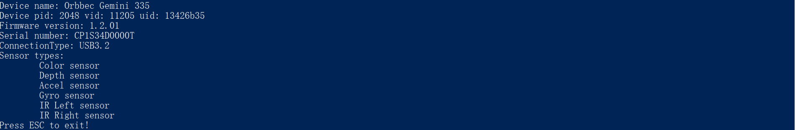

# HelloOrbbec

Function Description: Used to demonstrate SDK initialization, get SDK version, get device model, get device serial number, get firmware version number, SDK resource release, and exit the program through the ESC_KEY key.

This example is based on the C++ Low Level API for demonstration.

## 1.Print the version number of the SDK, which is divided into main version number, minor version number, and revision version number.
```cpp
std::cout << "SDK version: " << ob::Version::getMajor() << "." << ob::Version::getMinor() << "." << ob::Version::getPatch() << std::endl;
```

## 2.Firstly, it is necessary to create a Context for obtaining a list of device information and creating a device.
```cpp
ob::Context ctx;
```

## 3.Query the list of connected devices
```cpp
auto devList = ctx.queryDeviceList();

// Get the number of connected devices
if(devList->deviceCount() == 0) {
    std::cerr << "Device not found!" << std::endl;
    return -1;
}
```

## 4.Create device
```cpp
//Create a device, where 0 represents the index of the first device
auto dev = devList->getDevice(0);
```

## 5.Get current preset information
Currently, only the Gemini 330 Series is supported.
```cpp
auto devicePresetList = dev->getAvailablePresetList();
auto devicePreset     = dev->getCurrentPresetName();
std::cout << "Available preset list: " << std::endl;
for(uint32_t i = 0; i < devicePresetList->count(); i++) {
    auto name = devicePresetList->getName(i);
    if(std::string(name) == std::string(devicePreset)) {
        std::cout << "\t" << name << " (current preset)" << std::endl;
    }
    else {
        std::cout << "\t" << name << std::endl;
    }


```
## 6. Set current preset
Currently, only the Gemini 330 Series is supported.
```cpp
auto newPreset = "High Accuracy";
if(devicePresetList->hasPreset(newPreset)) {
    dev->loadPreset(newPreset);
    std::cout << "Current preset is changed to " << newPreset << std::endl;
}
```

## 7.Next, you can get information related to this device: device information, device name, device PID, vid, uid, device firmware version number, and device serial number
```cpp
//Get device information
auto devInfo = dev->getDeviceInfo();

//Get the name of the device
std::cout << "Device name: " << devInfo->name() << std::endl;

//Get the device's pid, vid, uid
std::cout << "Device pid: " << devInfo->pid() << " vid: " << devInfo->vid() << " uid: " << devInfo->uid() << std::endl;

//Get the firmware version number of the device
auto fwVer = devInfo->firmwareVersion();
std::cout << "Firmware version: " << fwVer << std::endl;

//Get the serial number of the device
auto sn = devInfo->serialNumber();
std::cout << "Serial number: " << sn << std::endl;

// By getting the connection type of the device
auto connectType = devInfo->connectionType();
```

## 8.Get a list of supported sensors
```cpp
std::cout << "Sensor types: " << std::endl;
auto sensorList = dev->getSensorList();
for(uint32_t i = 0; i < sensorList->count(); i++) {
    auto sensor = sensorList->getSensor(i);
    switch(sensor->type()) {
    case OB_SENSOR_COLOR:
        std::cout << "\tColor sensor" << std::endl;
        break;
    case OB_SENSOR_DEPTH:
        std::cout << "\tDepth sensor" << std::endl;
        break;
    case OB_SENSOR_IR:
        std::cout << "\tIR sensor" << std::endl;
        break;
    case OB_SENSOR_IR_LEFT:
        std::cout << "\tIR Left sensor" << std::endl;
        break;
    case OB_SENSOR_IR_RIGHT:
        std::cout << "\tIR Right sensor" << std::endl;
        break;
    case OB_SENSOR_GYRO:
        std::cout << "\tGyro sensor" << std::endl;
        break;
    case OB_SENSOR_ACCEL:
        std::cout << "\tAccel sensor" << std::endl;
        break;
    default:
        break;
    }
}
```
## 9.Expected Output

