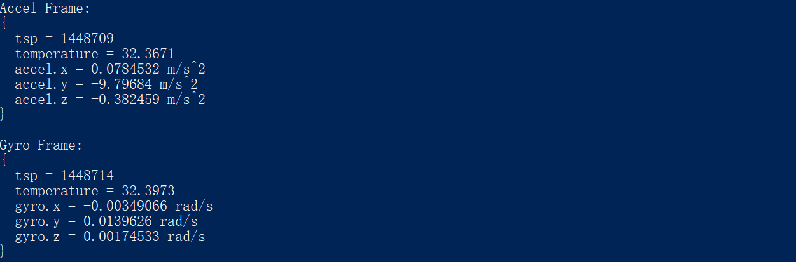

# C++ Sample Imu Reader


Function description: Demonstration of obtaining IMU data

This example is based on the C++low level API for demonstration, outputting imu data and exiting the program using the ESC_KEY key

## 1.Get device
```cpp
    // Create a Context.
    ob::Context ctx;
    
    // Query the list of connected devices
    auto devList = ctx.queryDeviceList();
    
    if(devList->deviceCount() == 0) {
        std::cerr << "Device not found!" << std::endl;
        return -1;
    }
    
    // Create a device, 0 represents the index of the first device
    auto dev = devList->getDevice(0);
```
## 2.Get gyroscope data
```cpp
    // Get Gyroscope Sensor
    gyroSensor = dev->getSensorList()->getSensor(OB_SENSOR_GYRO);
    if(gyroSensor) {
        // Get configuration list
        auto profiles = gyroSensor->getStreamProfileList();
        // Select the first profile to open stream
        auto profile = profiles->getProfile(OB_PROFILE_DEFAULT);
        gyroSensor->start(profile, [](std::shared_ptr<ob::Frame> frame) {
            std::unique_lock<std::mutex> lk(printerMutex);
            auto                         timeStamp = frame->timeStamp();
            auto                         index     = frame->index();
            auto                         gyroFrame = frame->as<ob::GyroFrame>();
            if(gyroFrame != nullptr && (index % 50) == 2) {  //( timeStamp % 500 ) < 2: Reduce printing frequency
                auto value = gyroFrame->value();
                std::cout << "Gyro Frame: \n\r{\n\r"
                            << "  tsp = " << timeStamp << "\n\r"
                            << "  temperature = " << gyroFrame->temperature() << "\n\r"
                            << "  gyro.x = " << value.x << " rad/s"
                            << "\n\r"
                            << "  gyro.y = " << value.y << " rad/s"
                            << "\n\r"
                            << "  gyro.z = " << value.z << " rad/s"
                            << "\n\r"
                            << "}\n\r" << std::endl;
            }
        });
    }
```
## 3.Get accelerometer
```cpp
    accelSensor = dev->getSensorList()->getSensor(OB_SENSOR_ACCEL);
    if(accelSensor) {
        // Get configuration list
        auto profiles = accelSensor->getStreamProfileList();
        // Select the first profile to open stream
        auto profile = profiles->getProfile(OB_PROFILE_DEFAULT);
        accelSensor->start(profile, [](std::shared_ptr<ob::Frame> frame) {
            std::unique_lock<std::mutex> lk(printerMutex);
            auto                         timeStamp  = frame->timeStamp();
            auto                         index      = frame->index();
            auto                         accelFrame = frame->as<ob::AccelFrame>();
            if(accelFrame != nullptr && (index % 50) == 0) {
                auto value = accelFrame->value();
                std::cout << "Accel Frame: \n\r{\n\r"
                            << "  tsp = " << timeStamp << "\n\r"
                            << "  temperature = " << accelFrame->temperature() << "\n\r"
                            << "  accel.x = " << value.x << " m/s^2"
                            << "\n\r"
                            << "  accel.y = " << value.y << " m/s^2"
                            << "\n\r"
                            << "  accel.z = " << value.z << " m/s^2"
                            << "\n\r"
                            << "}\n\r" << std::endl;
            }
        });
    }

    // turn off the stream
    if(gyroSensor) {
        gyroSensor->stop();
    }
    if(accelSensor) {
        accelSensor->stop();
    }
```

## 4. expected Output 



