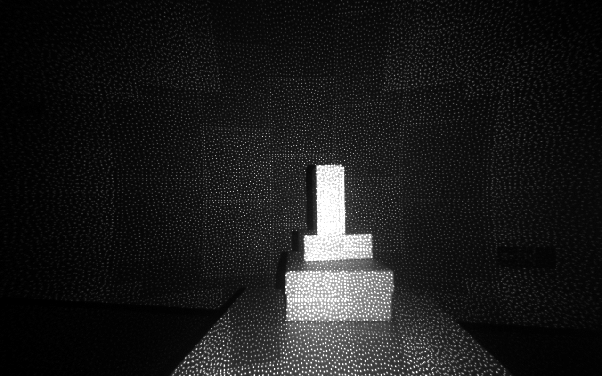

# C++ Sample Infrared Stream Viewer

Function description: Demonstrate obtaining infrared camera images, displaying infrared images, and exiting the program with the ESC_KEY key

This example is based on the C++High Level API for demonstration

## 1. Create a pipeline and configure stream information
```cpp
    // Create a pipeline with default device
    ob::Pipeline pipe;
    
    // Get all stream profiles of the infrared camera, including stream resolution, frame rate, and frame format
    // Please adjust the sensor according to the actual product, some device types only have OB_SENSOR_IR_LEFT and OB_SENSOR_IR_RIGHT.
    auto profiles = pipe.getStreamProfileList(OB_SENSOR_IR);
    
    if(profiles == nullptr) {
        std::cerr
            << "The obtained IR resolution list is NULL. For binocular structured light devices, try using the doubleIr example to turn on the ir data stream. "
            << std::endl;
        return 0;
    }
    
    std::shared_ptr<ob::VideoStreamProfile> irProfile = nullptr;
    try {
        // Find the corresponding profile according to the specified format, first look for the y16 format
        irProfile = profiles->getVideoStreamProfile(640, 480, OB_FORMAT_Y8, 30);
    }
    catch(ob::Error &e) {
        // If the specified format is not found, search for the default profile to open the stream
        irProfile = std::const_pointer_cast<ob::StreamProfile>(profiles->getProfile(OB_PROFILE_DEFAULT))->as<ob::VideoStreamProfile>();
    }
    
    // By creating config to configure which streams to enable or disable for the pipeline, here the infrared stream will be enabled
    std::shared_ptr<ob::Config> config = std::make_shared<ob::Config>();
    config->enableStream(irProfile);
```

## 2. Start Pipeline through Configuration
```cpp
    pipe.start(config);
```

## 3.Get frame data
```cpp

    auto frameSet = pipe.waitForFrames(100);
```

## 4.Stop pipeline
```cpp
    pipe.stop();
```

## 5. expected Output 

