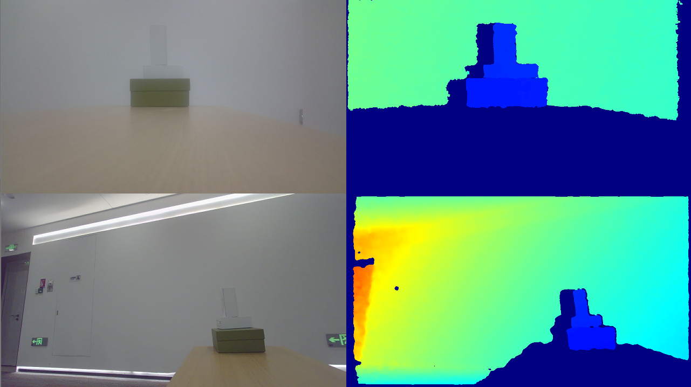

# 多设备示例

功能描述：本示例主要演示了对多设备进行操作。

本示例基于C++ High Level API进行演示

## 1. 首先创建一个Context，获取设备信息列表用于创建设备及Pipeline
```cpp
    ob::Context ctx;
    //查询已经接入设备的列表
    auto devList = ctx.queryDeviceList();
    //获取接入设备的数量
    int devCount = devList->deviceCount();
```

## 2. 创建设备，并通过设备创建Pipeline
```cpp
    //遍历设备列表并创建设备
    std::vector<std::shared_ptr<ob::Device>> devices;
    for (int i = 0; i < devCount; i++)
    {
        //获取设备并创建pipeline
        auto dev  = devList->getDevice( i );
        auto pipe = std::make_shared< ob::Pipeline >( dev );
        pipes.push_back( pipe );
```    

## 3. 打开多个设备的深度和彩色流
```cpp
    void StartStream(std::vector<std::shared_ptr<ob::Pipeline>> pipes) {
        int i = 0;
        for(auto &&pipe: pipes) {
            std::shared_ptr<ob::Config> config = std::make_shared<ob::Config>();
            // Get the depth camera configuration list
            auto                                    depthProfileList = pipe->getStreamProfileList(OB_SENSOR_DEPTH);
            std::shared_ptr<ob::VideoStreamProfile> depthProfile     = nullptr;
            if(depthProfileList) {
                // Open the default profile of Depth Sensor, which can be configured through the configuration file
                depthProfile = std::const_pointer_cast<ob::StreamProfile>(depthProfileList->getProfile(OB_PROFILE_DEFAULT))->as<ob::VideoStreamProfile>();
            }
            config->enableStream(depthProfile);
    
            // Get the color camera configuration list
            try {
                auto                                    colorProfileList = pipe->getStreamProfileList(OB_SENSOR_COLOR);
                std::shared_ptr<ob::VideoStreamProfile> colorProfile     = nullptr;
                if(colorProfileList) {
                    // Open the default profile of Color Sensor, which can be configured through the configuration file
                    colorProfile = std::const_pointer_cast<ob::StreamProfile>(colorProfileList->getProfile(OB_PROFILE_DEFAULT))->as<ob::VideoStreamProfile>();
                }
                config->enableStream(colorProfile);
            }
            catch(ob::Error &e) {
                std::cerr << "Current device is not support color sensor!" << std::endl;
            }
    
            // Start the pipeline and pass in the configuration
            pipe->start(config, [i](std::shared_ptr<ob::FrameSet> frameSet) {
                std::lock_guard<std::mutex> lock(frameMutex);
                if(frameSet->colorFrame()) {
                    colorFrames[i] = frameSet->colorFrame();
                }
                if(frameSet->depthFrame()) {
                    depthFrames[i] = frameSet->depthFrame();
                }
            });
            i++;
        }
    }
```
## 4. 停止所有设备已打开的流
```cpp
    void StopStream( std::vector< std::shared_ptr< ob::Pipeline > > pipes) {
        int i = 0;
        for ( auto&& pipe : pipes ) {
            if(colorFrames[i])
                colorFrames->reset();
            if(depthFrames[i])
                depthFrames->reset();
            if(irFrames[i])
                irFrames->reset();
            //停止pipeline
            pipe->stop();
            i++;
        }
    }
```

程序正常退出之后资源将会自动释放

## 5. 预期输出

