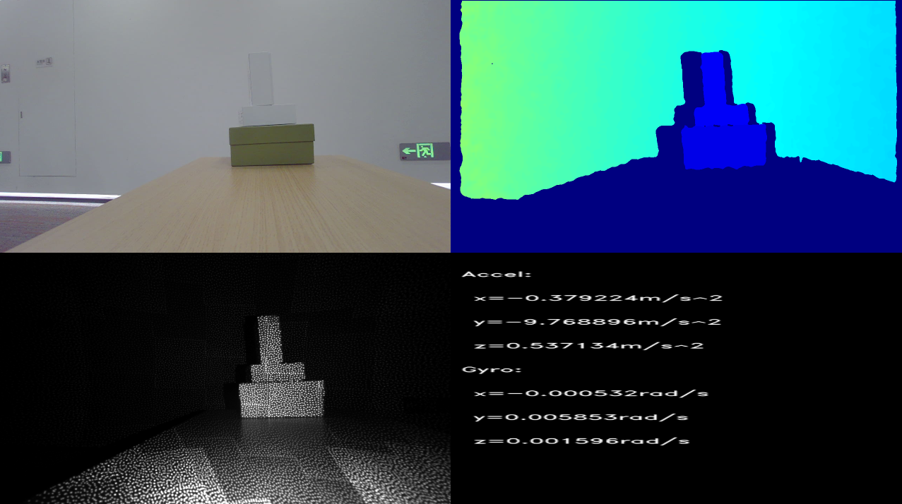

# C++ Sample Multi Stream


Function description: This example mainly demonstrates the operation of opening multiple sensor streams simultaneously using device, displaying multiple stream images, and exiting the program through the ESC_KEY key

This example is based on the C++High Level API for demonstration

## 1. Firstly, you need to create a pipeline
```cpp
    ob::Pipeline pipe;
```

## 2. Enumerate devices and perform stream configuration
```cpp
    // enumerate and config all sensors
    auto device     = pipe.getDevice();
    auto sensorList = device->getSensorList();
    for(int i = 0; i < sensorList->count(); i++) {
        auto sensorType = sensorList->type(i);
        if(sensorType == OB_SENSOR_GYRO || sensorType == OB_SENSOR_ACCEL) {
            continue;
        }
        auto profiles = pipe.getStreamProfileList(sensorType);
        auto profile  = profiles->getProfile(OB_PROFILE_DEFAULT);
        config->enableStream(profile);
    }
```

## 3. Enable pipeline through configuration
```cpp
    // Start the pipeline with config
    std::mutex                                        frameMutex;
    std::map<OBFrameType, std::shared_ptr<ob::Frame>> frameMap;
    pipe.start(config, [&](std::shared_ptr<ob::FrameSet> frameset) {
        auto count = frameset->frameCount();
        for(int i = 0; i < count; i++) {
            auto                         frame = frameset->getFrame(i);
            std::unique_lock<std::mutex> lk(frameMutex);
            frameMap[frame->type()] = frame;
        }
    });
```
The IMU frame rate is much faster than the video, so it is advisable to use a separate pipeline to get IMU data.
```cpp

    auto                                              dev         = pipe.getDevice();
    auto                                              imuPipeline = std::make_shared<ob::Pipeline>(dev);
    std::mutex                                        imuFrameMutex;
    std::map<OBFrameType, std::shared_ptr<ob::Frame>> imuFrameMap;
    try {
        auto                        accelProfiles = imuPipeline->getStreamProfileList(OB_SENSOR_ACCEL);
        auto                        gyroProfiles  = imuPipeline->getStreamProfileList(OB_SENSOR_GYRO);
        auto                        accelProfile  = accelProfiles->getProfile(OB_PROFILE_DEFAULT);
        auto                        gyroProfile   = gyroProfiles->getProfile(OB_PROFILE_DEFAULT);
        std::shared_ptr<ob::Config> imuConfig     = std::make_shared<ob::Config>();
        imuConfig->enableStream(accelProfile);
        imuConfig->enableStream(gyroProfile);
        imuPipeline->start(imuConfig, [&](std::shared_ptr<ob::FrameSet> frameset) {
            auto count = frameset->frameCount();
            for(int i = 0; i < count; i++) {
                auto                         frame = frameset->getFrame(i);
                std::unique_lock<std::mutex> lk(imuFrameMutex);
                imuFrameMap[frame->type()] = frame;
            }
        });
    }
    catch(...) {
        std::cout << "IMU sensor not found!" << std::endl;
        imuPipeline.reset();
    }
```

## 4. Stop pipeline
```cpp
    pipe.stop();
```

## 5. Stop IMU pipeline
```cpp
    imuPipeline->stop();
```

## 6. expected Output 

