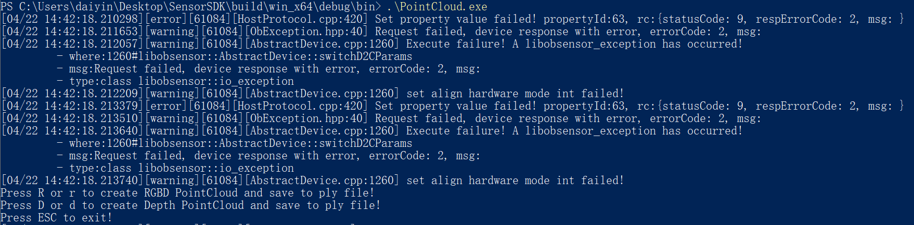

# C++ Sample PointCloud

# PointCloud

Function description: Connect the device to open the stream, generate a depth point cloud or RGBD point cloud and save it as a ply format file, and exit the program through the ESC\_KEY key

This example is based on the C++High Level API for demonstration

## 1. Create a point cloud and save it as a ply file function.
 The detailed description of the ply file format can be viewed on the network.

Firstly，create two functions to save the point cloud data obtained from the stream, which are functions for saving regular point cloud data
```cpp
    // Save point cloud data to ply
    void savePointsToPly(std::shared_ptr<ob::Frame> frame, std::string fileName) {
        int   pointsSize = frame->dataSize() / sizeof(OBPoint);
        FILE *fp         = fopen(fileName.c_str(), "wb+");
        fprintf(fp, "ply\n");
        fprintf(fp, "format ascii 1.0\n");
        fprintf(fp, "element vertex %d\n", pointsSize);
        fprintf(fp, "property float x\n");
        fprintf(fp, "property float y\n");
        fprintf(fp, "property float z\n");
        fprintf(fp, "end_header\n");
    
        OBPoint *point = (OBPoint *)frame->data();
        for(int i = 0; i < pointsSize; i++) {
            fprintf(fp, "%.3f %.3f %.3f\n", point->x, point->y, point->z);
            point++;
        }
    
        fflush(fp);
        fclose(fp);
    }
```
Create another function to save color point cloud data for storing color point cloud data
```cpp
    //Save color point cloud data to ply
    void saveRGBPointsToPly(std::shared_ptr<ob::Frame> frame, std::string fileName) {
        int   pointsSize = frame->dataSize() / sizeof(OBColorPoint);
        FILE *fp         = fopen(fileName.c_str(), "wb+");
        fprintf(fp, "ply\n");
        fprintf(fp, "format ascii 1.0\n");
        fprintf(fp, "element vertex %d\n", pointsSize);
        fprintf(fp, "property float x\n");
        fprintf(fp, "property float y\n");
        fprintf(fp, "property float z\n");
        fprintf(fp, "property uchar red\n");
        fprintf(fp, "property uchar green\n");
        fprintf(fp, "property uchar blue\n");
        fprintf(fp, "end_header\n");
    
        OBColorPoint *point = (OBColorPoint *)frame->data();
        for(int i = 0; i < pointsSize; i++) {
            fprintf(fp, "%.3f %.3f %.3f %d %d %d\n", point->x, point->y, point->z, (int)point->r, (int)point->g, (int)point->b);
            point++;
        }
    
        fflush(fp);
        fclose(fp);
    }
```

Set the Log level to avoid excessive Info level logs affecting the output results of point clouds
```cpp

    ob::Context::setLoggerSeverity(OB_LOG_SEVERITY_ERROR);
```

## 2. Create a pipeline that makes it easy to open and close multiple types of streams and get a set of frame data
```cpp
    ob::Pipeline pipeline;
```

## 3. Configure color stream
```cpp
    auto colorProfiles = pipeline.getStreamProfileList(OB_SENSOR_COLOR);
    if(colorProfiles) {
        auto profile = colorProfiles->getProfile(OB_PROFILE_DEFAULT);
        colorProfile = profile->as<ob::VideoStreamProfile>();
    }
    config->enableStream(colorProfile);
```

## 4. Configure depth stream
```cpp
    std::shared_ptr<ob::StreamProfileList> depthProfileList;
    OBAlignMode                            alignMode = ALIGN_DISABLE;
    if(colorProfile) {
        // Try find supported depth to color align hardware mode profile
        depthProfileList = pipeline.getD2CDepthProfileList(colorProfile, ALIGN_D2C_HW_MODE);
        if(depthProfileList->count() > 0) {
            alignMode = ALIGN_D2C_HW_MODE;
        }
        else {
            // Try find supported depth to color align software mode profile
            depthProfileList = pipeline.getD2CDepthProfileList(colorProfile, ALIGN_D2C_SW_MODE);
            if(depthProfileList->count() > 0) {
                alignMode = ALIGN_D2C_SW_MODE;
            }
        }
    }
    else {
        depthProfileList = pipeline.getStreamProfileList(OB_SENSOR_DEPTH);
    }
    
    if(depthProfileList->count() > 0) {
        std::shared_ptr<ob::StreamProfile> depthProfile;
        try {
            // Select the profile with the same frame rate as color.
            if(colorProfile) {
                depthProfile = depthProfileList->getVideoStreamProfile(OB_WIDTH_ANY, OB_HEIGHT_ANY, OB_FORMAT_ANY, colorProfile->fps());
            }
        }
        catch(...) {
            depthProfile = nullptr;
        }
    
        if(!depthProfile) {
            // If no matching profile is found, select the default profile.
            depthProfile = depthProfileList->getProfile(OB_PROFILE_DEFAULT);
        }
        config->enableStream(depthProfile);
    }
```

## 5. Enable D2C alignment to generate RGBD point clouds
```cpp
    config->setAlignMode(ALIGN_D2C_HW_MODE);
```

## 6. Start Pipeline
```cpp
    pipeline.start( config );
```

## 7. Create a point cloud Filter object and set camera intrinsic parameters
```cpp
    // Create a point cloud filter object (when creating a point cloud filter, device parameters are obtained within the Pipeline, so it is recommended to configure the device as much as possible before creating the filter)
    ob::PointCloudFilter pointCloud;
    
    // Get camera internal parameters and input them into the point cloud filter
    auto cameraParam = pipeline.getCameraParam();
    pointCloud.setCameraParam(cameraParam);
```
Set some operation prompts
```cpp
     std::cout << "Press R to create rgbd pointCloud and save to ply file! " << std::endl;
     std::cout << "Press d to create depth pointCloud and save to ply file! " << std::endl;
     std::cout << "Press ESC to exit! " << std::endl;
```
## 8.Set the main process to get and save point cloud data through the point cloud Filter object created above
```cpp
    if(key == 'R' || key == 'r') {
      count = 0;
      // Limit up to 10 repetitions
      while(count++ < 10) {
        // Waiting for one frame of data with a timeout of 100ms
        auto frameset = pipeline.waitForFrames(100);
        if(frameset != nullptr && frameset->depthFrame() != nullptr && frameset->colorFrame() != nullptr) {
          try {
            // Generate colored point clouds and save them
            std::cout << "Save RGBD PointCloud ply file..." << std::endl;
            pointCloud.setCreatePointFormat(OB_FORMAT_RGB_POINT);
            std::shared_ptr<ob::Frame> frame = pointCloud.process(frameset);
            saveRGBPointsToPly(frame, "RGBPoints.ply");
            std::cout << "RGBPoints.ply Saved" << std::endl;
          }
          catch(std::exception &e) {
            std::cout << "Get point cloud failed" << std::endl;
          }
          break;
        }
      }
    }
    else if(key == 'D' || key == 'd') {
      count = 0;
      // Limit up to 10 repetitions
      while(count++ < 10) {
        // Waiting for one frame of data with a timeout of 100ms
        auto frameset = pipeline.waitForFrames(100);
        if(frameset != nullptr && frameset->depthFrame() != nullptr) {
          try {
            // Generate point cloud and save
            std::cout << "Save Depth PointCloud to ply file..." << std::endl;
            pointCloud.setCreatePointFormat(OB_FORMAT_POINT);
            std::shared_ptr<ob::Frame> frame = pointCloud.process(frameset);
            savePointsToPly(frame, "DepthPoints.ply");
            std::cout << "DepthPoints.ply Saved" << std::endl;
          }
          catch(std::exception &e) {
            std::cout << "Get point cloud failed" << std::endl;
          }
          break;
        }
      }
    }
```
## 9. Finally, stop the stream through the Pipeline
```cpp
     pipeline.stop();
```

## 10. expected Output



