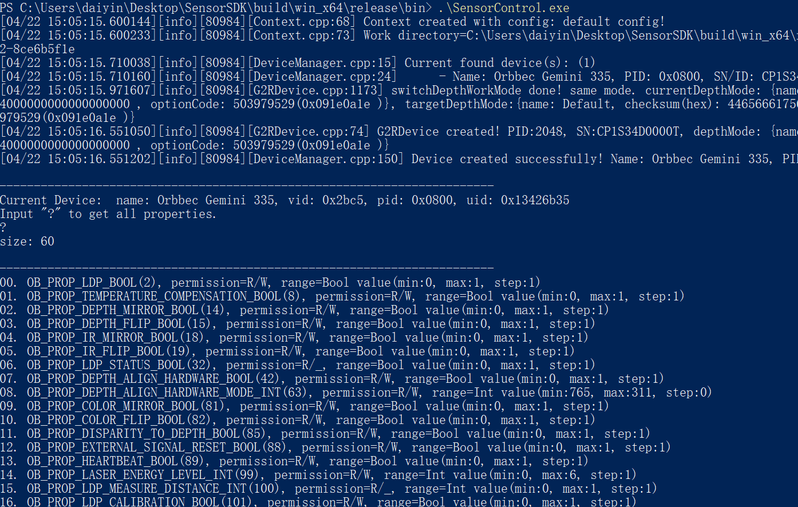

# 传感器控制示例

功能描述：本示例演示了对device控制命令的操作、对Sensor控制命令的操作、对Sensor进行流操作。

本示例基于C++ Low Level API进行演示

## 1. 首先需要创建一个Context，用于获取设备信息列表和创建设备
```cpp
    ob::Context ctx;
```

查询设备信息列表
```cpp
    auto devList = ctx.queryDeviceList();
```

获取设备并输出设备信息
```cpp
    if(deviceList->deviceCount() > 0) {
        if(deviceList->deviceCount() <= 1) {
            // If a single device is plugged in, the first one is selected by default
            device = deviceList->getDevice(0);
        }
        else {
            device = selectDevice(deviceList);
        }
        auto deviceInfo = device->getDeviceInfo();
        std::cout << "\n------------------------------------------------------------------------\n";
        std::cout << "Current Device: "
                    << " name: " << deviceInfo->name() << ", vid: 0x" << std::hex << deviceInfo->vid() << ", pid: 0x" << std::setw(4) << std::setfill('0')
                    << deviceInfo->pid() << ", uid: 0x" << deviceInfo->uid() << std::dec << std::endl;
    }
```

## 2. 按照提示获取所有属性
```cpp
    std::cout << "Input \"?\" to get all properties." << std::endl;
    std::getline(std::cin, choice);
```

## 3. 输入参数提示
```cpp
    std::cout << "Property control usage: [property index] [set] [property value] or [property index] [get]" << std::endl;
```

## 4. 获取属性
```cpp
    getPropertyValue(device, propertyItem);
```

## 5. 设置属性
```cpp
    setPropertyValue(device, propertyItem, controlVec.at(2));
```

## 6. 预期输出


