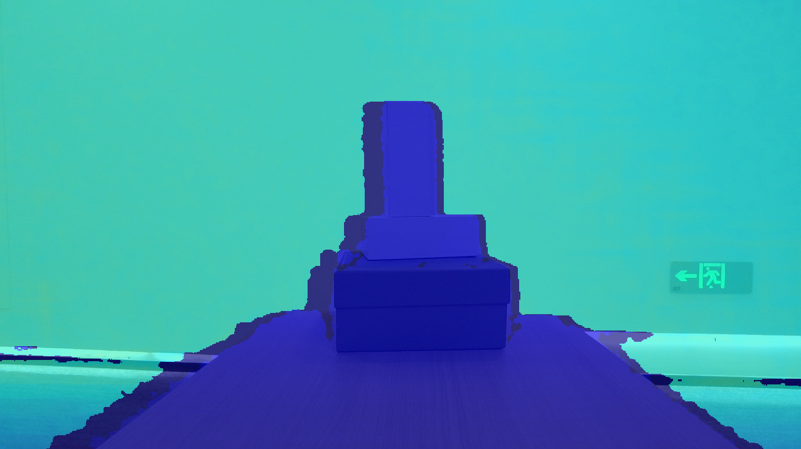

# C++ Sample Sync Align Viewer

Function description: This example demonstrates the operation of aligning Sensor data stream control, displaying the aligned image, and exiting the program through the ESC_KEY key

This example is based on the C++High Level API for demonstration

## 1. Firstly, create a pipeline, through which multiple types of streams can be easily opened and closed, and a set of frame data can be obtained
```cpp
    ob::Pipeline pipe;
```

## 2. Get all stream configurations for color and depth cameras, including stream resolution, frame rate, and frame format
```cpp
    std::shared_ptr<ob::VideoStreamProfile> colorProfile = nullptr;
    try {
        // Get all stream profiles of the color camera, including stream resolution, frame rate, and frame format
        auto colorProfiles = pipe.getStreamProfileList(OB_SENSOR_COLOR);
        if(colorProfiles) {
            colorProfile = std::const_pointer_cast<ob::StreamProfile>(colorProfiles->getProfile(OB_PROFILE_DEFAULT))->as<ob::VideoStreamProfile>();
        }
        config->enableStream(colorProfile);
    }
    catch(...) {
        std::cerr << "Current device is not support color sensor!" << std::endl;
        exit(EXIT_FAILURE);
    }
    
    // Get all stream profiles of the depth camera, including stream resolution, frame rate, and frame format
    auto                                    depthProfiles = pipe.getStreamProfileList(OB_SENSOR_DEPTH);
    std::shared_ptr<ob::VideoStreamProfile> depthProfile  = nullptr;
    if(depthProfiles) {
        depthProfile = std::const_pointer_cast<ob::StreamProfile>(depthProfiles->getProfile(OB_PROFILE_DEFAULT))->as<ob::VideoStreamProfile>();
    }
    config->enableStream(depthProfile);
```

## 3. Configure which streams to enable or disable in the Pipeline by creating a Configuration, where color and depth streams will be enabled
```cpp
    std::shared_ptr<ob::Config> config = std::make_shared<ob::Config>();
    config->enableStream(colorProfile);
    config->enableStream(depthProfile);
```

## 4. Control stream alignment, turn on software alignment here
```cpp
    // Configure alignment mode to software D2C alignment
    config->setAlignMode(ALIGN_D2C_SW_MODE);
```

## 5. Start the stream configured in Configuration. If no parameters are passed, the default configuration startup stream will be started
```cpp
    pipe.start(config);
```

## 6. Stop Pipeline, no more frame data will be generate
```cpp
    pipe.stop();
```

After the program exits normally, resources will be automatically released

## 7. expected Output 

